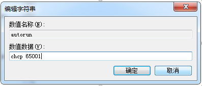

<!-- TOC -->

- [1.编辑 tomcat\bin 目录下的 startup.bat 文件](#1编辑-tomcatbin-目录下的-startupbat-文件)
- [2.修改 catalina.bat 文件](#2修改-catalinabat-文件)
- [3.由于直接打开 startup.bat 文件，执行的时候是 windows 的 cmd 窗口，窗口的默认编码是 gbk 编码号是 936，如图：](#3由于直接打开-startupbat-文件执行的时候是-windows-的-cmd-窗口窗口的默认编码是-gbk-编码号是-936如图)

<!-- /TOC -->
# 1.编辑 tomcat\bin 目录下的 startup.bat 文件

将 call "%EXECUTABLE%" start %CMD_LINE_ARGS%  修改为  call "%EXECUTABLE%" run %CMD_LINE_ARGS% 

# 2.修改 catalina.bat 文件

将 set "JAVA_OPTS=%JAVA_OPTS% %JSSE_OPTS%"  修改为  set "JAVA_OPTS=%JAVA_OPTS% %JSSE_OPTS%  -Dfile.encoding=UTF-8" 

# 3.由于直接打开 startup.bat 文件，执行的时候是 windows 的 cmd 窗口，窗口的默认编码是 gbk 编码号是 936，如图：

所以我们需要修改注册表
* 1.运行 win+r 输入regedit，打开注册表
* 2.找到 [HKEY_LOCAL_MACHINE\SOFTWARE\Microsoft\Command Processor]

* 3.右键

* 4.输入数值名称 autorun ；输入数值数据 chcp 65001。点击确定。
  
  重新运行tomcat即可