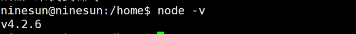

# 1.安装node
```
sudo apt-get install nodejs

sudo apt install nodejs-legacy
```
# 2.查看是否安装成功
```
node -v
```

# 3.安装npm
```
sudo apt-get install npm
```
# 4.将vue-cli全局安装到系统环境中
```
sudo npm install -g vue-cli
```
# 5.验证npm安装成功
```
npm -v
```

至此vue的环境搭建结束