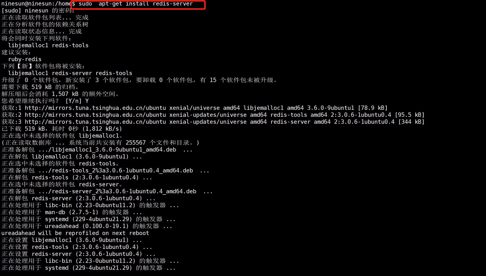
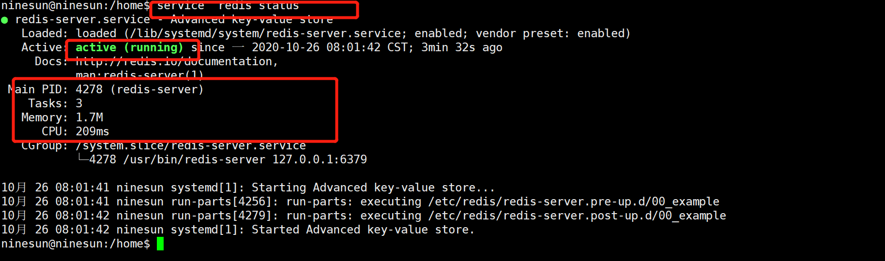
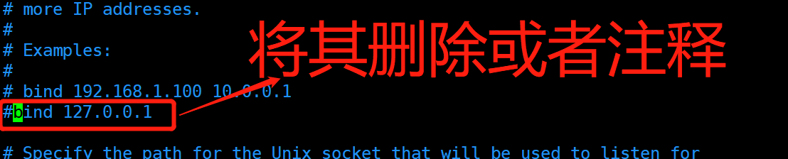
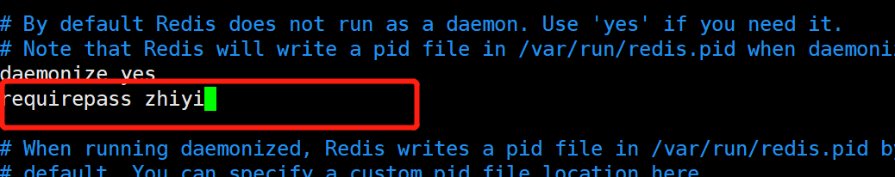
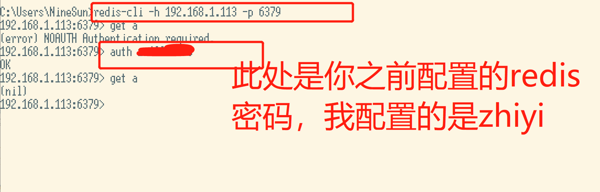

<!-- TOC -->

- [1.安装](#1安装)
- [2.执行service  redis status 我们可以看到redis的一些状态](#2执行service-redis-status-我们可以看到redis的一些状态)
- [3.配置redis](#3配置redis)
- [4.重新启动redis](#4重新启动redis)
- [5.使用windows远程连接进行测试](#5使用windows远程连接进行测试)

<!-- /TOC -->
# 1.安装
```
sudo  apt-get install redis-server
```

# 2.执行service  redis status 我们可以看到redis的一些状态
```
service  redis status
```

# 3.配置redis
找到/et/redis/redis.conf文件修改如下几处
* 1.注释掉  127.0.0.1   #bind 127.0.0.1

> 注意：如果不需要远程连接redis则不需要这个操作
* 2.将daemonize属性改为yes。这样redis-server就能后台运行了

* 3.添加requirepass zhiyi来给redis添加密码，密码设置为zhiyi

# 4.重新启动redis
```
service redis restart
```
至此ubuntu上的操作全部结束，下面的操作全部在windows系统上进行
# 5.使用windows远程连接进行测试
> 注意:若采用windows进行远程连接，则需要你的windows系统也已经配置了redis，若还未配置[点击此处](https://blog.csdn.net/zhiyikeji/article/details/85687772)

在本地window打开一个客户端 ，cd到redis安装的目录，主要是要有redis-cli.exe的目录输入 redis-cli -h redis服务器IP -p redis服务端口号(默认6379)

若出现以上结果说明配置成功