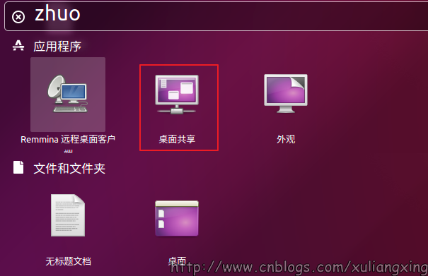
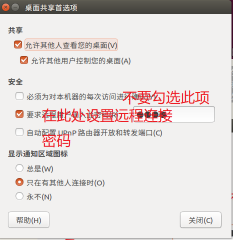
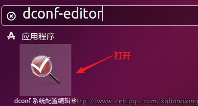
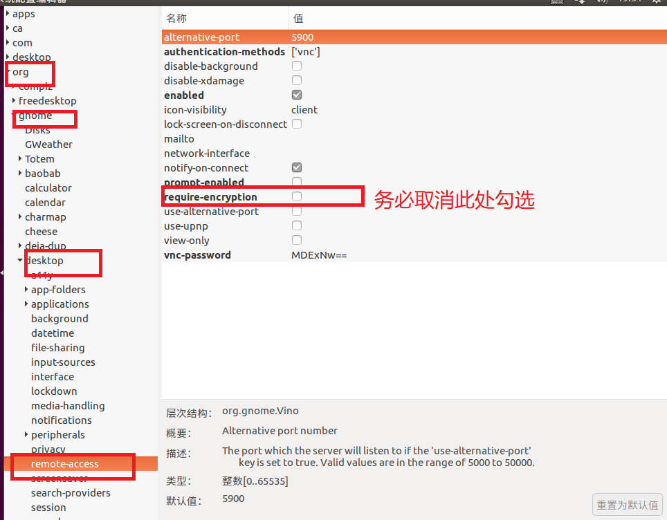
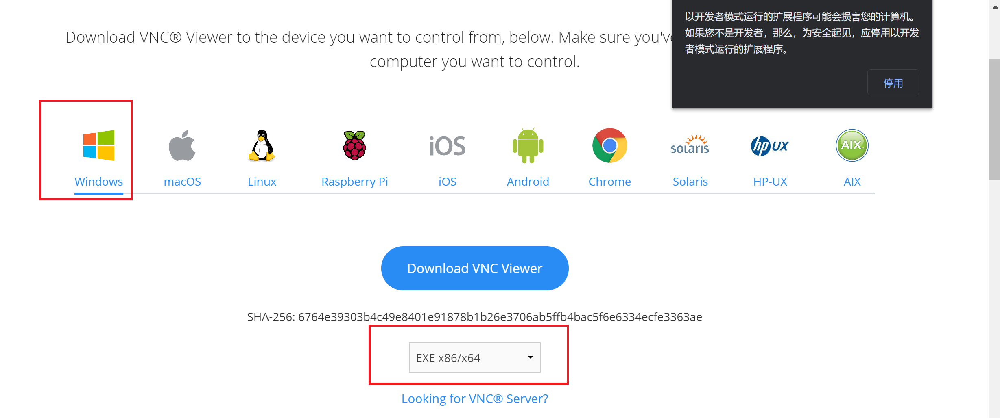
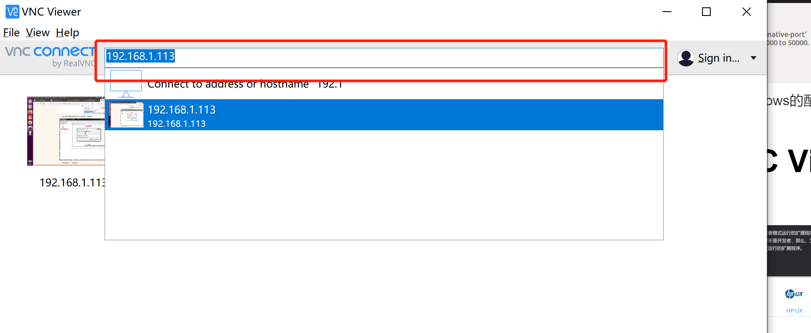
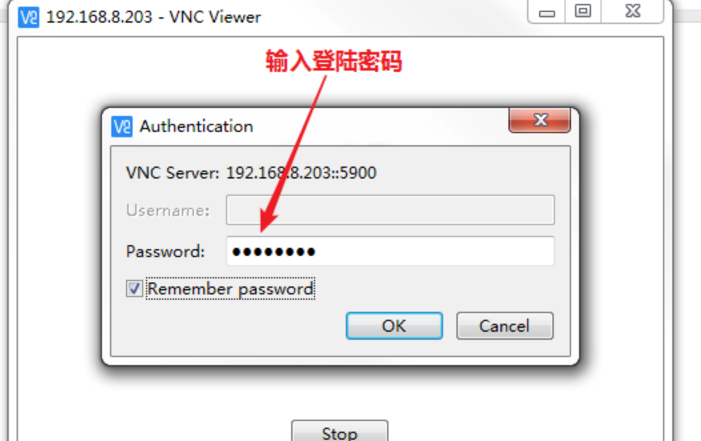
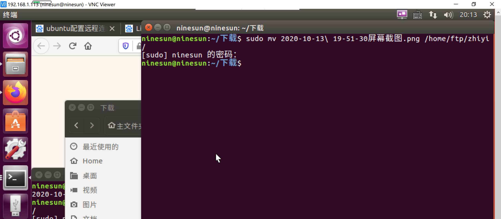

# 1.首先设置允许被控制,直接搜索桌面控制

# 2.　将【允许其他人查看您的桌面】这一项勾上，然后在安全那项，勾选【要求远程用户输入此密码】，并设置远程密码。并且我们取消勾选【必须为对本机器的每次访问进行确定】（这样做，是为了被远程的时候不需要再确认，否则每次远程都要人为确认才能被远程，会很繁琐）如图所示：

# 3.安装vncserver
``` 
sudo apt-get install xrdp vnc4server xbase-clients
```
# 4.安装dconf-editor(取消权限限制)
``` 
sudo apt-get install dconf-editor
```
安装完成之后，我们需要打开dconf-editor工具，在桌面搜索dconf-editor打开，如图所示：

打开之后，依次展开org->gnome->desktop->remote-access，然后取消 “requlre-encryption”的勾选即可。如图所示：

至此ubuntu上的配置已经全部结束，下面开始配置windows的配置
# 5.在windows中安装VNC Viewer
[点击此处访问VNC官网](https://www.realvnc.com/en/connect/download/viewer/)

# 6.安装成功之后，在输入框输入我们要远程连接的地址


连接成功之后的效果如下：
