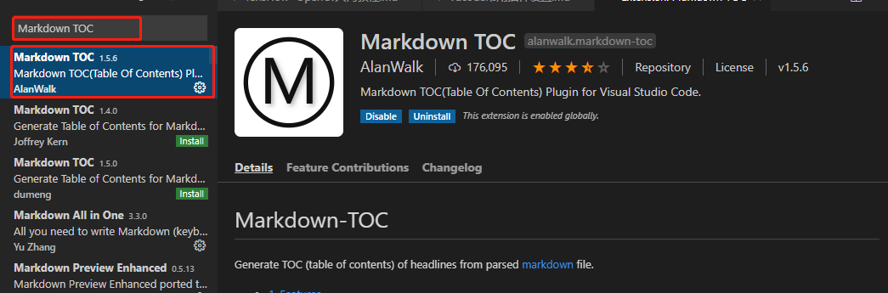
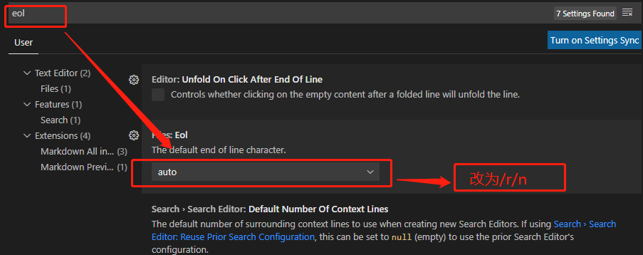
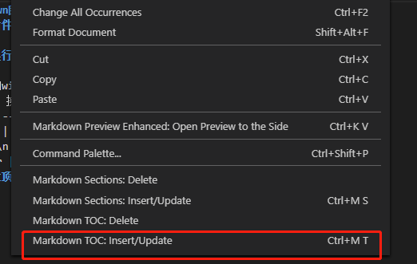
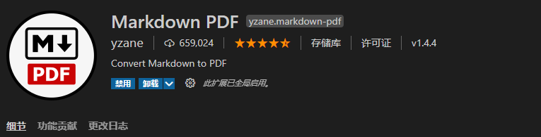
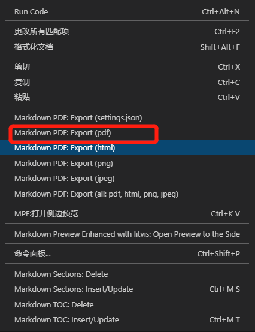

<!-- TOC -->

- [1.markdown自动生成目录插件](#1markdown自动生成目录插件)
  - [1.引入插件markdown TOC](#1引入插件markdown-toc)
  - [2.设置换行符](#2设置换行符)
  - [3.在文章顶部右单击](#3在文章顶部右单击)
  - [4.最终显示效果如下](#4最终显示效果如下)
- [2.markdown转pdf插件](#2markdown转pdf插件)
  - [2.1 安装插件Markdown PDF](#21-安装插件markdown-pdf)
  - [2.2 安装完成之后，右单击我们要转换的markdown文件](#22-安装完成之后右单击我们要转换的markdown文件)

<!-- /TOC -->

# 1.markdown自动生成目录插件
## 1.引入插件markdown TOC

## 2.设置换行符

此处是设置的windows系统，其他系统请参考此处
|  系统   | 换行符  |
|  ----  | ----  |
| windows  | \n\r |
| unix  | \n |
| mac  | \r |
## 3.在文章顶部右单击

## 4.最终显示效果如下

# 2.markdown转pdf插件
## 2.1 安装插件Markdown PDF

## 2.2 安装完成之后，右单击我们要转换的markdown文件
