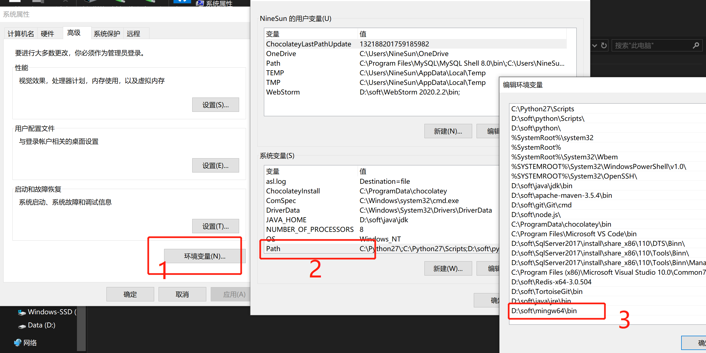
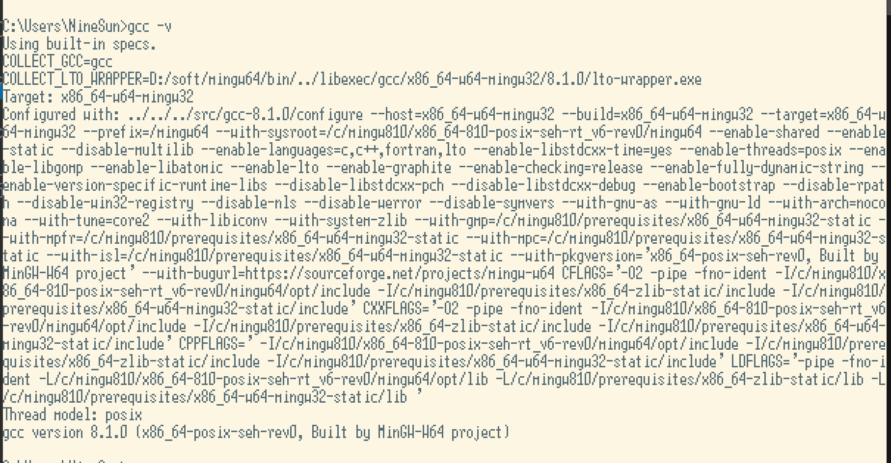
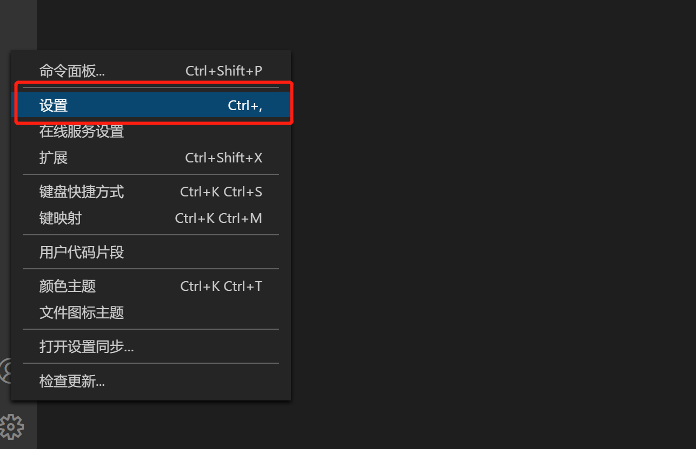
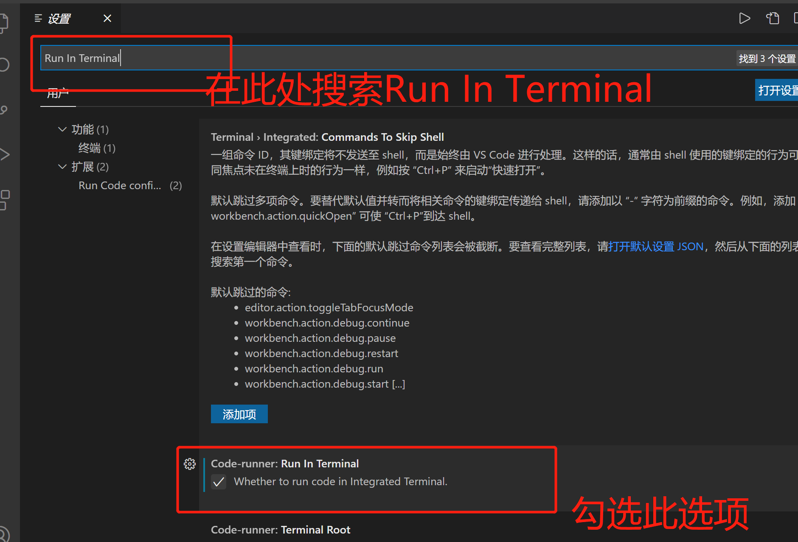
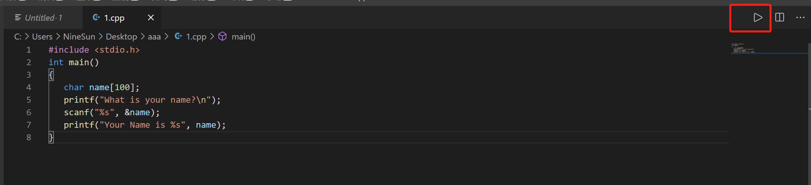
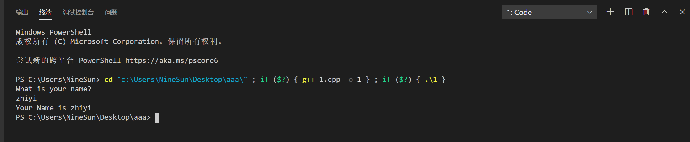

# 1.安装配置c/c++编译环境mingw-w64
## 1.1 下载c++的编译环境mingw-w64
[点击此处下载](http://zhiyitec.top:2000/downLoad/mingw64.zip)
## 1.2 配置mingw-w64
### 1.2.1 解压刚刚下载的文件
### 1.2.2 配置环境变量
> 在path中添加刚刚解压文件的bin目录


### 1.2.3 检测环境变量是否配置成功
> 在cmd中输入gcc -v，若出现以下信息说明配置成功
>  

# 2.下载vscode相应的插件
> * chinese(simplified)
> * C/C++
> * Code Runner
> * C/C++ Clang Command Adapter
# 3.配置vscode的控制台输出


# 4.测试
我们再本地新建一个1.cpp文件，用vscode开，复制以下代码：
``` c
#include <stdio.h>
int main()
{
   char name[100];
   printf("What is your name?\n");
   scanf("%s", &name);
   printf("Your Name is %s", name);
}
```
点击运行按钮

运行效果如下


