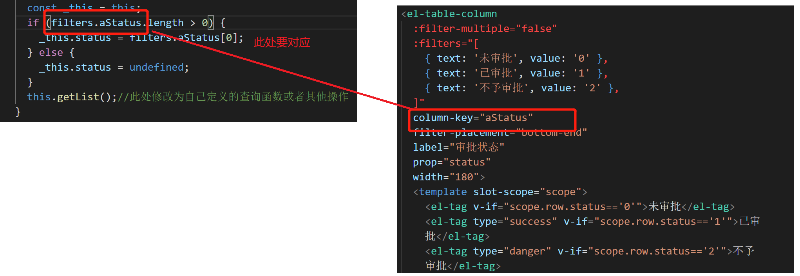
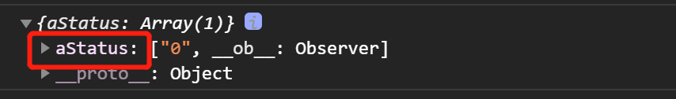
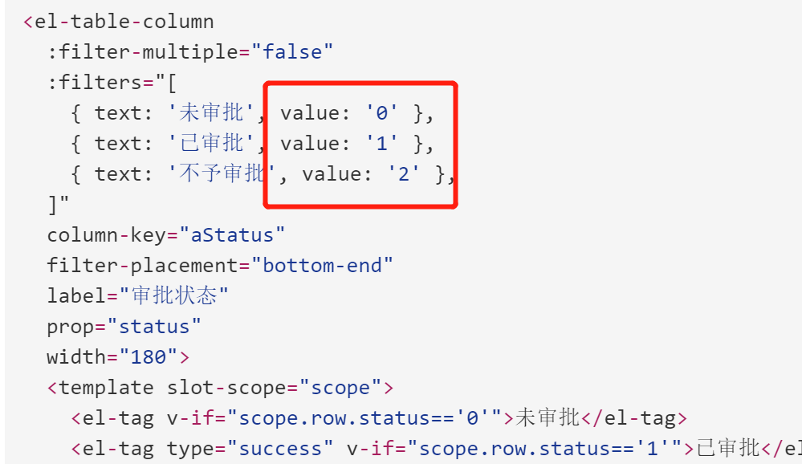
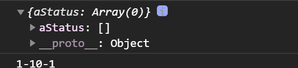

我们在使用element ui中的table自定筛选条件时只能筛选当页数据而无法检索所有数据，这是因为我们把筛选条件定义在列上
所以我们把filter-change绑定在最外部即el-table上，如下所示
``` html
<el-table
  :data="bookRoomList"
  :ref="bookRoomList"
  @filter-change="handleFilterChange"
  class="bookTable"
  max-height="100%"
  stripe>
```
此时我们还需要在对应的筛选列上面定义一个column-key来作为筛选的监听状态
``` html
<el-table-column
  :filter-multiple="false"
  :filters="[
    { text: '未审批', value: '0' },
    { text: '已审批', value: '1' },
    { text: '不予审批', value: '2' },
  ]"
  column-key="aStatus"
  filter-placement="bottom-end"
  label="审批状态"
  prop="status"
  width="180">
  <template slot-scope="scope">
    <el-tag v-if="scope.row.status=='0'">未审批</el-tag>
    <el-tag type="success" v-if="scope.row.status=='1'">已审批</el-tag>
    <el-tag type="danger" v-if="scope.row.status=='2'">不予审批</el-tag>
  </template>
</el-table-column>
```
对应的handleFilterChange事件如下：
``` js
handleFilterChange(filters) {
  console.log(filters)
  const _this = this;
  if (filters.aStatus.length > 0) {
    _this.status = filters.aStatus[0];
  } else {
    _this.status = undefined;
  }
  this.getList();//此处修改为自己定义的查询函数或者其他操作
}
```

控制台打印的filters如下：

其中aStatus就是filters对应的value值

当选择全部或重置时filters.aStatus就是空数组

至此一个表格的分页不能筛选全部的问题就迎刃而解