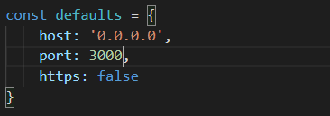
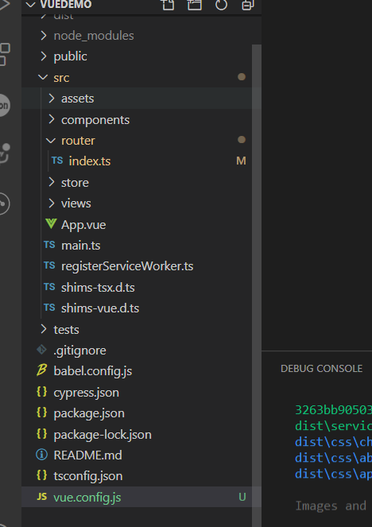
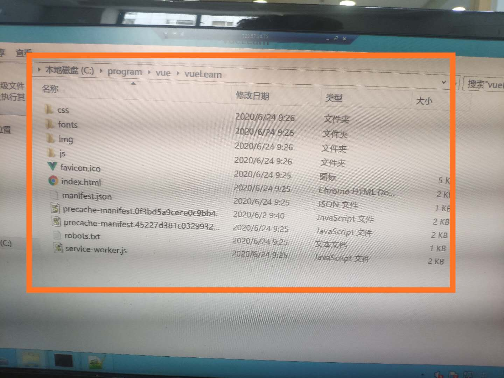
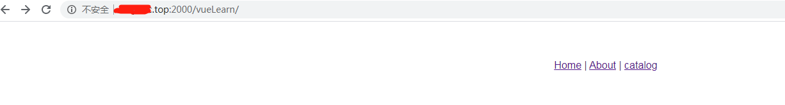

<!-- TOC -->

- [1.创建项目](#1创建项目)
- [2.修改项目端口号](#2修改项目端口号)
- [3.打包部署到nginx服务器](#3打包部署到nginx服务器)
  - [3.1 首先在根目录下创建vue.config.js](#31-首先在根目录下创建vueconfigjs)
  - [3.2 使用命令打包](#32-使用命令打包)
  - [3.3 如果为安装部署nginx，参考此处](#33-如果为安装部署nginx参考此处)
  - [3.4 nginx的静态资源的分离，参考此处](#34-nginx的静态资源的分离参考此处)
  - [3.5 将dist目录下的文件放在你nginx指定的目录下，在浏览器访问即可](#35-将dist目录下的文件放在你nginx指定的目录下在浏览器访问即可)

<!-- /TOC -->
# 1.创建项目
[参考此处](https://www.jianshu.com/p/5e13bc2eb97c)
# 2.修改项目端口号
在 node_modules/@vue/cli-service/lib/commands/serve.js文件中修改，如下图所示

# 3.打包部署到nginx服务器
## 3.1 首先在根目录下创建vue.config.js
``` js
module.exports = {
    publicPath: process.env.NODE_ENV === 'production' ?
        './' :
        '/'
}
```

## 3.2 使用命令打包
``` xml
npm run build
```
生成的文件在dist目录下，此时生成的文件是不可以直接访问的，需要部署在http服务器下，所以我们借助nginx来进行部署。
## 3.3 如果为安装部署nginx，[参考此处](https://blog.csdn.net/zhiyikeji/article/details/104262522)
## 3.4 nginx的静态资源的分离，[参考此处](https://blog.csdn.net/zhiyikeji/article/details/105048892)
## 3.5 将dist目录下的文件放在你nginx指定的目录下，在浏览器访问即可
nginx的配置：

dist文件对应的目录:

在浏览器访问路径：
