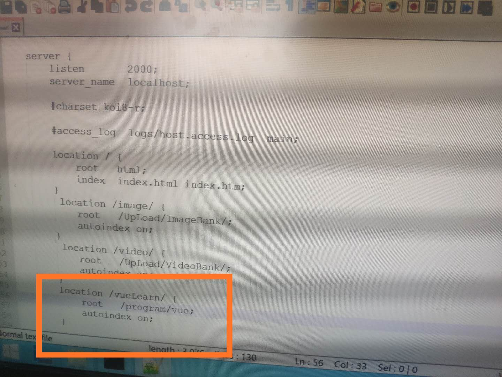
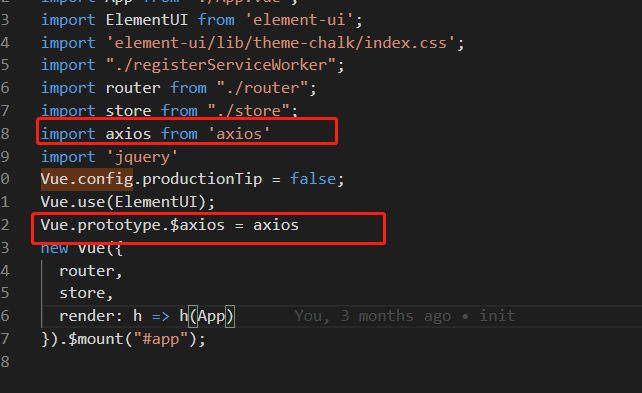

<!-- TOC -->

- [1.创建项目](#1创建项目)
- [2.修改项目端口号](#2修改项目端口号)
- [3.打包部署到nginx服务器](#3打包部署到nginx服务器)
  - [3.1 首先在根目录下创建vue.config.js](#31-首先在根目录下创建vueconfigjs)
  - [3.2 使用命令打包](#32-使用命令打包)
  - [3.3 如果为安装部署nginx，参考此处](#33-如果为安装部署nginx参考此处)
  - [3.4 nginx的静态资源的分离，参考此处](#34-nginx的静态资源的分离参考此处)
  - [3.5 将dist目录下的文件放在你nginx指定的目录下，在浏览器访问即可](#35-将dist目录下的文件放在你nginx指定的目录下在浏览器访问即可)
- [4. 引入jquery](#4-引入jquery)
  - [4.1 首先使用指令安装jquery](#41-首先使用指令安装jquery)
  - [4.2 在main.ts进行引用](#42-在maints进行引用)
  - [4.3 在vue.config.js文件中添加以下配置](#43-在vueconfigjs文件中添加以下配置)
  - [4.4 具体如何使用](#44-具体如何使用)
- [5.部署至tomcat 服务器](#5部署至tomcat-服务器)
  - [5.1 在服务器上的Tomcat的 webapps文件夹下,新建一个文件夹如：vueservice](#51-在服务器上的tomcat的-webapps文件夹下新建一个文件夹如vueservice)
  - [5.2 将我们打包好的dist目录中的文件放在刚刚新建的文件夹下，注意打包方式与部署至nginx服务器方式一致，注意打包后对index.html的修改，参考3.打包部署到nginx服务器](#52-将我们打包好的dist目录中的文件放在刚刚新建的文件夹下注意打包方式与部署至nginx服务器方式一致注意打包后对indexhtml的修改参考3打包部署到nginx服务器)
  - [5.3 启动tomcat服务器，访问路径如下：http://localhost:8083/vueservice/](#53-启动tomcat服务器访问路径如下httplocalhost8083vueservice)
- [6.解决vue部署至服务器刷新非主页面404问题](#6解决vue部署至服务器刷新非主页面404问题)
  - [6.1 路由配置是history模式，所以我们将history模式去掉](#61-路由配置是history模式所以我们将history模式去掉)
- [7.vue组件引用js文件的函数](#7vue组件引用js文件的函数)
  - [7.1 我们在util.js文件中创建了一个函数，而我们要想在组件中使用这个函数，则必须使用export进行导出](#71-我们在utiljs文件中创建了一个函数而我们要想在组件中使用这个函数则必须使用export进行导出)
  - [7.2 具体在组件中的使用](#72-具体在组件中的使用)
  - [7.3 引用css文件](#73-引用css文件)
- [8.配置跨域](#8配置跨域)
  - [8.1 首先引入axios](#81-首先引入axios)
  - [8.2 在main.ts(main.js)文件中进行引入](#82-在maintsmainjs文件中进行引入)
  - [8.3 配置跨域](#83-配置跨域)
  - [8.4 具体如何使用](#84-具体如何使用)
- [9.解决‘vue-cli-service' 不是内部或外部命令，也不是可运行的程序或批处理文件的报错](#9解决vue-cli-service-不是内部或外部命令也不是可运行的程序或批处理文件的报错)
  - [9.1 解决办法](#91-解决办法)
- [10.引入echarts](#10引入echarts)
  - [1.使用指令下载所需要的库](#1使用指令下载所需要的库)
  - [2.在main.js（或者main.ts）文件中进行引用](#2在mainjs或者maints文件中进行引用)
- [11.推荐一款日期格式化插件 moment](#11推荐一款日期格式化插件-moment)
  - [11.1 安装](#111-安装)
  - [11.2 在使用的页面进行引用](#112-在使用的页面进行引用)
  - [11.3 如何使用](#113-如何使用)
- [12.vue路由设置](#12vue路由设置)
  - [12.1 配置页面带参数的跳转](#121-配置页面带参数的跳转)
    - [12.1.1 传参](#1211-传参)
    - [12.1.2 接受参数](#1212-接受参数)
  - [12.2 消除地址栏路由参数](#122-消除地址栏路由参数)

<!-- /TOC -->
# 1.创建项目
[参考此处](https://www.jianshu.com/p/5e13bc2eb97c)
# 2.修改项目端口号
在 node_modules/@vue/cli-service/lib/commands/serve.js文件中修改，如下图所示

# 3.打包部署到nginx服务器
## 3.1 首先在根目录下创建vue.config.js
``` js
module.exports = {
    publicPath: process.env.NODE_ENV === 'production' ?
        './' :
        '/'
}
```

## 3.2 使用命令打包
``` xml
npm run build
```
生成的文件在dist目录下，此时生成的文件是不可以直接访问的，需要部署在http服务器下，所以我们借助nginx来进行部署。
## 3.3 如果为安装部署nginx，[参考此处](https://blog.csdn.net/zhiyikeji/article/details/104262522)
## 3.4 nginx的静态资源的分离，[参考此处](https://blog.csdn.net/zhiyikeji/article/details/105048892)
## 3.5 将dist目录下的文件放在你nginx指定的目录下，在浏览器访问即可
nginx的配置：

dist文件对应的目录:

在浏览器访问路径：

# 4. 引入jquery
## 4.1 首先使用指令安装jquery
``` js
npm install jquery --save
```
## 4.2 在main.ts进行引用
``` js
import 'jquery'
```

## 4.3 在vue.config.js文件中添加以下配置
``` js
// 引入jq需要加入以下代码
const webpack = require('webpack')

  chainWebpack: config => {
        config.plugin('provide').use(webpack.ProvidePlugin, [{
            $: 'jquery',
            jquery: 'jquery',
            jQuery: 'jquery',
            'window.jQuery': 'jquery'
        }])
    }
```

注意：若没有vue.config.js，则需要自己新建一个该文件
   
下面贴出vue.config.js的代码
``` js
// 引入jq需要加入以下代码
const webpack = require('webpack')
module.exports = {
    publicPath: process.env.NODE_ENV === 'production' ?
        './' : '/',
    devServer: {
        port: 3000, //前台代理端口
        proxy: {
            '/vue': {
                target: 'http: //localhost:2000', //后台接口
                ws: true, //如果要代理websockets
                secure: false, // 使用的是http协议则设置为false，https协议则设置为true
                changeOrigin: true, //将选项changeOrigin设置true为基于名称的虚拟托管站点。
                pathRewrite: {
                    '^/vue': '/vue'
                }
            }
        }
    },
    chainWebpack: config => {
        config.plugin('provide').use(webpack.ProvidePlugin, [{
            $: 'jquery',
            jquery: 'jquery',
            jQuery: 'jquery',
            'window.jQuery': 'jquery'
        }])
    }


}
```
## 4.4 具体如何使用
在你要使用的页面中添加
``` js
import $ from "jquery";
```
  
# 5.部署至tomcat 服务器
## 5.1 在服务器上的Tomcat的 webapps文件夹下,新建一个文件夹如：vueservice
 
## 5.2 将我们打包好的dist目录中的文件放在刚刚新建的文件夹下，注意打包方式与部署至nginx服务器方式一致，注意打包后对index.html的修改，参考[3.打包部署到nginx服务器]()
## 5.3 启动tomcat服务器，访问路径如下：http://localhost:8083/vueservice/
注意：此处的http://localhost:8083/vueservice/中vueservice要与你自己创建的文件夹的名字一致
 
# 6.解决vue部署至服务器刷新非主页面404问题
## 6.1 路由配置是history模式，所以我们将history模式去掉
打开 router/index.ts，删除mode: "history"
 
# 7.vue组件引用js文件的函数
## 7.1 我们在util.js文件中创建了一个函数，而我们要想在组件中使用这个函数，则必须使用export进行导出
``` util.js
export function getFileType(fileName) {
    var index = fileName.indexOf(".");
    var type = fileName.substr(index + 1);
    return type;
}
```
## 7.2 具体在组件中的使用
``` js
import {getFileType} from "../../assets/js/util.js";
```
注意必须要使用{}进行处理


## 7.3 引用css文件
``` js
@import "../../assets/css/common.css";
```

# 8.配置跨域
## 8.1 首先引入axios
``` js
npm install --save axios vue-axios
```
## 8.2 在main.ts(main.js)文件中进行引入
``` js
import axios from 'axios'
Vue.prototype.$axios = axios
```

注意：使用axios时直接使用 this.$axios即可
## 8.3 配置跨域
在vue.config.js文件中添加以下代码，注意：若没有vue.config.js参考本文第四章创建此文件
``` js
   proxy: {
            '/api': {
                target: 'http://localhost:8088', //你要跨域的网址  比如  'http://news.baidu.com',
                // secure: true, // 如果是https接口，需要配置这个参数
                changeOrigin: true, //这个参数是用来回避跨站问题的，配置完之后发请求时会自动修改http header里面的host，但是不会修改别的
                pathRewrite: {
                    '^/api': '/api' //路径的替换规则
                        //这里的配置是正则表达式，以/api开头的将会被用用‘/api’替换掉，假如后台文档的接口是 /api/list/xxx
                        //前端api接口写：axios.get('/api/list/xxx') ， 被处理之后实际访问的是：http://news.baidu.com/api/list/xxx
                }
            }
        }
```

## 8.4 具体如何使用
``` js
   testCross() {
      console.log("aaaaaaaaaaa");
      this.$axios({
        method: "post",
        url: "http://localhost:8088/campusGang/test/test1",
         data: {
    firstName: 'Fred',
    lastName: 'Flintstone'
  }
        headers: {
          "Content-Type": "application/x-www-form-urlencoded; charset=UTF-8",
        },
      }).then((res) => {
        console.log(res);
      }).catch((error)=>{
        console.log(error)
      });
    },
```
# 9.解决‘vue-cli-service' 不是内部或外部命令，也不是可运行的程序或批处理文件的报错

## 9.1 解决办法
将项目里的“node_modules”文件夹删除，然后运行npm run i,如果没有这个文件夹就直接运行npm run i，运行结束之后重新npm run serve即可
# 10.引入echarts
## 1.使用指令下载所需要的库
``` js
npm install echarts -S
```
## 2.在main.js（或者main.ts）文件中进行引用
``` js
// 引入echarts
import echarts from 'echarts'
Vue.prototype.$echarts = echarts
```
# 11.推荐一款日期格式化插件 moment
## 11.1 安装
``` js
npm install moment --save
```
## 11.2 在使用的页面进行引用
```
import moment from "moment";
```

## 11.3 如何使用
```js
 this.startTime=moment(this.startTime).format("YYYY-MM-DD HH:mm:ss")
```
此时日期就会格式化为如2020-10-28 15:28:21
# 12.vue路由设置
## 12.1 配置页面带参数的跳转
### 12.1.1 传参
``` html
<router-link :to="{path: 'apple', query: {color: 'red' }}"> to apple</router-link>
```
### 12.1.2 接受参数
``` js
var color=this.$route.query.color
```
## 12.2 消除地址栏路由参数
* 方法1：
``` js
let path = this.$route.path; //先获取路由路径
this.$router.push(path); //再跳转路由路径，query参数没带过去，所以被清除了
```
* 方法2：
``` js
this.$router.push({ query: {} });
```