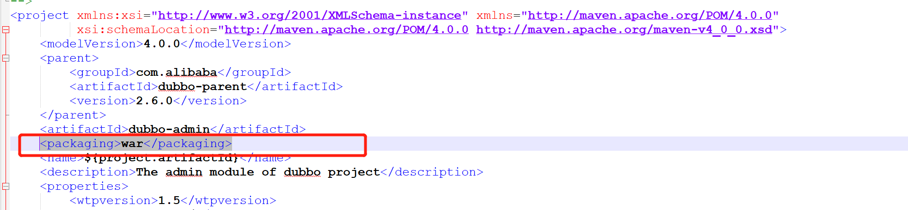
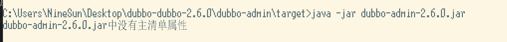
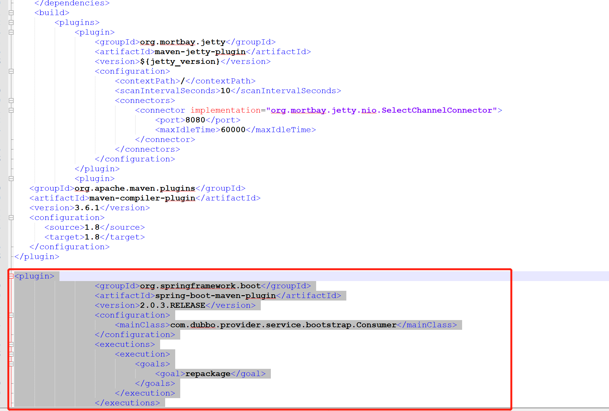

# 1.我们将war包改为jar包很简单，只需修改
```xml
<packaging>war</packaging>
```
将其改为
```xml
<packaging>jar</packaging>
```

即可，但是在我们在运行时可能会出现以下错误

此时做法也很简单，只需添加一个插件即可
``` xml
<plugin>
                <groupId>org.springframework.boot</groupId>
                <artifactId>spring-boot-maven-plugin</artifactId>
                <version>2.0.3.RELEASE</version>
                <configuration>
                    <mainClass>com.dubbo.provider.service.bootstrap.Consumer</mainClass>
                </configuration>
                <executions>
                    <execution>
                        <goals>
                            <goal>repackage</goal>
                        </goals>
                    </execution>
                </executions>
            </plugin>
```

然后重新打包即可,打包命令：
``` xml
mvn  package -Dmaven.skip.test=true
```