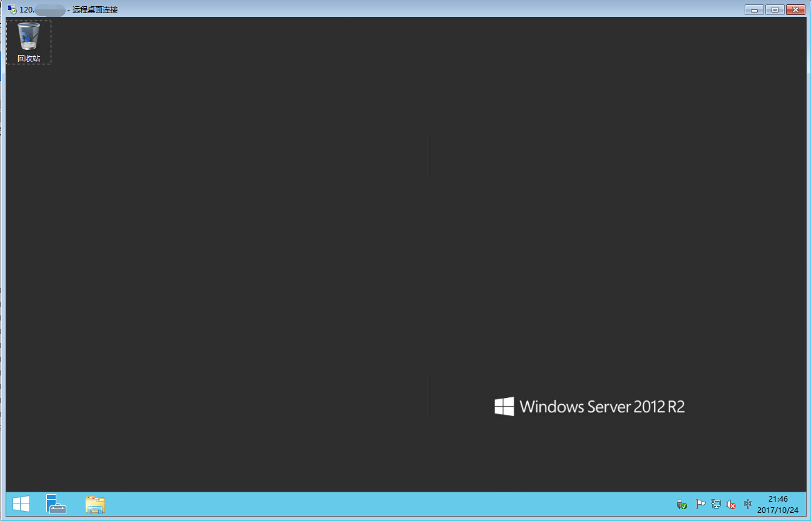

# 1.WIN键+R键，输入mstsc，并回车，打开远程桌面连接工具

# 2.在远程桌面连接工具的计算机和用户名中分别填入服务器的IP地址和用户名（默认为administrator），并点击连接

# 3.提示需要输入密码，请按照正确的密码输入，并点击 确定 。

注：若忘记密码，点击[重置服务器密码](https://help.aliyun.com/document_detail/60055.html?spm=5176.10173289.0.0.1c8b2e77ys8Z4O)
# 4.第一次连接服务器，可能会提示证书错误，选中“不再询问……”并 点击 是 信任证书

# 5.连接成功之后就可以看到Windows的远程桌面了。
