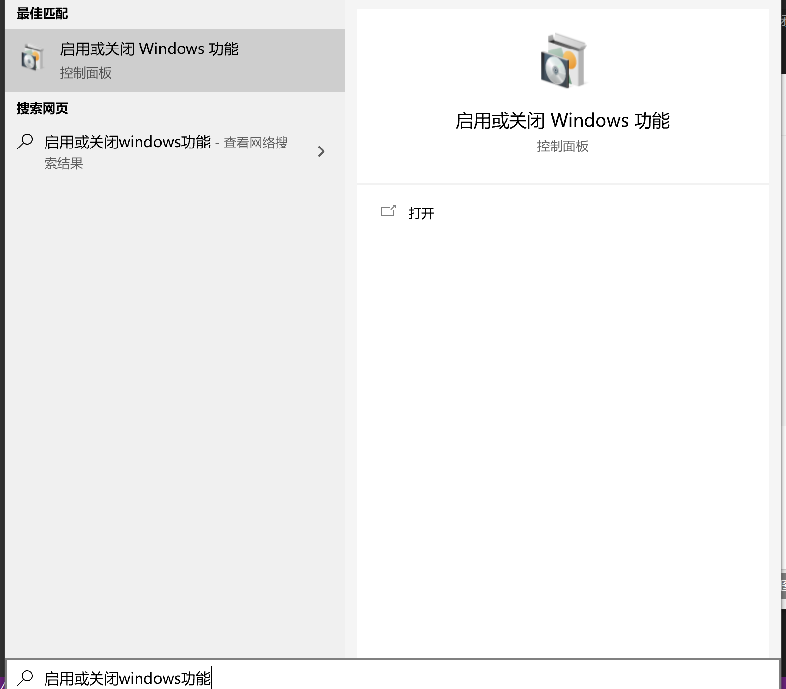
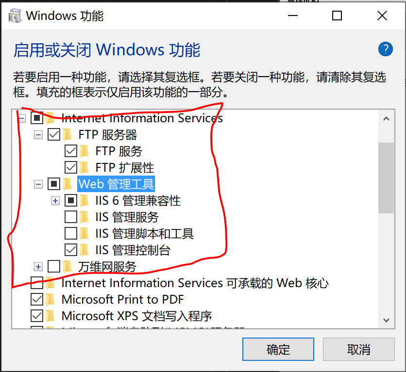
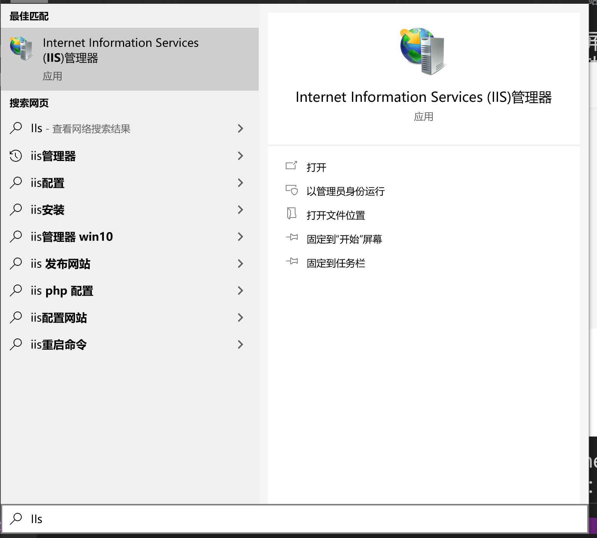
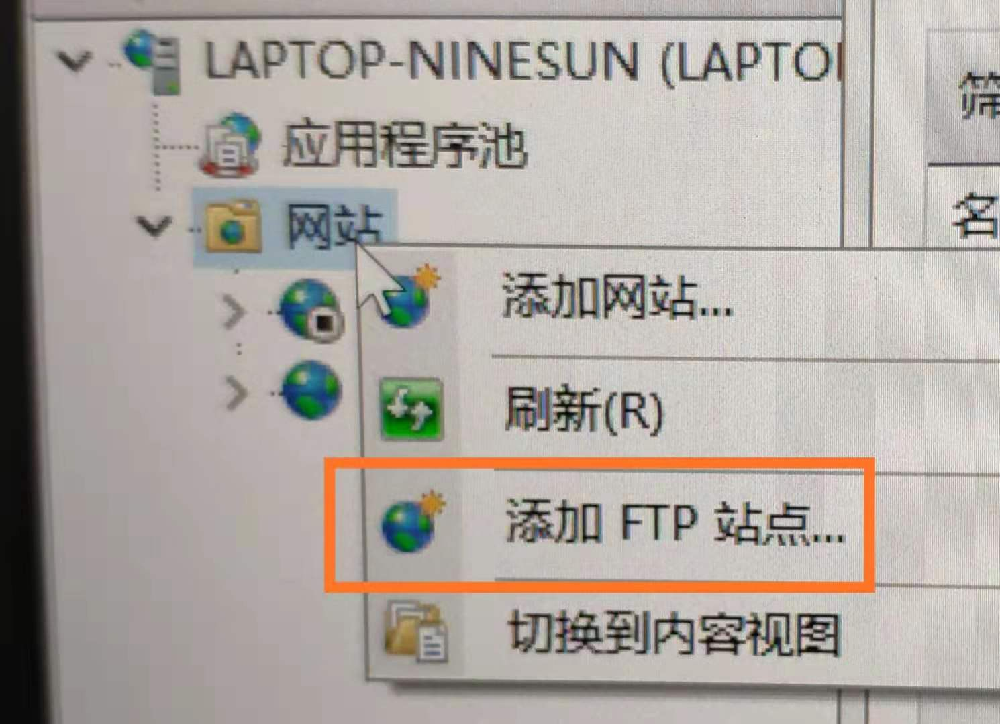

# 1.在开始屏幕的搜索中输入“启用或关闭windows功能”

# 2.在Internet Information Service中打开如下几项：

# 3.点击确定 完成配置之后，在开始屏幕中搜索“IIS”

# 4.右单击“网站”

# 5.输入“站点名称”，以及配置路径（注：名称随意起一个，路径选一个与服务器上相同的文件路径）

# 6.点击“下一步”，按照下图提示，设置“绑定和SSL设置”，在“IP地址”处，可以用内网IP也可以用外网IP，访客自然也就根据你的IP设定来决定;

# 7.点击“下一步”，设置“身份验证和授权信息”

# 8.设置完以后，点击“完成”，即可在左栏“网站”下看到“多了一个你设置的FTP站点”

# 9.然后在浏览器地址栏中输入“ftp://填写的IP”进行测试
