# 2010
## 1.适用类型：适用于感谢对方接待自己并且要求对方回访以回馈对方接待
### 1.1.真题回顾：
> You have just come back from the U.S. as a member of a Sino-American cultural
exchange program. Write a letter to your American colleague to     
1 Express your thanks for his/her warm reception;    
2 Welcome him/her to visit China in due course.
### 1.2.作文模板
> My Dear Friend,   
##### $\color{#FF0000}{第一段叙述收信人的热情接待，并对此表达感激之情}$
> I  would  like to convey my heartfelt thanks to you for your kindness to receive me when I participated in an exchange program in USA.Your generous help made it possible that I had a very pleasant stay and a chance to know American cultures better. Besides, I think it is an honor for me to make friends with you and I will cherish the goodwill you showed to me wherever I go.
##### $\color{#FF0000}{第二段邀请收信人来中国餐参观，以此回报先前的 热情款待}$
> Additionally, I highly welcome you to com to Chinan in due course so that I can reciprocate your hospitality.I promise you a fantastic visit  ,through which you may gain a deep insight into Chinese culture .Look forward to you visit.
# 2011
## 2.适用类型：祝贺信，适用于以长辈或者前辈的身份恭喜对方以及提建议
### 2.1.真题回顾：
> Suppose your cousin Li Ming has just been admitted to a university. Write him/her a letter to   
1 congratulate him/her, and    
2 give him/her suggestions on how to get prepared for university life.
### 2.2.作文模板
> My Dear Friend,   
##### $\color{#FF0000}{第一段对对方表示祝贺}$
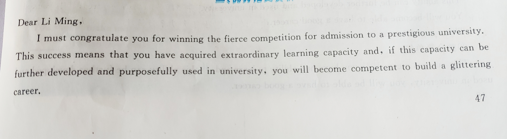
##### $\color{#FF0000}{第二段提建议}$
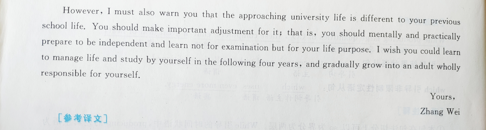
### 2.3.翻译
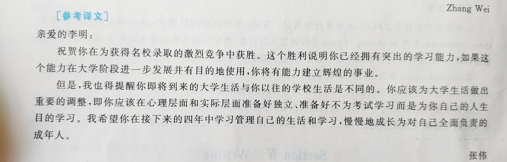
# 2012
## 3.适用类型：投诉建议类
### 3.1.真题回顾：
> Suppose you have found something wrong with the electronic dictionary that you bought from an onlin store the other day ,Write an email to the customer service center to   
1)make a complaint and   
2)demand a prompt solution
### 3.2.作文模板  
##### $\color{#FF0000}{第一段说明要投诉的问题以及解决方案}$
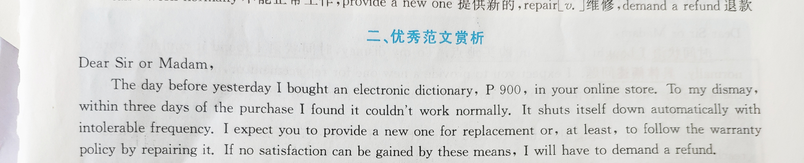
##### $\color{#FF0000}{第二段要求别人联系，说出联系方式}$
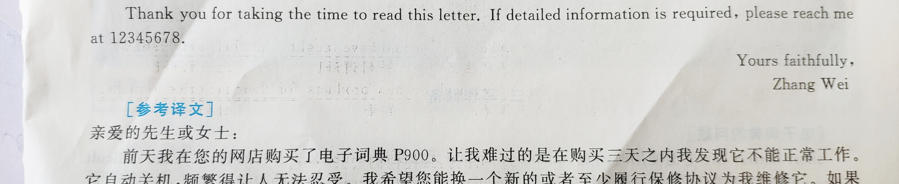
### 3.3.翻译
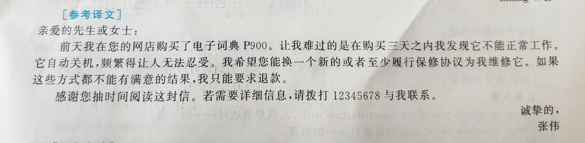
# 2013
## 4.适用类型：邀请信，用于邀请对方参加某种活动
### 4.1.真题回顾：
>Suppose your class is to hold a charity sale foe kids in need of help. Write your
classmates an email to    
1 inform them about the details and encourage them to participate .    
2 Don ’ t use your own name, use “ Li Ming ” instead. Don ’ t write your
address.(10 points)
### 4.2.作文模板  
##### $\color{#FF0000}{第一段说明活动举办的时间和地点以及举办该活动的目的}$
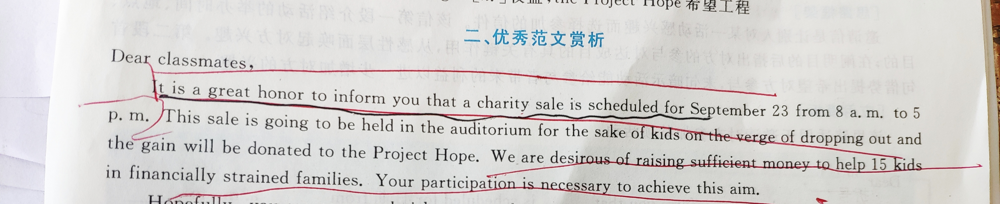
##### $\color{#FF0000}{第二段提出希望对方参加}$
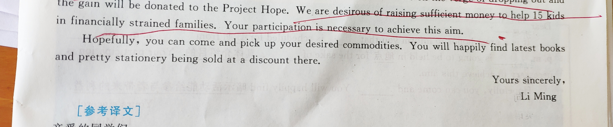
### 4.3.翻译
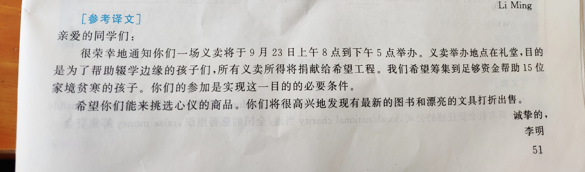
# 2014
## 5.适用类型：自我介绍
### 5.1.真题回顾：
>Directions: Suppose you are going to study abroad and share an apartment with John, a local student. Write him to email to   
1)tell him about your living habits, and   
2)ask for advice about living there.
### 5.2.作文模板  
##### $\color{#FF0000}{第一段表示自己很高兴，并提出初步了解的意义}$
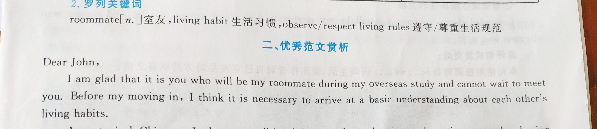
##### $\color{#FF0000}{第二段对自己的情况进行介绍}$
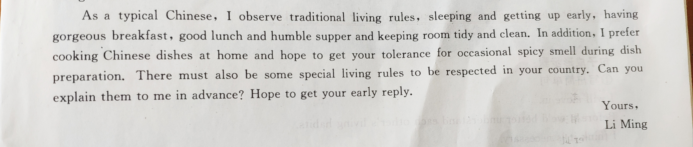
### 5.3.翻译
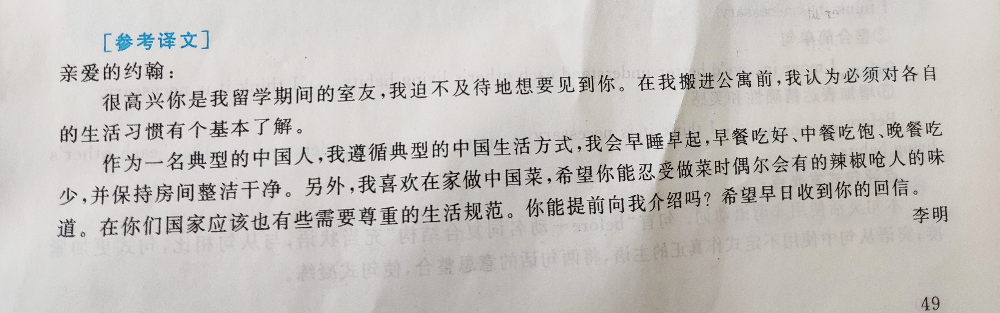
# 2015
## 6.适用类型：招募启事 用于招募志愿者或者职员
### 6.1.真题回顾：
>Suppose your university is going to host a summer camp for high school students. Write a
notice to    
1 briefly introduce the camp activities, and    
2 call for volunteers.    
You should write about 100 words on the ANSWER SHEET.    
Do not use your name or the name of your university.    
Do not write your address. (10 points)    
### 6.2.作文模板  
##### $\color{#FF0000}{第一段首先提出招募对象以及对招募方的介绍}$
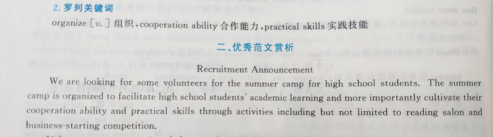
##### $\color{#FF0000}{第二段指出对招募对象的要求以及联系方式}$
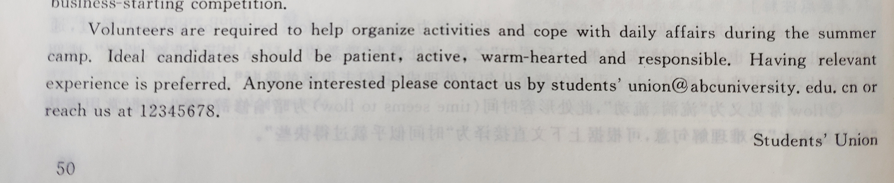
### 6.3.翻译
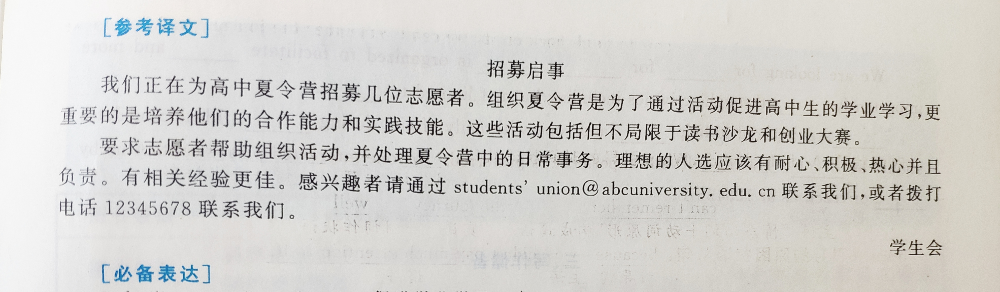
# 2016
## 7.适用类型：建议信 用于针对别人的问题提出自己建议
### 7.1.真题回顾：
>Suppose you won a translation contest and your friend Jack wrote an email to congratulate you,
and ask advice on translation. Write him a reply to     
1 thank him;     
2 give your advice.     
You should write neatly on the ANWSER SHEET. Do not sign you own name at the end of the letter, use “Li Ming ” instead.        
Do not write the address .(10 point)          
### 7.2.作文模板  
##### $\color{#FF0000}{第一段首先表达感谢，简述事由}$
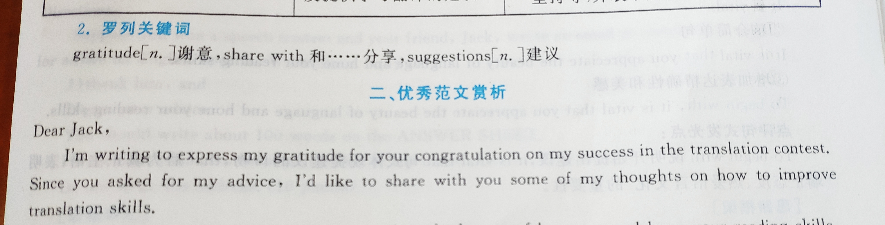
##### $\color{#FF0000}{第二段根据自身的经历提出感悟和建议}$
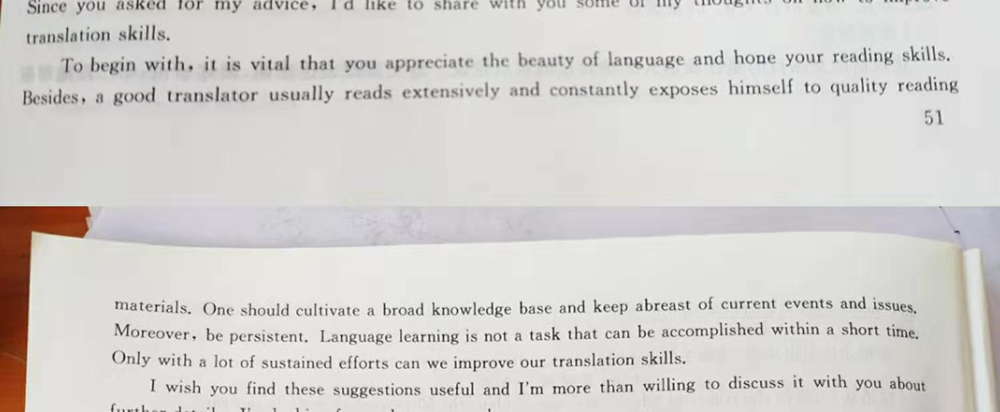
##### $\color{#FF0000}{第三段重申目的，并表示期待}$
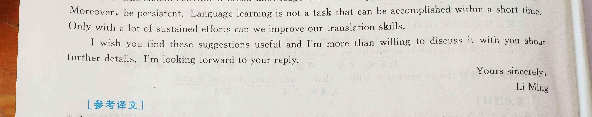
### 7.3.翻译
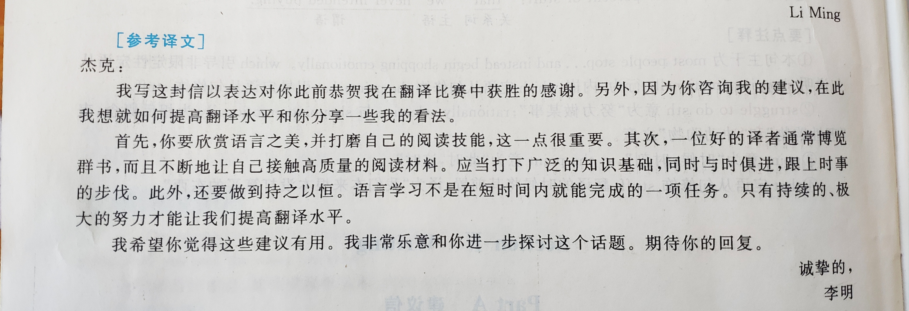
# 2017
## 8.适用类型：接受讲座邀请等回信
### 8.1.真题回顾：
>Suppose you are invited by Professor Williams to give a presentation about Chinese culture to a group of international students. Write a reply to      
1 Accept the invitation, and      
2 Introduce the key points of your presentation.             
### 8.2.作文模板  
##### $\color{#FF0000}{第一段首先表示已收到邀请，并接受邀请}$
##### $\color{#FF0000}{第二段明确讲座主题，并讲述主题内容}$
##### $\color{#FF0000}{第三段表达感谢，并表示期待见面}$
### 8.3.模板和翻译
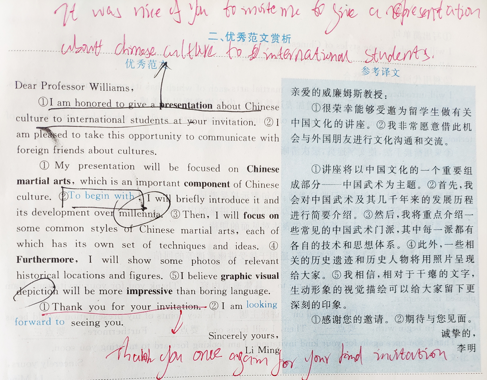
# 2018
## 9.适用类型：道歉信 用于由于某些原因无法出席活动等回信
### 9.1.真题回顾：
>Suppose you have to cancel your travel plan and will not be able to visit Professor
Smith. Write him an email to     
1 Apologize and explain the situation, and     
2 Suggest a future meeting            
### 9.2.作文模板  
##### $\color{#FF0000}{第一段首先说明道歉事由，并表示歉意}$
##### $\color{#FF0000}{第二段明确讲座主题，并讲述主题内容}$
##### $\color{#FF0000}{第三段表达感谢，并表示期待见面}$
### 9.3.模板和翻译
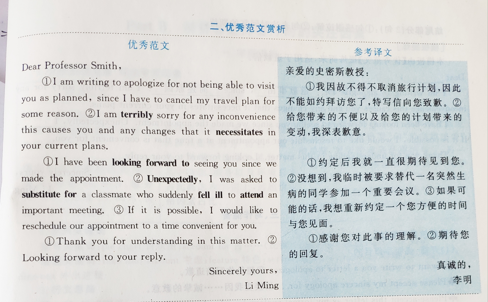
# 2019
## 10.适用类型：建议信 用于建议某项活动
### 10.1.真题回顾：
>Suppose Professor Smith asked you to plan a debate on the theme of city traffic. Write him an email to       
1 suggest a specific topic with your reasons, and       
2 tell him about your arrangements.          
### 10.2.作文模板  
##### $\color{#FF0000}{第一段首先说明活动准备情况，并引出讨论的话题}$
##### $\color{#FF0000}{第二段对这个话题进行解释，并说明带来的意义}$
##### $\color{#FF0000}{第三段说明辩论赛比赛的时间地点，并表示期待}$
### 9.3.模板和翻译
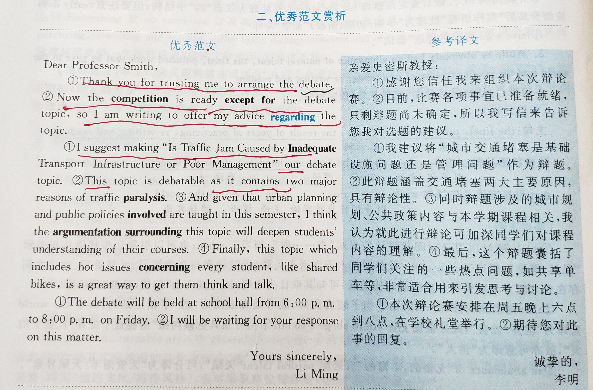