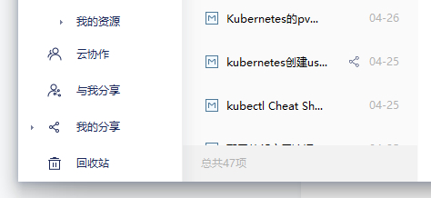

# 1.打开有道云安装的目录,找到 theme 目录下的 build.xml 文件，比如我的就是：

> C:\Program Files (x86)\Youdao\YoudaoNote\theme\build.xml

# 2.去除文章列表底部广告：

## 2.1 搜索 AdWraperMid, 找到如下代码块:

```xml
<AdWraperMid type="panel" css="public" dockstyle="bottom" visible="false" bounds="0,0,0,161">
```

修改成如下部分:

```xml
<AdWraperMid type="panel" css="public" dockstyle="bottom" visible="false" bounds="0,0,0,0">
```

> 其实就是修改了第一行末尾的 bounds="0,0,0,161" 为 bounds="0,0,0,0"，来隐藏广告位窗口。

# 3.去除左下角广告:

## 3.1 搜索 PanelAd, 找到如下代码块，<PanelAd 这一行的 ass="mainform panelclient PanelAd" 删除即可:

```xml
<PanelAd type="adpanel" css="public" ass="mainform panelclient PanelAd">
```

修改成如下部分:

```xml
<PanelAd type="adpanel" css="public">
```

然后保存文件，重启软件。
看下效果，如果你的左下角也是这样，那就成功了：

