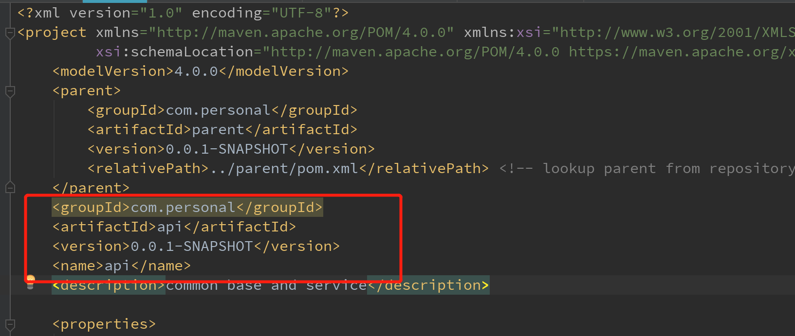
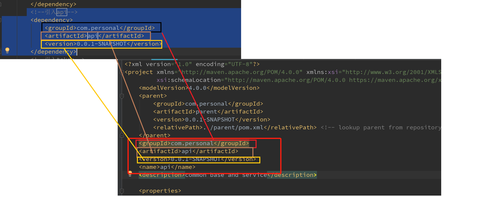
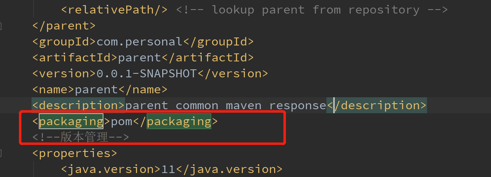
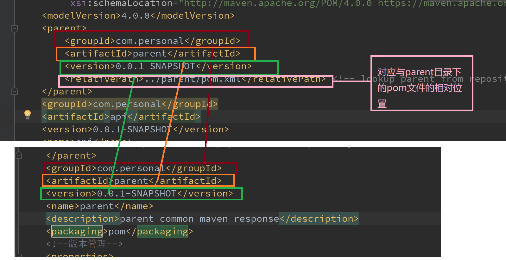

# 1.两个项目之间的互相引用：
现在我们有两个项目，一个是api,一个是indentity，我们现在需要在indentity中引入api
api:

则在indetinty中引入方式为：
``` xml
 <!--引入api-->
        <dependency>
            <groupId>com.cloud</groupId>
            <artifactId>api</artifactId>
            <version>0.0.1-SNAPSHOT</version>
        </dependency>
```
对应方式如下：

如果我们再添加另一项目的maven依赖后发现仍然不起作用，在对引入该jar包的项目进行编译时会出现“找不到程序包”的错误。这是由于一般作为jar包被引入其他项目，说明是公共模块代码，不需要单独部署。此时应该将该项目的pom.xml中如下内容去掉：
``` java
	<build>
		<plugins>
		<!--被引入的spring boot jar 包不能引入此plugin ，否则引入此jar包的项目编译时会报 找不到程序包 的错误-->
			<!--<plugin>-->
				<!--<groupId>org.springframework.boot</groupId>-->
				<!--<artifactId>spring-boot-maven-plugin</artifactId>-->
			<!--</plugin>-->
		</plugins>
	</build>
```
去掉这个插件之后重新打包即可
# 2.使用另外一个项目作为父级项目来进行版本管理：
先解释以下版本管理的声明依赖dependencyManagement：
> dependencyManagement里只是声明依赖，并不实现引入，因此子项目需要显式的声明需要用的依赖。如果不在子项目中声明依赖，是不会从父项目中继承下来的；只有在子项目中写了该依赖项，并且没有指定具体版本，才会从父项目中继承该项，并且version和scope都读取自父pom;另外如果子项目中指定了版本号，那么会使用子项目中指定的jar版本。

现在有两个项目：parent和api,其中parent作为父级，api来继承父级的项目
parent:
``` xml
<?xml version="1.0" encoding="UTF-8"?>
<project xmlns="http://maven.apache.org/POM/4.0.0" xmlns:xsi="http://www.w3.org/2001/XMLSchema-instance"
         xsi:schemaLocation="http://maven.apache.org/POM/4.0.0 https://maven.apache.org/xsd/maven-4.0.0.xsd">
    <modelVersion>4.0.0</modelVersion>
    <parent>
        <groupId>org.springframework.boot</groupId>
        <artifactId>spring-boot-starter-parent</artifactId>
        <version>2.3.4.RELEASE</version>
        <relativePath/> <!-- lookup parent from repository -->
    </parent>
    <groupId>com.personal</groupId>
    <artifactId>parent</artifactId>
    <version>0.0.1-SNAPSHOT</version>
    <name>parent</name>
    <description>parent common maven response</description>
    <packaging>pom</packaging>
    <!--版本管理-->
    <properties>
        <java.version>11</java.version>
        <jackson.databind.version>2.7.4</jackson.databind.version>
        <jackson.core.version>2.7.4</jackson.core.version>
        <jackson.core.annotations>2.7.4</jackson.core.annotations>
    </properties>
    <!--依赖声明-->
    <dependencyManagement>
        <dependencies>
            <!--jackson-->
            <dependency>
                <groupId>com.fasterxml.jackson.core</groupId>
                <artifactId>jackson-databind</artifactId>
                <version>${jackson.databind.version}</version>
                <exclusions>
                    <exclusion>
                        <groupId>com.fasterxml.jackson.core</groupId>
                        <artifactId>jackson-core</artifactId>
                    </exclusion>
                    <exclusion>
                        <groupId>com.fasterxml.jackson.core</groupId>
                        <artifactId>jackson-annotations</artifactId>
                    </exclusion>
                </exclusions>
            </dependency>
            <dependency>
                <groupId>com.fasterxml.jackson.core</groupId>
                <artifactId>jackson-core</artifactId>
                <version>${jackson.core.version}</version>
            </dependency>
            <dependency>
                <groupId>com.fasterxml.jackson.core</groupId>
                <artifactId>jackson-annotations</artifactId>
                <version>${jackson.core.annotations}</version>
            </dependency>

        </dependencies>
    </dependencyManagement>
    <dependencies>
        <dependency>
            <groupId>org.springframework.boot</groupId>
            <artifactId>spring-boot-starter</artifactId>
        </dependency>

        <dependency>
            <groupId>org.springframework.boot</groupId>
            <artifactId>spring-boot-starter-test</artifactId>
            <scope>test</scope>
            <exclusions>
                <exclusion>
                    <groupId>org.junit.vintage</groupId>
                    <artifactId>junit-vintage-engine</artifactId>
                </exclusion>
            </exclusions>
        </dependency>
    </dependencies>
    <build>
        <plugins>
            <!--<plugin>-->
                <!--<groupId>org.springframework.boot</groupId>-->
                <!--<artifactId>spring-boot-maven-plugin</artifactId>-->
            <!--</plugin>-->
        </plugins>
    </build>
</project>
```
注意：parent的打包方式要改为pom方式

在api中继承：
``` xml
<?xml version="1.0" encoding="UTF-8"?>
<project xmlns="http://maven.apache.org/POM/4.0.0" xmlns:xsi="http://www.w3.org/2001/XMLSchema-instance"
         xsi:schemaLocation="http://maven.apache.org/POM/4.0.0 https://maven.apache.org/xsd/maven-4.0.0.xsd">
    <modelVersion>4.0.0</modelVersion>
    <parent>
        <groupId>com.personal</groupId>
        <artifactId>parent</artifactId>
        <version>0.0.1-SNAPSHOT</version>
        <relativePath>../parent/pom.xml</relativePath> <!-- lookup parent from repository -->
    </parent>
    <groupId>com.personal</groupId>
    <artifactId>api</artifactId>
    <version>0.0.1-SNAPSHOT</version>
    <name>api</name>
    <description>common base and service</description>

    <properties>
        <java.version>11</java.version>
    </properties>

    <dependencies>
        <dependency>
            <groupId>org.springframework.boot</groupId>
            <artifactId>spring-boot-starter</artifactId>
        </dependency>

        <dependency>
            <groupId>org.springframework.boot</groupId>
            <artifactId>spring-boot-starter-test</artifactId>
            <scope>test</scope>
            <exclusions>
                <exclusion>
                    <groupId>org.junit.vintage</groupId>
                    <artifactId>junit-vintage-engine</artifactId>
                </exclusion>
            </exclusions>
        </dependency>
        <!--jackson-->
        <dependency>
            <groupId>com.fasterxml.jackson.core</groupId>
            <artifactId>jackson-databind</artifactId>
        </dependency>
        <dependency>
            <groupId>com.fasterxml.jackson.core</groupId>
            <artifactId>jackson-core</artifactId>
        </dependency>
        <dependency>
            <groupId>com.fasterxml.jackson.core</groupId>
            <artifactId>jackson-annotations</artifactId>
        </dependency>


    </dependencies>

    <build>
        <plugins>
            <!--<plugin>-->
                <!--<groupId>org.springframework.boot</groupId>-->
                <!--<artifactId>spring-boot-maven-plugin</artifactId>-->
            <!--</plugin>-->
        </plugins>
    </build>

</project>
```
对应方式：

