<!-- TOC -->

- [1.python的基本语法元素](#1python的基本语法元素)
  - [1.1.python程序语法元素分析](#11python程序语法元素分析)
    - [1.1.1 命名规则](#111-命名规则)
    - [1.1.2 print函数的格式化](#112-print函数的格式化)
    - [1.1.3 eval函数](#113-eval函数)
- [2.python的基本图形绘制](#2python的基本图形绘制)
  - [2.1 python蟒蛇的绘制](#21-python蟒蛇的绘制)
    - [2.1.1 引入绘图库 turtle](#211-引入绘图库-turtle)
      - [1.turtle空间坐标体系](#1turtle空间坐标体系)
        - [绝对坐标](#绝对坐标)
        - [海龟坐标](#海龟坐标)
      - [2.turtle的角度坐标体系](#2turtle的角度坐标体系)
        - [1.绝对角度](#1绝对角度)
        - [2.海龟角度](#2海龟角度)

<!-- /TOC -->
# 1.python的基本语法元素
## 1.1.python程序语法元素分析
### 1.1.1 命名规则
> 大小写字母 数字 下划线 汉字等字符及其组合

注意：命名区分大小写，首字符不能是数字，且不能与保留字相同
保留字：被编程语言内部定义并保留使用的标识符,python内部的保留字如下：
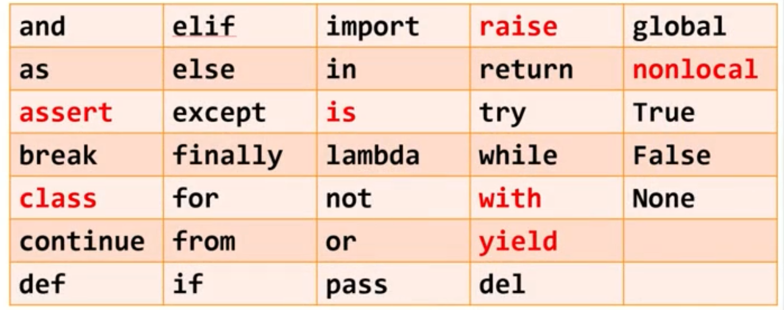
### 1.1.2 print函数的格式化
``` python
print("转换后的温度为：{:.2f}C".format(F))
```
{:.2f}表示将变量C填充到这个位置时取小数点后两位
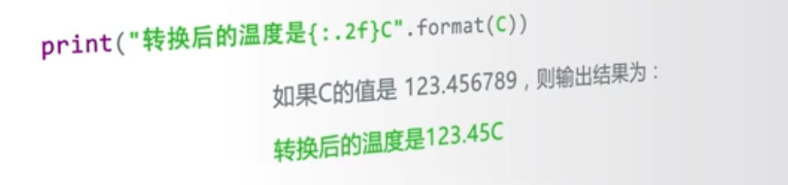
### 1.1.3 eval函数
作用：去掉参数最外侧引号并执行余下语句的函数
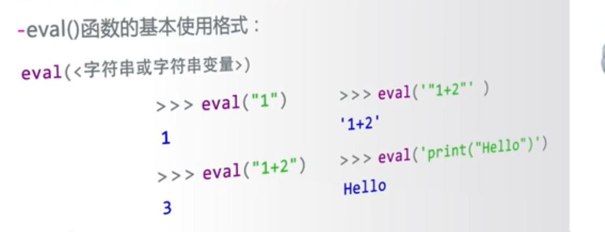
# 2.python的基本图形绘制
## 2.1 python蟒蛇的绘制
### 2.1.1 引入绘图库 turtle
``` python
import turtle
```
```python

```
* 1.turtle.setup
turtle.setup(650, 350, 200, 200)
> 用于设置启动窗体的大小以及位置
650:绘图窗体本身的宽度
350:绘图窗体本身的高度
200:相对于屏幕左上角的x坐标
300:相对于屏幕左上角y轴的坐标
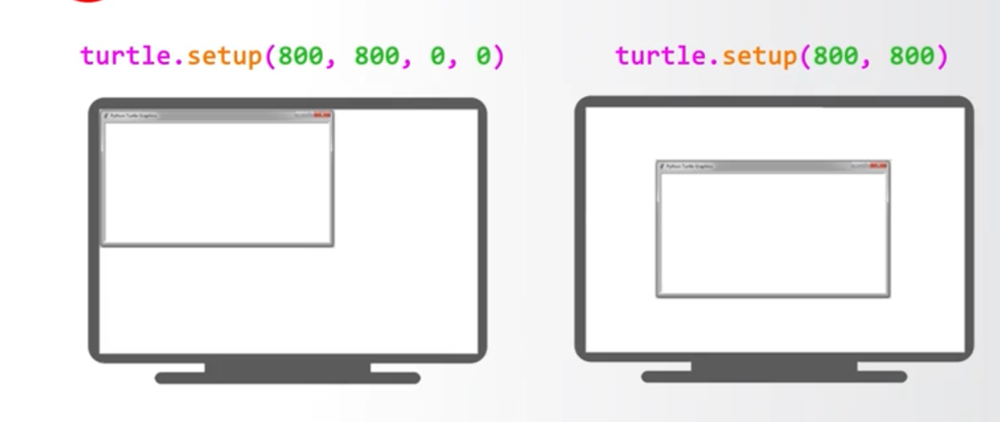
#### 1.turtle空间坐标体系
##### 绝对坐标
* turtle.goto(x,y)
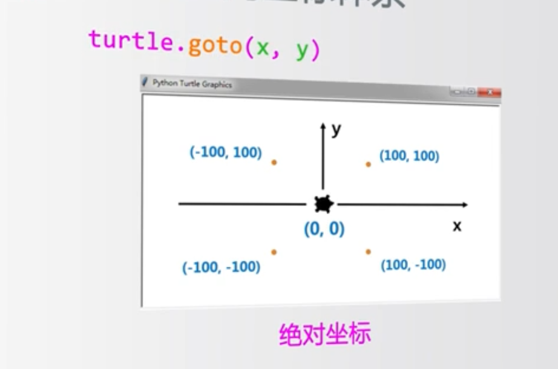
下面具体解释一下turtle.goto
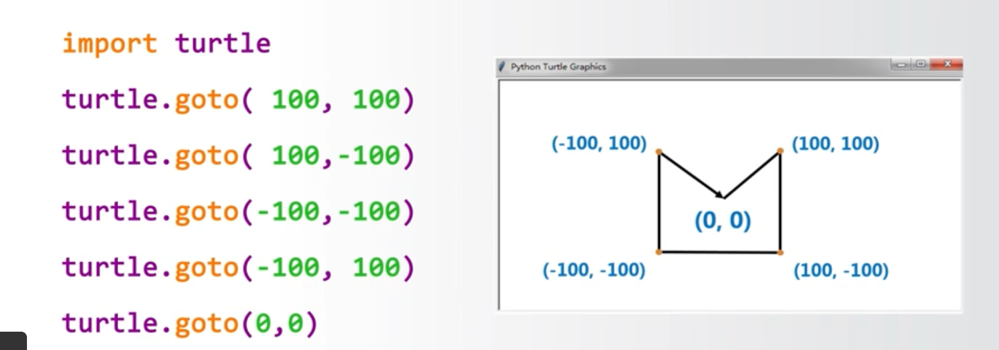
表示从(0,0)->(100,100)->(100,-100)->(-100,100)->(-100,-100)->(-100,100)->(0,0)
##### 海龟坐标
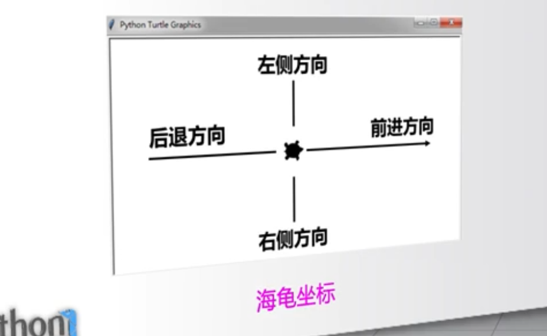
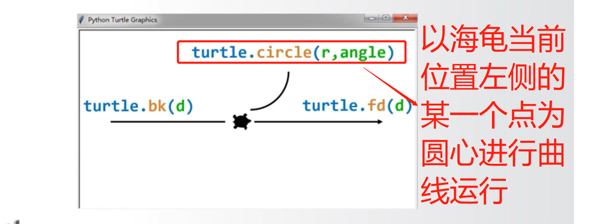
#### 2.turtle的角度坐标体系
##### 1.绝对角度
* turtle.seth(angle):
> 只改变海龟的行进方向，但是不行进
> angle为绝对度数
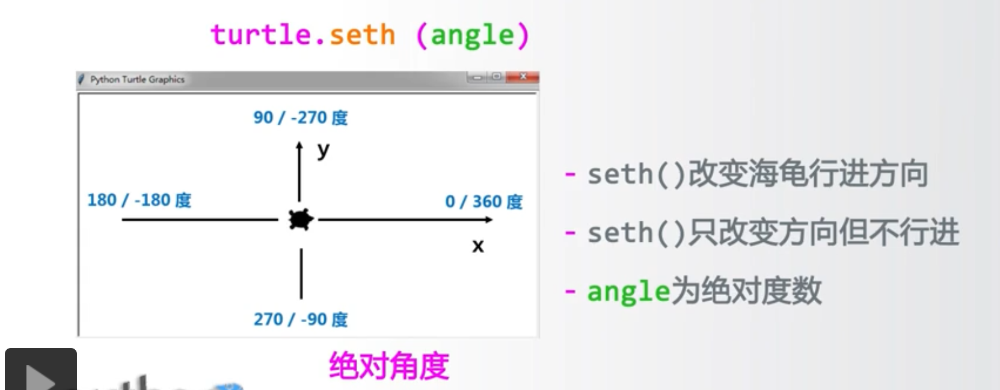
##### 2.海龟角度
* turtle.left
* turtle.right
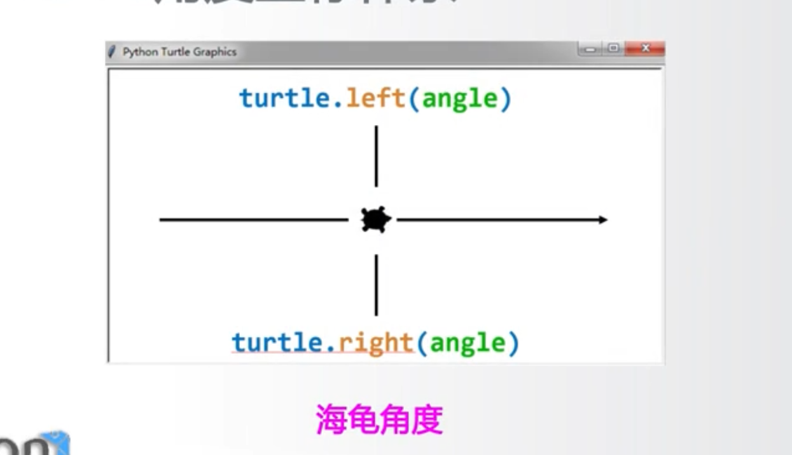
demo:
``` python
import turtle
turtle.left(45)
turtle.fd(150)
turtle.right(135)
turtle.fd(300)
turtle.left(135)
turtle.fd(150)
turtle.done()
```
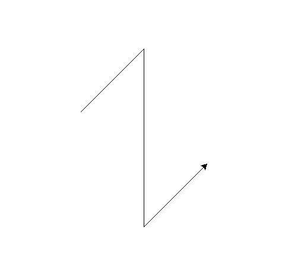