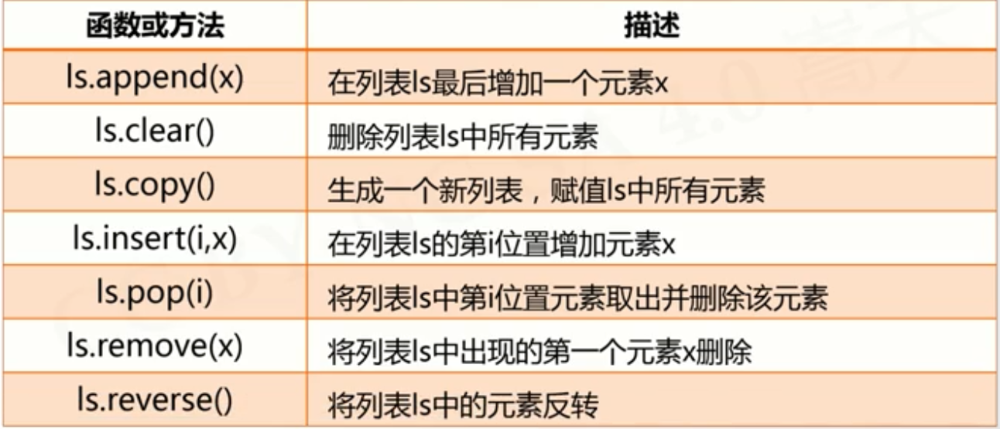
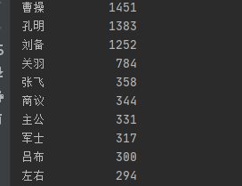

<!-- TOC -->

- [1.python的基本语法元素](#1python的基本语法元素)
  - [1.1.python程序语法元素分析](#11python程序语法元素分析)
    - [1.1.1 命名规则](#111-命名规则)
    - [1.1.2 print函数的格式化](#112-print函数的格式化)
    - [1.1.3 eval函数](#113-eval函数)
- [2.python的基本图形绘制](#2python的基本图形绘制)
  - [2.1 python蟒蛇的绘制](#21-python蟒蛇的绘制)
    - [2.1.1 引入绘图库 turtle](#211-引入绘图库-turtle)
      - [1.turtle空间坐标体系](#1turtle空间坐标体系)
        - [绝对坐标](#绝对坐标)
        - [海龟坐标](#海龟坐标)
      - [2.turtle的角度坐标体系](#2turtle的角度坐标体系)
        - [1.绝对角度](#1绝对角度)
        - [2.海龟角度](#2海龟角度)
  - [2.2 RGB色彩模式](#22-rgb色彩模式)
    - [1.turtle的RGB色彩模式](#1turtle的rgb色彩模式)
- [3.基本数据类型](#3基本数据类型)
  - [1.整数类型](#1整数类型)
    - [四种进制表现形式](#四种进制表现形式)
  - [2.浮点数类型](#2浮点数类型)
    - [浮点数的科学计数法](#浮点数的科学计数法)
  - [3.复数类型](#3复数类型)
  - [4.数值运算操作符](#4数值运算操作符)
    - [基本的运算操作符](#基本的运算操作符)
    - [二元操作符对应的增强赋值操作符](#二元操作符对应的增强赋值操作符)
    - [不同类型的混合运算](#不同类型的混合运算)
  - [5.数值运算函数](#5数值运算函数)
  - [6.字符串类型](#6字符串类型)
    - [1.字符串的表示方法](#1字符串的表示方法)
    - [2.字符串的序号](#2字符串的序号)
      - [1.正向递增序号和反向递减序号](#1正向递增序号和反向递减序号)
      - [2.使用[]获取字符串中的一个或多个字符](#2使用获取字符串中的一个或多个字符)
        - [1.索引](#1索引)
        - [2.切片](#2切片)
    - [3.字符串的特殊字符](#3字符串的特殊字符)
      - [1.转义符](#1转义符)
    - [4.字符串类型及操作](#4字符串类型及操作)
    - [5.字符串的处理函数](#5字符串的处理函数)
    - [6.python字符串的编码方式](#6python字符串的编码方式)
    - [7.字符串的处理方法](#7字符串的处理方法)
      - [1.字符类型及操作](#1字符类型及操作)
      - [2.字符串类型的格式化](#2字符串类型的格式化)
  - [7.time库的使用](#7time库的使用)
    - [1.time库是干嘛的](#1time库是干嘛的)
    - [2.time库的使用：](#2time库的使用)
      - [时间获取](#时间获取)
      - [时间格式化](#时间格式化)
      - [程序计时应用](#程序计时应用)
  - [8.文本进度条](#8文本进度条)
      - [1.多行输出](#1多行输出)
      - [2.单行动态刷新](#2单行动态刷新)
      - [3.文本进度条](#3文本进度条)
- [4.程序的控制结构](#4程序的控制结构)
  - [1.程序的循环结构](#1程序的循环结构)
    - [1.遍历循环](#1遍历循环)
    - [2.无限循环](#2无限循环)
    - [3.循环控制保留字](#3循环控制保留字)
  - [2.random库](#2random库)
    - [1.基本随机数函数](#1基本随机数函数)
    - [2.扩展随机数函数](#2扩展随机数函数)
    - [3.圆周率的计算](#3圆周率的计算)
- [5.函数和代码复用](#5函数和代码复用)
  - [1.函数的定义与使用](#1函数的定义与使用)
    - [1.可变参数传递](#1可变参数传递)
    - [2.函数返回值](#2函数返回值)
    - [3.局部变量和全局变量](#3局部变量和全局变量)
    - [4.lambda函数](#4lambda函数)
  - [2.七段数码管的绘制](#2七段数码管的绘制)
  - [3.代码复用与函数递归](#3代码复用与函数递归)
    - [1.n!](#1n)
    - [2.字符串翻转](#2字符串翻转)
    - [3.斐波那契数列](#3斐波那契数列)
    - [4.汉诺塔问题](#4汉诺塔问题)
  - [4.PyInstaller库的使用](#4pyinstaller库的使用)
    - [1.通过pip指令进行安装](#1通过pip指令进行安装)
    - [2.pyInstaller库的使用说明](#2pyinstaller库的使用说明)
      - [1.简单的使用](#1简单的使用)
      - [2.pyInstaller库常用参数](#2pyinstaller库常用参数)
  - [5.科赫雪花小包裹问题分析](#5科赫雪花小包裹问题分析)
- [6.组合数据类型](#6组合数据类型)
  - [1.集合类型及操作](#1集合类型及操作)
    - [1.集合的描述](#1集合的描述)
    - [2.集合操作符](#2集合操作符)
    - [3.集合的处理方法](#3集合的处理方法)
    - [4.集合类型应用场景](#4集合类型应用场景)
  - [2.序列类型及操作](#2序列类型及操作)
    - [1.序列类型的定义](#1序列类型的定义)
    - [2.序列处理函数及方法](#2序列处理函数及方法)
    - [3.元祖类型及操作](#3元祖类型及操作)
    - [4.列表类型及操作](#4列表类型及操作)
      - [1.列表的定义](#1列表的定义)
      - [2.列表常用的操作](#2列表常用的操作)
      - [3.列表常用函数](#3列表常用函数)
      - [4.实现功能](#4实现功能)
    - [5.序列类型应用场景](#5序列类型应用场景)
      - [1.数据保护](#1数据保护)
    - [6.总结](#6总结)
  - [3.“基本统计值计算“问题分析](#3基本统计值计算问题分析)
    - [1.需求](#1需求)
    - [2.如何实现](#2如何实现)
  - [4.字典类型及操作](#4字典类型及操作)
    - [1.字典类型的定义](#1字典类型的定义)
    - [2.字典处理函数及方法](#2字典处理函数及方法)
  - [5.jieba库的使用](#5jieba库的使用)
    - [1.jieba库的安装](#1jieba库的安装)
    - [2.jieba库的分词原理](#2jieba库的分词原理)
    - [3.jieba库使用说明](#3jieba库使用说明)
      - [4.常用函数](#4常用函数)
  - [6.文本词频统计](#6文本词频统计)

<!-- /TOC -->
# 1.python的基本语法元素
## 1.1.python程序语法元素分析
### 1.1.1 命名规则
> 大小写字母 数字 下划线 汉字等字符及其组合

注意：命名区分大小写，首字符不能是数字，且不能与保留字相同
保留字：被编程语言内部定义并保留使用的标识符,python内部的保留字如下：

### 1.1.2 print函数的格式化
``` python
print("转换后的温度为：{:.2f}C".format(F))
```
{:.2f}表示将变量C填充到这个位置时取小数点后两位

### 1.1.3 eval函数
作用：去掉参数最外侧引号并执行余下语句的函数

# 2.python的基本图形绘制
## 2.1 python蟒蛇的绘制
### 2.1.1 引入绘图库 turtle
``` python
import turtle
```
```python

```
* 1.turtle.setup
turtle.setup(650, 350, 200, 200)
> 用于设置启动窗体的大小以及位置
650:绘图窗体本身的宽度
350:绘图窗体本身的高度
200:相对于屏幕左上角的x坐标
300:相对于屏幕左上角y轴的坐标

#### 1.turtle空间坐标体系
##### 绝对坐标
* turtle.goto(x,y)

下面具体解释一下turtle.goto

表示从(0,0)->(100,100)->(100,-100)->(-100,100)->(-100,-100)->(-100,100)->(0,0)
##### 海龟坐标


#### 2.turtle的角度坐标体系
##### 1.绝对角度
* turtle.seth(angle):
> 只改变海龟的行进方向，但是不行进
> angle为绝对度数

##### 2.海龟角度
* turtle.left
* turtle.right

demo:
``` python
import turtle
turtle.left(45)
turtle.fd(150)
turtle.right(135)
turtle.fd(300)
turtle.left(135)
turtle.fd(150)
turtle.done()
```

## 2.2 RGB色彩模式

### 1.turtle的RGB色彩模式
默认采用小数值，可切换为整数值
``` python
turtle.colormode(mode)
```
mode:
* 1.0 RGB小数值模式
* 255 RGB整数值模式
# 3.基本数据类型
## 1.整数类型
* power(x,y):计算x的y次方
### 四种进制表现形式
* 10进制：1010，,9。-217
* 二进制：以0b或0B开头：ob010,-0B101
* 八进制：以0o或0O开头：0o123，-0O456
* 十六进制：以0x或0X开头：0x9a，-0X89
## 2.浮点数类型
注意：浮点数间运算存在不确定尾数

由于浮点数运算存在不确定尾数，所以我们可以使用round函数来对小数部分进行截取
* round(x,d):对x进行四舍五入，d是对小数截取的位数
### 浮点数的科学计数法
使用字母e或E作为幂的符号，以10位基数

<font color=#FF0000>  < a> e< b></font>表示$$
a*10^b 
$$
## 3.复数类型
如果 $$x^2=-1$$那么x的值为多少？
* 定义 $$j=\sqrt[2]{-1}$$，以此为基础，构建数学体系
* -a+bj被称为复数，其中a为实部，b为虚部
比如 z=1.23e-4+5.6e+89j
-- 实部 使用z.real获取
-- 虚部 使用z.imag获取
## 4.数值运算操作符
### 基本的运算操作符


### 二元操作符对应的增强赋值操作符

### 不同类型的混合运算
<font color=#FF0000>整数->浮点数->复数</font>
例如 123+4.0=127.0
## 5.数值运算函数


## 6.字符串类型
### 1.字符串的表示方法
* 由一对单引号或双引号表示，但是这种表示方法仅仅能表示单行字符串
* 由一对三单引号或三双引号来表示，可以用来表示多行字符串
注意：由三单引号或三双引号表示的字符串若无变量引用则会被当做注释处理
``` python
a='''
这是多行字符串
你知道吗你
'''
print(a)
```
### 2.字符串的序号
#### 1.正向递增序号和反向递减序号

#### 2.使用[]获取字符串中的一个或多个字符
##### 1.索引
返回字符串中的单个字符 
``` python
b="请输入带有符号的温度值"
print(b[0])
print("请输入带有符号的温度值"[0])
```
输入结果：
##### 2.切片
返回字符串中的一段字符子串
``` python
b="请输入带有符号的温度值"
print(b[0:-1])
print("请输入带有符号的温度值"[1:3])
```
输出结果：
**字符串切片的高级用法:**
* <字符串>[M:N],<font color=#FF0000>  M缺失表示至开头 </font>，<font color=#808080>  N缺失表示至结尾 </font>   
```python
c="零一二三四五六七八九十"
print(c[:3])
```
输出结果：
* <字符串>[M:N:K] 根据步长K对字符串进行切片
``` python
c="零一二三四五六七八九十"
print(c[1:8:2])
```
输出结果：
表示从第一位开始到第八位前结束，每次增加2的步长
字符串逆序：<字符串>[::-1] 表示从开头至结尾，步长为-1表示从后往前逐个的取出数据
``` python
c="零一二三四五六七八九十"
d=c[::-1]
print(d)
```
输出结果：
### 3.字符串的特殊字符
#### 1.转义符
\
* 1.转义符表示特定字符的本意
``` python
e = "这里有个双引号\""
print(e)
```
输出结果：
* 2.转义符形成一些组合，表达一些不可打印的含义

| 转义符 | 表示含义               |
| ------ | ---------------------- |
| \b     | 回退                   |
| \n     | 换行                   |
| \r     | 回车（光标移到本行首） |
### 4.字符串类型及操作
| 操作符及使用 | 描述                                  |
| ------------ | ------------------------------------- |
| x+y          | 连接两个字符串x和y                    |
| n*x 或 x*n   | 复制n次子字符串                       |
| x in s       | 如果x是s的子串，返回true否则返回false |
``` python
weekStr="星期一星期二星期三星期四星期五星期六星期日"
weekId=eval(input("请输入星期数字（1-7）："))
pos=(weekId-1)*3
print(weekStr[pos:pos+3])
```
或
``` python
weekStr="一二三四五六日"
weekId=eval(input("请输入星期数字（1-7）："))
print("星期"+weekStr[weekId-1])
```
输出结果：
### 5.字符串的处理函数
| 函数及使用     | 描述                                                                                 |
| -------------- | ------------------------------------------------------------------------------------ |
| len(x)         | 长度，返回字符串x的长度，len("123456")—结果为6                                       |
| str(x)         | 任意类型的x对应的字符串的形式，str(3.14)—对应结果为1.23 str([1,2]) 对应结果为"[1,2]" |
| hex(x)或oct(x) | 整数x的十六进制或八进制小写形式字符串 hex(425)结果为"0x1a9" oct(425)结果为"0o651"    |
| chr(x)         | x为unicode编码，返回其对应的字符                                                     |
| ord(x)         | x为字符，返回对应的unicode编码                                                       |

### 6.python字符串的编码方式
* 统一字符编码，即覆盖几乎所有字符的编码方式
* 从0到1114111(Ox10FFFF)空间，每个编码对应一个字符
* Python字符串中每个字符都是Unicode编码字符
``` python
for i in range(12):
    print(chr(9800+i))
```
### 7.字符串的处理方法
#### 1.字符类型及操作
| 方法及使用                   | 描述                                                                                                     |
| ---------------------------- | -------------------------------------------------------------------------------------------------------- |
| str.lower()或 str.upper()    | 返回字符串的副本，全部字符小写/大写 "AbCdEfGh". lower()结果为"abcdefgh"                                  |
| str.split(sep=None)          | 返回一个列表，由str根据sep被分隔的部分组成 "A,B,C".split(",")结果为['A','B' , 'C']                       |
| str.count(sub)               | 返回子串sub在str中出现的次数  "a apple a day" .count("a") 结果为4                                        |
| str.replace(old, new)        | 返回字符串str副本，所有old子串被替换为new   "python".replace(""n" , "n123.io")结果为"python123.io"       |
| str.center(width[,fillchar]) | 字符串str根据宽度width居中，fillchar可选"python".center(20,"=")结果为 '=======python======='             |
| str.strip(chars)             | 从str中去掉在其左侧和右侧chars中列出的字符 "= python= ".strip(" =np")结果为"ytho"                        |
| str.join(iter)               | 在iter变量除最后元素外每个元素后增加一个str   " , ".join("12345")结果为 "1,2,3,4,5”#主要用于字符串分隔等 |
#### 2.字符串类型的格式化
格式化是对字符串进行格式表达的方式
<模板字符串>.format(<逗号分隔的参数>).


## 7.time库的使用
### 1.time库是干嘛的
time库是Python中处理时间的标准库
* 计算机时间的表达
* 提供获取系统时间并格式化输出功能
* 提供系统级精确计时功能，用于程序性能分析
### 2.time库的使用：
``` python
import time
time.<b>()
```
time库包括三类函数：
* 时间获取: time() ctime() gmtime()
* 时间格式化: strftime() strptime(）
* 程序计时: sleep(), perf_counter()
#### 时间获取
| 函数     | 描述                                                                                                                                                                                   |
| -------- | -------------------------------------------------------------------------------------------------------------------------------------------------------------------------------------- |
| time()   | 获取当前时间戳，即计算机内部时间值，浮点数  <br>>>>time.time()<br>输入结果：1516939876.6022282                                                                                         |
| ctime()  | 获取当前时间并以易读方式表示，返回字符串 <br> >>>time.ctime()<br> 输出结果：'Fri Jan 26 12:11:16 2018'                                                                                 |
| gmtime() | 获取当前时间，表示为计算机可处理的时间格式<br> >>time.gmtime()<br> time.struct_time(tm_year=2018，tm_mon=1,tm_mday=26,tm_hour=4, tm_min=11, tm_sec=16,tm_wday=4,tm_yday=26,tm_isdst=0) |
#### 时间格式化

| 函数               | 描述                                                                                                                                                                                                                                                                            |
| ------------------ | ------------------------------------------------------------------------------------------------------------------------------------------------------------------------------------------------------------------------------------------------------------------------------- |
| strftime(tpl, ts)  | tpl是格式化模板字符串，用来定义输出效果ts是计算机内部时间类型变量<br>>>>t = time.gmtime()<br>>>>time.strftime("%Y-%m-%d %H:%M:%S",t)<br>'2018-01-26 12:55:20'                                                                                                                   |
| strptime(str, tpl) | str是字符串形式的时间值<br>tpl是格式化模板字符串，用来定义输入效果<br>>>>timeStr = '2018-01-26 12:55:20'<br>>>>time.strptime(timeStr，"%Y-%m-%d %H:%M:%S")<br>time.struct_time(tm_year=2018,tm_mon=1,tm_mday=26,tm_hour=4, tm_min=11,tm_sec=16,tm_wday=4, tm_yday=26,m_isdst=0) |


#### 程序计时应用
程序计时是指测量起止动作所经历时间的过程
* 测量时间:time.perf_counter()
* 产生时间：time.sleep()

| 函数           | 描述                                                                                                                                                                                                                                              |
| -------------- | ------------------------------------------------------------------------------------------------------------------------------------------------------------------------------------------------------------------------------------------------- |
| perf_counter() | 返回一个CPU级别的精确时间计数值，单位为秒<br>由于这个计数值起点不确定，连续调用差值才有意义<br>>>>start = time.perf_counter()<br> 318.66599499718114<br>>>>end = time.perf_counter()<br>341.3905185375658<br>>>>end - start<br>22.724523540384666 |
| sleep(s)       | s拟休眠的时间，单位是秒，可以是浮点数<br>>>>def wait():<br>time.sleep(3.3)<br>>>>wait() #程序将等待3.3秒后再退出                                                                                                                                  |
## 8.文本进度条
#### 1.多行输出
``` python
import time
scale = 10
print("---------开始执行---------")
for i in range(scale + 1):
    a = '*' * i
    b = '.' * (scale - i)
    c = (i / scale) * 100
    print("{:^3.0f}%[{}->{}]".format(c, a, b))
    time.sleep(0.1)
print("---------执行结束---------")

```
输出结果：
#### 2.单行动态刷新
* 刷新的本质是：用后打印的字符覆盖之前的字符
* 不能换行：print()需要被控制
* 要能回退：打印之后的光标回到之前的位置 \r

``` python
import time
for i in range(101):
    print("\r{:3}%".format(i), end="")
    time.sleep(0.1)
```
输出结果：
#### 3.文本进度条
``` python
import time
scale = 50
print("执行开始".center(scale // 2, "-"))
start = time.perf_counter()
for i in range(scale + 1):
    a = "*" * i
    b = "." * (scale - 1)
    c = (i / scale) * 100
    dur = time.perf_counter() - start
    print("\r{:^3.0f}%[{}->{}]{:.2f}s".format(c, a, b, dur), end="")
    time.sleep(0.1)
print("\n" + "执行结果".center(scale // 2, "-"))
```
输出结果：
# 4.程序的控制结构
## 1.程序的循环结构
### 1.遍历循环
for <循环变量> in <遍历结构>:
    <语句块>
``` python
for i in range(9):
    print(i)
```
输出结果：
``` python
for i in range(1,6):
    print(i)
```
输出结果：
``` python
for i in range(1,6,2):
    print(i)
```
输出结果：
* 字符串循环
``` python
str = "python123"
for c in str:
    print(c, end="#")
```
输出结果：
### 2.无限循环
while <条件>:
    <语句块>
``` python
a = 3
while a > 0:
    a-=1
    print(a)

```
输出结果：
### 3.循环控制保留字
* break 跳出并结束当前整个循环，执行循环后的语句
注意:break只能跳出最内层循环
``` python
str = "PYTHON"
for c in str:
    if c == "T":
        break
    print(c, end=" ")
```
输出结果：
* continue 结束当次循环，继续执行后续次数的循环
``` python
str = "PYTHON"
for c in str:
    if c == "T":
        continue
    print(c, end=" ")
```
输出结果：
## 2.random库
random库是使用随机数的python的标准库
使用 import random进行引入
### 1.基本随机数函数
| 函数           | 描述                                                                                                                                                                                                                                              |
| -------------- | ------------------------------------------------------------------------------------------------------------------------------------------------------------------------------------------------------------------------------------------------- |
|seed(a=None) | 初始化给定的随机数种子，默认为当前系统时间<br>>>>random.seed(10)#产生种子10对应的序列<br>|
| random()      | 生成一个[0.0,1.0)之间的随机小数<br>>>>random.random()<br> 0.5714025946899135|

``` python
import random
random.seed(10)
print(random.random())
```
输出结果：
### 2.扩展随机数函数
| 函数           | 描述                                                                                                                                                                                                                                              |
| -------------- | ------------------------------------------------------------------------------------------------------------------------------------------------------------------------------------------------------------------------------------------------- |
|randint(a, b)| 生成一个[a, b]之间的整数<br>>>>random.randint(10，100)<br>64|
|randrange(m, n[, k])| 生成一个[m, n)之间以k为步长的随机<br>>>>random.randrange(10，100，10)<br>80|
|getrandbits(k)| 生成一个k比特长的随机整数<br>>>>random.getrandbits(16)<br>37885|
|uniform(a, b)| 生成一个[a, b]之间的随机小数<br>>>>random.uniform(10，100)<br>13.096321648808136|
|choice(seq)| 从序列seq中随机选择一个元素<br>>>>random.choice([1,2,3,4,5,6,7,8,9])<br>8|
|shuffle(seq)|将序列seq中元素随机排列，返回打乱后的序列<br>>>>5=[1,2,3,4,5,6,7,8,9];random.shuffle(s);print(s)<br>[3，5，8，9，6， 1，2，7，4]|
### 3.圆周率的计算
``` python
import random
import time
DARTS = 1000 * 1000
hits = 0.0  # 表示命中的数量
start = time.perf_counter()
for i in range(1, DARTS + 1):
    x = random.random()
    y = random.random()
    dist = pow(x ** 2 + y ** 2, 0.5)
    if dist <= 1.0:
        hits += 1
pi = 4 * (hits / DARTS)
print("圆周率的值为：{}".format(pi))
print("运行时间：{:.5f}".format(time.perf_counter() - start))
```
输出结果：
# 5.函数和代码复用
## 1.函数的定义与使用
### 1.可变参数传递
``` python
def fact(n, *b):
    s = 1
    for i in range(1, n + 1):
        s *= i
    for item in b:
        s *= item
    return s
result = fact(10, 1, 2, 3)
print(result)
```
输出结果：
### 2.函数返回值
函数可以返回0个或多个结果
``` python
def fact(n, m):
    s = 1
    for i in range(1, n + 1):
        s *= i
    return s // m, n, m
print(fact(5, 2))
a, b, c = fact(5, 2)
print("a:{},b:{},c:{}".format(a, b, c))
```
输出结果：
### 3.局部变量和全局变量
在函数内部在不使用global保留字声明的情况下所定义的变量都是局部变量
### 4.lambda函数
lambda函数是一种匿名函数，即没有名字的函数
<函数名>=lambda <参数>:<表达式>
等价于
def <函数名>(<参数>):
  <函数体>
  return <返回值>
 ``` python
f = lambda x, y: x + y
print(f(10, 15))
g=lambda :"lambda函数"
print(g())
 ```
## 2.七段数码管的绘制
 ``` python
import turtle
import time


# 绘制数码管间隔
def drawGap():
    turtle.penup()
    turtle.fd(5)


# 绘制单段数码管
def drawLine(draw):
    drawGap()
    turtle.pendown() if draw else turtle.penup()
    turtle.fd(40)
    drawGap()
    turtle.right(90)


# date为日期，格式为'%y-%m=%d+'
def drawDate(date):
    turtle.pencolor("red")
    for i in date:
        if i == "-":
            turtle.write('年', font=("Arial", 18, "normal"))
            turtle.pencolor("green")
            turtle.fd(40)
        elif i == "=":
            turtle.write("月", font=("Arial", 18, "normal"))
            turtle.pencolor("blue")
            turtle.fd(40)
        elif i == "+":
            turtle.write("日", font=("Arial", 18, "normal"))
        else:
            drawDigit(eval(i))


# 根据数字绘制七段数码管
def drawDigit(digit):
    drawLine(True) if digit in [2, 3, 4, 5, 6, 8, 9] else drawLine(False)
    drawLine(True) if digit in [0, 1, 3, 4, 5, 6, 7, 8, 9] else drawLine(False)
    drawLine(True) if digit in [0, 2, 3, 5, 6, 8, 9] else drawLine(False)
    drawLine(True) if digit in [0, 2, 6, 8] else drawLine(False)
    turtle.left(90)
    drawLine(True) if digit in [0, 4, 5, 6, 8, 9] else drawLine(False)
    drawLine(True) if digit in [0, 2, 3, 5, 6, 7, 8, 9] else drawLine(False)
    drawLine(True) if digit in [0, 1, 2, 3, 4, 7, 8, 9] else drawLine(False)
    turtle.left(180)
    turtle.penup()  # 为绘制后续数字
    turtle.fd(20)  # 为绘制后续数字确定位置


def main():
    turtle.setup(800, 350, 200, 200)
    turtle.penup()
    turtle.fd(-300)
    turtle.pensize(5)
    drawDate(time.strftime('%Y-%m=%d+', time.gmtime()))
    turtle.hideturtle()
    turtle.done()


main()

 ```
 输出结果：

## 3.代码复用与函数递归
### 1.n!
``` python
def fact(n):
    if n == 0:
        return 1
    else:
        return n * fact(n - 1)


print("递归的结果为：{}".format(fact(3)))
```
### 2.字符串翻转
``` python
def rvs(s):
    if s == "":
        return s
    else:
        return rvs(s[1:]) + s[0]
print("反转结果：{}".format(rvs("字符串反转")))
```
### 3.斐波那契数列

``` python
def f(n):
    if n == 1 or n == 2:
        return 1
    else:
        return f(n - 1) + f(n - 2)
```
### 4.汉诺塔问题
[问题详解](https://blog.csdn.net/qq_37873310/article/details/80461767)

## 4.PyInstaller库的使用
将.py源代码转换成无需源代码的可执行文件

### 1.通过pip指令进行安装
``` shell
pip install pyinstaller
```

### 2.pyInstaller库的使用说明
#### 1.简单的使用
cd到对应的工程目录，执行以下指令
``` shell
pyinstaller -F <文件名.py>
```

最后生成的可执行文件在dist目录下

#### 2.pyInstaller库常用参数
-h --clean -D,--onedir -F,--onefile -i<图标文件名.ico>

使用示例：


## 5.科赫雪花小包裹问题分析
科赫曲线也叫雪花曲线

下面开始进行绘制：
* 科赫曲线
``` python
import turtle


def koch(size, n):
    if n == 0:
        turtle.fd(size)
    else:
        for angle in [0, 60, -120, 60]:
            turtle.left(angle)
            koch(size / 3, n - 1)


def main():
    turtle.setup(800, 400)
    turtle.penup()
    turtle.goto(-300, -50)
    turtle.pendown()
    turtle.pensize(2)
    koch(600, 3)


main()
```
* 科赫雪花的绘制:
``` python
import turtle


def koch(size, n):
    if n == 0:
        turtle.fd(size)
    else:
        for angle in [0, 60, -120, 60]:
            turtle.left(angle)
            koch(size / 3, n - 1)


def main():
    turtle.setup(600, 600)
    turtle.penup()
    turtle.goto(-200, 100)
    turtle.pendown()
    turtle.pensize(2)
    level = 3  # 3阶科赫曲线
    koch(400, level)
    turtle.right(120)
    koch(400, level)
    turtle.right(120)
    koch(400, level)
    turtle.hideturtle()
main()
```

# 6.组合数据类型
## 1.集合类型及操作
### 1.集合的描述
* 集合用大括号{}表示，元素之间用逗号分隔
* 建立集合类型用{}或set
* 建立空集合类型，必须使用set()
* 集合间每个元素唯一，不存在相同元素
* 集合元素无序

``` python
A = {"python", 123, ("python", 123)}
print(A)
B = set("pypy123123")
print(B)
C = {"python", 123, "python", 123}
print(C)

```
输出结果：
### 2.集合操作符
交S&T 并S|T 补S^T 差S-T

增强操作符：
S|=T S-=T S&=T S^=T

``` python
A = {"p", "y", 123}
B = set("pypym123")
print("A-B:{}".format(A - B))
print("B-A:{}".format(B - A))
print("A&B:{}".format(A & B))
print("A | B:{}".format(A | B))
print("A ^ B", format(A ^ B))
```
输出结果：
### 3.集合的处理方法
S.add S.discard S.remove S.clear s.pop


S.copy len(s) x in s x not in S set(X)

``` python
A = {"p", "y", 123}
try:
    while True:
        print(A.pop(), end="")
except:
    pass
```
### 4.集合类型应用场景
* 1.包含关系比较
``` python
A = {"p", "y", 123}
print("p" in A)
```
输出结果:
* 2.数据去重
``` python
# 列表
ls = ["p", "p", "y", "y", 123]
s = set(ls)
print(s)
ls=list(s) #将集合转为列表
print(ls)
```
输出结果：

## 2.序列类型及操作
### 1.序列类型的定义
序列是具有先后关系的一组元素
* 序列一维元素向量，元素类型可以不同
* 类似数学元素序列:$$ s_0,s_1,...,s_n-1 $$
* 元素间由序号引导，通过下标访问序列的特定元素

序列是一个基类类型

序列号的定义：

### 2.序列处理函数及方法
x in s x not in s s+t s*n 或n*s s[i] s[i:j]或s[i:j:k]

len(s) min(s) max(s) s.index(x)或s.index(x,i,j) s.count(x)

### 3.元祖类型及操作
元组是序列类型的扩展
* 元组是一种序列类型，一旦创建就不能修改
* 使用小括号()或tuple()创建，元素间用逗号,分隔
* 可以使用或不使用小括号

``` python
creature = "cat", "dog", "tiger", "human"
print(creature[::-1])
color = (111, "blue", creature)
print(color[-1][2])
```
输出结果：
### 4.列表类型及操作
#### 1.列表的定义
* 列表是一种序列类型，创建后可以随意被修改
* 使用方括号[]或list()创建，元素间用.分隔
* 可以使用或不适用小括号

``` 
ls = ["cat", "dog", "tiger", 1024]
print(ls)
lt = ls
print(lt)
lt.pop(0)
print(ls)
print(lt)
```
输出结果:
我们可以看出lt=ls这句话并不是真正的产生一个新的列表，而是声明了一个新的变量lt，并且指向与ls的同一个内存地址
#### 2.列表常用的操作
ls[i]=x ls[i:j:k]=lt del ls[i] del ls[i:j:k] ls+=lt ls *=n

``` python
ls = ["cat", "dog", "tiger", 1024]
ls[1:2] = [1, 2, 3, 4, 5, 6]
print("ls:{}".format(ls))
del ls[::3]
print("ls[::3]:{}".format(ls))
ls *= 2
print("ls *= 2:{}".format(ls))
```
输出结果:
#### 3.列表常用函数
ls.append ls.clear() ls.copy() ls.insert(i,x) ls.pop(i) ls.remove(x) ls.reverse()

``` python
ls = ["cat", "dog", "tiger", 1024]
ls.append(1234)
print("ls.append(1234):{}".format(ls))
ls.insert(3, "human")
print('ls.insert:{}'.format(ls))
ls.reverse()
print("ls.reverse(){}".format(ls))
```
输出结果：
#### 4.实现功能
现在实现以下需求

``` python
# 定义一个空列表
lt = []
# 向Lt中新增5个元素
lt += [1, 2, 3, 4, 5]
print("新增5个元素之后的结果为{}".format(lt))
# 修改lt中的第二个元素
lt[1] = 6
print("修改lt中的第二个元素:{}".format(lt))
# 向第二个位置增加一个元素
lt.insert(1, 7)
print("向第二个位置增加一个元素:{}".format(lt))
# 从lt中删除第一个元素
lt.pop(0)  # 或del lt[0]
print("从lt中删除第一个元素{}".format(lt))
# 删除lt中第0到第三个位置的元素，包含第三个位置
del lt[0:3]
print("删除lt中第0到第三个位置的元素，包含第三个位置:{}".format(lt))
# 判断lT中是否包含数字0
print("判断lT中是否包含数字0:{}".format(0 in lt))
# 向lt中新增数字0
lt.append(0)
print("向lt中新增数字0:{}".format(lt))
# 返回数字0在lt中的索引
print("返回数字0在lt中的索引:{}".format(lt.index(0)))
# lt的长度
print("lt的长度:{}".format(len(lt)))
# lt的最大元素
print("lt的最大元素:{}".format(max(lt)))
# lt的最小元素
print("lt的最小元素:{}".format(min(lt)))
# 清空lt
lt.clear()
print("清空lt:{}".format(lt))
```
输出结果：
### 5.序列类型应用场景
* 元组用于元素不改变的场景，更多应用于固定场景搭配
* 列表更加灵活，它是最常用的序列类型
* 最主要的作用：表示一组有序的数据，进而操作他们

#### 1.数据保护
如果不希望数据被程序所改变，转换为元组类型
``` python
ls = ["cat", "dog", "tiger", 1024]
lt=tuple(ls)
print(lt)
del lt[0]
```
输出结果:
### 6.总结
* 序列是基本类型，扩展类型包括：字符串，元组，列表
* 元组用（）和tuple()创建，列表用[]和list()创建
* 元组操作与序列基本相同
* 列表操作在序列操作的基础上增加了更多的灵活性


## 3.“基本统计值计算“问题分析
### 1.需求

### 2.如何实现
* 总个数：len()
* 求和：for ... in 
* 平均值：求和/总个数
* 方差：各个数据与平均数差的平方的和的平均数
* 中位数：排序，然后...奇数找中间1个，偶数找中间两个取平均

``` python
# 获取用户输入的数据
def getNum():
    nums = []
    isNumStr = input("请输入数字（回车退出）：")
    while isNumStr != "":
        nums.append(eval(isNumStr))
        isNumStr = input("请输入数字（回车退出）：")
    return nums


# 计算平均值
def mean(numbers):
    s = 0.
    for num in numbers:
        s += num
    return s / len(numbers)


# 计算用户输入的方差
def dev(numbers, mean):
    sdev = 0.
    for num in numbers:
        sdev = sdev + (num - mean) ** 2
    return pow(sdev / (len(numbers) - 1), 0.5)


# 计算中位数
def median(numbers):
    sorted(numbers)
    size = len(numbers)
    if size % 2 == 0:
        a1 = numbers[size // 2]
        a2 = numbers[size // 2 + 1]
        result = (a1 + a2) / 2
    else:
        result = numbers[size // 2]
    return result


def main():
    n = getNum()
    m = mean(n)
    print("平均值：{},方差:{:.2},中位数:{}".format(m, dev(n, m), median(n)))
main()
```
输出结果：
## 4.字典类型及操作
### 1.字典类型的定义
* 映射是一种键（索引）和值（数据）的对应

``` python
d = {"中国": "北京", "美国": "华盛顿", "法国": "巴黎"}
print(d)
print(d["中国"])
print(type(d))
```
输出结果：

### 2.字典处理函数及方法
del d[k] k in d d.keys() d.values() d.items()

``` python
d = {"中国": "北京", "美国": "华盛顿", "法国": "巴黎"}
print("中国 in d:{}".format("中国" in d))
print("d.keys():{}".format(d.keys()))
print("d.values:{}".format(d.values()))
```
输出结果:
d.get() d.pop d.popitem d.clear len

``` python
# 1.定义一个空字典
d = {}
print("定义一个空字典:{}".format(d))
# 2.向d中新增两个元素
d["a"] = 1
d["b"] = 2
print("向d中新增两个元素:{}".format(d))
# 3.修改第二个元素
d["b"] = 3
print("修改第二个元素:{}".format(d))
# 4.判断字符c是否是d键
print("判断字符c是否是d键:{}".format("c" in d))
```
输出结果：

## 5.jieba库的使用
用于分词
### 1.jieba库的安装
在cmd中输入指令
```
pip install jieba
```
### 2.jieba库的分词原理
jieba库分词依靠中文词库
* 利用一个中文词库，确定汉字之间的关联概率
* 汉字间概率大的组成词组，形成分词结果
* 除了分词，用户还可以添加自定义的词组

### 3.jieba库使用说明
三种模式：
* 精确模式：把文本精确的切分开，不存在冗余单词
* 全模式：把文本中所有可能的词语都扫描出来，有冗余
* 搜索引擎模式：在精确模式基础上对长词再次进行切分
#### 4.常用函数
jieba.lcut(s) jieba.lcut(s,cut_all=True)

jieba.lcut_for_search(s) jieba.add_word(w)


## 6.文本词频统计
``` python
file = "./file/hamlet.txt"


def getText(file):
    txt = open(file, "r").read()
    txt = txt.lower()
    for ch in '!"#$%&()*+,-./:;<=>?@[\\]^_’{|}~':
        txt = txt.replace(ch, " ")
    return txt


hamletText = getText(file)
words = hamletText.split()
counts = {}
for word in words:
    counts[word] = counts.get(word, 0) + 1
items = list(counts.items())

items.sort(key=lambda x: x[1], reverse=True)
print(items)
for i in range(10):
    word, count = items[i]
    print("{0:<10}{1:>5}".format(word, count))
```
```python
import jieba

txt = open("./file/三国.txt", "r", encoding="utf-8").read()
words = jieba.lcut(txt)
counts = {}
for word in words:
 if len(word) == 1:
        continue
else:
    counts[word] = counts.get(word, 0) + 1
items = list(counts.items())

items.sort(key=lambda x: x[1], reverse=True)
print(items)
for i in range(10):
    word, count = items[i]
    print("{0:<10}{1:>5}".format(word, count))
```
下面附上文件链接
[点击此处下载hamlet.txt](http://zhiyitec.top:2000/downLoad/1606396013625hamlet.txt)
[点击此处下载三国.txt](http://zhiyitec.top:2000/downLoad/1606396013631三国.txt)
接下来我们继续统计三国里面出现的人物：
``` python
import jieba

txt = open("./file/三国.txt", "r", encoding="utf-8").read()
excludes = {"将军", "却说", "荆州", "二人", "不可", "不能", "如此","如何"}
words = jieba.lcut(txt)
counts = {}
for word in words:
    if len(word) == 1:
        continue
    elif word in ["诸葛亮", "孔明曰"]:
        rword = "孔明"
    elif word in ["关公", "云长"]:
        rword = "关羽"
    elif word in ["玄德", "玄德曰"]:
        rword = "刘备"
    elif word in ["孟德", "丞相"]:
        rword = "曹操"
    else:
        rword = word
    counts[rword] = counts.get(rword, 0) + 1
for word in excludes:
    del counts[word]
items = list(counts.items())
items.sort(key=lambda x: x[1], reverse=True)
print(items)
for i in range(10):
    word, count = items[i]
    print("{0:<10}{1:>5}".format(word, count))

```
输出结果：