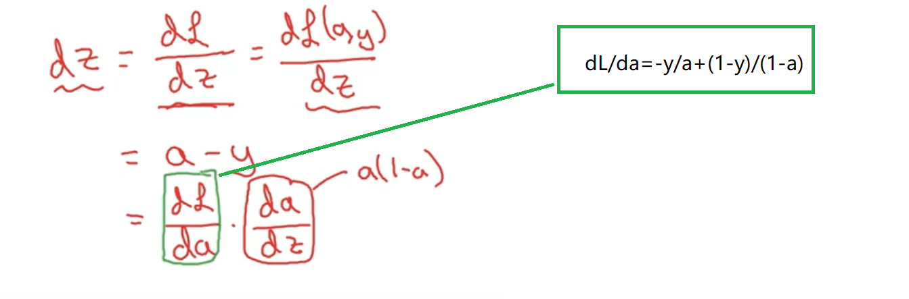
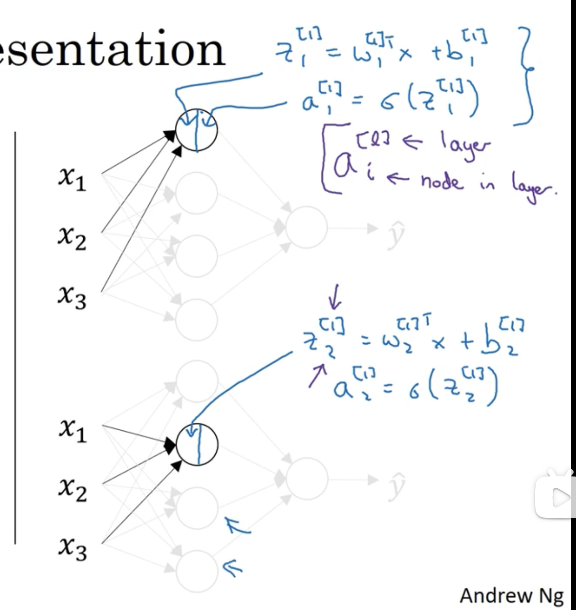

<!-- TOC -->

- [1.神经网络基础](#1神经网络基础)
  - [1.1 二分分类](#11-二分分类)
  - [1.2 logistic回归 （逻辑回归）](#12-logistic回归-逻辑回归)
  - [1.3 logistic回归损失函数 （逻辑回归损失函数）](#13-logistic回归损失函数-逻辑回归损失函数)
    - [成本函数 Cost function](#成本函数-cost-function)
  - [1.4 梯度下降法](#14-梯度下降法)
  - [1.5 逻辑回归中的梯度下降法](#15-逻辑回归中的梯度下降法)
  - [1.6 m个样本的梯度下降](#16-m个样本的梯度下降)
  - [1.7 向量化](#17-向量化)
  - [1.8 向量化logistic回归](#18-向量化logistic回归)
  - [1.9 向量化logistic回归的梯度输出](#19-向量化logistic回归的梯度输出)
  - [1.10 关于python 中numpy的说明](#110-关于python-中numpy的说明)
- [2.浅层神经网络](#2浅层神经网络)
  - [2.1 神经网络的表示](#21-神经网络的表示)
  - [2.2 计算神经网络的输出](#22-计算神经网络的输出)
  - [2.3 多个例子中的向量化](#23-多个例子中的向量化)

<!-- /TOC -->
# 1.神经网络基础
## 1.1 二分分类
假如我们有m个样本的训练集，我们可能会习惯使用一个for循环来遍历这m个样本，但事实上实现一个神经网络并不需要我们直接使用for循环 
神经网络的计算过程通常有一个正向过程 （也叫正向传播步骤），接着会有一个反向步骤 （也叫反向传播步骤） 
什么叫二分类？
> 简单来说就是一个问题最终只有两种结果，比如我们识别一只猫，那么识别的结果就只有两种，yes or no

我们用一对(x,y)来表示一个单独的样本 ，其中x是nx维的特征向量，标签y值为0或1，而我们的训练集由m个训练样本构成，其中
$$(x^1，y^1)$$表示样本1的输入和输出，同理$$(x^2，y^2)$$表示样本2的输入和输出,....以此类推$$(x^m，y^1)$$表示样本m的输入和输出，这些一起就构成了整个训练集
我们用整个m来表示训练样本的个数，为了区分训练样本和测试样本，我们使用：
* m_train:训练样本个数
* m_test:测试集样本个数

我们接着定义一个X矩阵，它是由训练集中的x1,x2,x3....组成
$$
X=\left[
\begin{matrix}
. & . & .... & . \\
. & . & ... & . \\
x^1 & x^2 & ... & x^m \\
. & . & .... & . \\
. & . & ... & . 
\end{matrix} \right]\tag{2}
$$
这个矩阵有m列，m就是我们的训练样本数，高记为nx，但是需要我们注意的是有时候矩阵的定义是训练样本作为行向量堆叠，而不是这样列向量堆叠，于是我们将上述矩阵稍作变换，即我们使用向量的转置变成行向量来构建神经网络
输出X.shape，会得到（nx * m）的结果

将输入矩阵说明之后，那么我们的输出矩阵Y应该怎么表示呢？
我们同样将y标签也放在列中，定义Y是由$$y^(1),y^(2),...,y^(m)$$组成的矩阵，$$Y=\left[
\begin{matrix}
y^(1) & y^(2) & .... & y^(m) 
\end{matrix} \right]\tag{3}$$
如果我们输出Y.shape 会得到（1，m）

## 1.2 logistic回归 （逻辑回归）
逻辑回归就是来解决二元分类乃至多元分类问题的一个算法
我们给出X,希望得到一个预测值y，我们将这个预测值定义为$$\overline{y}$$,实际上这个预测值是一个概率，我们希望$$0<=\overline{y}<=1$$,如果我们继续采用线性回归$$\overline{y}=w^Tx+b，其中w也是nx维度，b是任意一个实数$$的方式来解决多元分类的问题就会得到负值或者大于1的值，但是这些值对我们来说是没有任何意义的，所以我们在这个函数的基础上添加一个激活函数变为$$\overline{y}=\sigma(w^Tx+b)$$,我们看一下激活函数的曲线：

而$$\sigma(z)=\frac{1}{1+e^-z}$$当z非常大时，这个函数趋于1，当z=0时，函数值为0.5,当z非常小时，函数值无限趋于0
当我们对神经网络编程时，我们通常会把w和参数b分开，其中b对应一个拦截器
## 1.3 logistic回归损失函数 （逻辑回归损失函数）
损失函数的作用：他们用来衡量算法的运行情况
如果我们继续使用梯度下降的损失函数实际上在处理多元模型时只能得到局部最优解，但是我们定义损失函数的目的主要是为了衡量预测输出值y^和实际值y有多接近
我们先看一下损失函数的形态：
$$L(\overline{y},y)=-(y\log^{\overline{y}}+(1-y)\log^{1-\overline{y}})$$
我们要实现的就是让损失函数尽可能的小
我们先看两个例子：
* y=1 1-y=0,所以$$L(\overline{y},y)=-(y\log^{\overline{y}}+0)$$我们要想L尽可能的小，则$$\log^{\overline{y}}$$尽可能的大，意味着y^  尽可能的大，但是y^ 是我们由激活函数$$\sigma(z)=\frac{1}{1+e^-z}$$求出，最大也不会超过1，所以我们要尽可能的让y^ 接近1
* y=0 ,则$$L(\overline{y},y)=-(0+\log^{1-\overline{y}})$$要是L尽可能的小，则需要y^ 尽可能的小，但是0< y^ <1 所以我们需要让y^ 尽可能的接近0
### 成本函数 Cost function
接下来我们引入成本函数
* 成本函数 ：是在全体训练样本上的表现即衡量参数w,b的效果
* 损失函数是在单个训练样本上的表现
下面我们具体了解一下这个成本函数：
$$\frac{1}{m}\sum_{i=1}^{m}{L(\overline{y},y)}=-\frac{1}{m}\sum_{i=1}^{m}{(y\log^{\overline{y}}+(1-y)\log^{1-\overline{y}})}$$
所以我们要找到合适的参数w,b来让这里的成本函数j尽可能的小
以上就是逻辑回归算法的大致过程
结果表明逻辑回归可以看做是一个非常小的神经网络，接下来我们继续学习神经网络到底能做什么
## 1.4 梯度下降法
本节主要讲述如何使用梯度下降法来训练或学习训练集上的参数w,b
我们先来回顾一下激活函数$$\sigma(z)=\frac{1}{1+e^-z}$$
损失函数$$L(\overline{y},y)=-(y\log^{\overline{y}}+(1-y)\log^{1-\overline{y}})$$
成本函数：$$\frac{1}{m}\sum_{i=1}^{m}{L(\overline{y},y)}=-\frac{1}{m}\sum_{i=1}^{m}{(y\log^{\overline{y}}+(1-y)\log^{1-\overline{y}})}$$
先大致解释一下梯度下降法：它所做的就是从初始点开始从最陡的下坡方向走一步，在梯度下降一步之后，或许它会在那里停下，因为它正在试图沿着最快下降的方向往下走或者理解为它尽可能快的往下走，这个过程就是梯度下降的一次迭代，经过一次或者多次迭代之后得到一个全局最优解

而每一次迭代，w的变化如下：$$w=w-\alpha\frac{d_{j(w)}}{d_w}$$其中α为学习率，之后我们会讨论如何选择学习率，在之后的学习中我们使用dw为w导数的变量名即$$w'=d_w$$
通过不停的更新w，最终w的走向如图所示：

但是实际上我们有w,b两个参数，其实只要分别对应w,b求偏导即可
$$w=w-\alpha\frac{d_{j(w,b)}}{d_w}$$
$$b=b-\alpha\frac{d_{j(w,b)}}{d_b}$$
## 1.5 逻辑回归中的梯度下降法
在本节中我们将会讨论怎么计算偏导数
我们先回顾一下几个公式：

* z ：我们现在只考虑单个样本的情况
* L: a是logistic回归的输出，y是样本的基本真值标签值

则改样本的偏导数流程图：
假设样本只有两个特征值x1,x2,所以为了计算z，我们需要输入参数w1,w2,b通过这些参数以及上面的公式来推导出我们的损失函数

因此在logistic回归中，我们需要做的就是变换参数w和b的z值来使我们的损失函数L最小
接下来我们通过反向传播即我们要想计算L,向前一步先计算损失函数L关于a的导数

接下来我们继续向前一步计算dz,也就是L关于z的导数



我们继续向前计算dw1也就是L关于w1的导数


同理我们可以求出dw2,db
于是就有了
$$
w_1=w_1-\alpha d_{w_1}
$$
$$
w_2=w_1-\alpha d_{w_2}
$$
$$
b=b-\alpha d_{b}
$$
这就是单个样本实例的更新步骤
## 1.6 m个样本的梯度下降
在上一个章节我们已经学习到单个样本的梯度下降过程，接下来我们继续了解多个样本的梯度下降
 
接下来我们使用一串伪代码来解释整个过程

上面公式有看不懂的地方，可以复习一下上面的一个章节
利用求出的dw1,dw2,db接下来我们进一步使用梯度下降求出使成本函数最低的w1,w2,b
$$
w_1=w_1-\alpha d_{w_1}
$$
$$
w_2=w_1-\alpha d_{w_2}
$$
$$
b=b-\alpha d_{b}
$$
我们整个过程只使用了一次梯度下降
但是这个代码所实现的过程有两个弊端:
我们需要编写两个for循环：
  * 第一个是遍历m个训练样本的小循环
  * 第二个是遍历所有特征的for循环，由于本例中只有dw1,dw2两个特征，所以n=2,nx=2但是以后会有很多特征，我们需要一个for循环遍历n个特征
   
   两个for循环会使算法的效率极低，以后我们会有特别庞大的数据集，根本不会采用这种显式的for循环，于是向量化技术应运而生，它可以帮助我们的代码摆脱这些显式的for循环
## 1.7 向量化
对于$$z=w^Tx+b$$ 其中
$$
w=
\left[
\begin{matrix}
w_1  \\
w_2 \\
... \\
w_n 
\end{matrix} \right]
$$
$$
x=
\left[
\begin{matrix}
x_1  \\
x_2 \\
... \\
x_n 
\end{matrix} \right]
$$
我们使用一个小demo来展示
``` python
import numpy as np
import time
a = np.random.rand(1000000)
b = np.random.rand(1000000)
tic = time.time()
c = np.dot(a, b)
toc = time.time()
print("Vertorized version:" + str(1000 * (toc - tic)) + "ms")

c = 0
tic = time.time()
for i in range(1000000):
    c += a[i] * b[i]
toc = time.time()
print("for loop version:" + str(1000 * (toc - tic)) + "ms")
```

通过运行结果对比很明显可以看出向量和for之间的速度差异
下面解释一行代码
c = np.dot(a, b) 等价于$$z=w^Tx+b$$ 其中w=1,b=0 
接下来我们继续研究如何向量化
我们首先要记住一个原则：
> 当我们在编写新的网络时或者在做一个回归时，一定要尽量避免for循环，能不用就不要去用

我们在通过一个例子来具体研究：
加入我们想实现
$$
v=\left[
\begin{matrix}
v_1  \\
v_2 \\
... \\
v_n 
\end{matrix} \right]——> u=\left[
\begin{matrix}
e^{v_1}  \\
e^{v_2}  \\
... \\
e^{v_n} 
\end{matrix} \right]
$$
我们通过两种方式：
* for循环的方式
  ``` python
  u=np.zeros((n,1))
  for i in range(n):
      u[i]=math.exp(v[i])
  ```
* 向量化
  ``` python
  u=np.exp(v)
  ```
还有很多常用的向量函数:
``` python
np.log() #逐个计算元素的log值
np.abs() # 逐个计算元素的绝对值
np.maximum() #计算元素中的最大值
```
## 1.8 向量化logistic回归
本节会重点介绍向量化如何实现在逻辑回归上面的，这样我们就可以同时处理整个数据集来实现梯度下降的一步迭代
我们先回顾一下逻辑回归的正向传播
假如我们有m个训练样本，那么我们对第一个样本进行预测：
$$
z^{(1)}=w^TX^{(1)} +b ->\overline{y}^{(1)}=a^{(1)}=\sigma(z^{(1)})
$$
同理对第二个样本预测：
$$
z^{(2)}=w^TX^{(2)} +b ->\overline{y}^{(2)}=a^{(2)}=\sigma(z^{(2)})
$$
以此类推计算第m个样本的预测：
$$
z^{(m)}=w^TX^{(m)} +b ->\overline{y}^{(m)}=a^{(m)}=\sigma(z^{(m)})
$$
接下来我们先计算z=wx+b的值
首先我们先构建一个1*m的矩阵，实际上就是一个行向量，而
$$
[z^{(1)} z^{(2)} ... z^{(m)}]=w^TX+[b,b,...,b]
$$
注意
$$
w=\left[
\begin{matrix}
w^{1}  \\
w^{2}  \\
... \\
w^{m} 
\end{matrix} \right]
$$
b是一个一行m列的行向量
$$
b=\left[
\begin{matrix}
b & b & ... & b 
\end{matrix} \right]
$$
而x对应的矩阵如下：
$$
X=\left[
\begin{matrix}
... & ... &  &...\\
x^{(1)} & x^{(2)} & ... & x^{(m)}\\
... &  ... &  & ...
\end{matrix} \right]
$$
所以就有
$$
Z=[z^{(1)} z^{(2)} ... z^{(m)}]=w^TX+[b,b,...,b]=\left[
\begin{matrix}
w^Tx^{(1)}+b & w^Tx^{(2)}+b & ... & w^Tx^{(m)}+b
\end{matrix} \right]
$$
我们将以上步骤向量化表示：
``` python
Z=np.dot(w.T,X)+b
```
其中b是一个实数，但是在和矩阵相加时，通过python的Broadcasting机制会将b自动扩充为一个1*m的矩阵，我们仅仅需要这一行代码就实现了Z的求解
我们在定义一个矩阵A
$$
A=\left[
\begin{matrix}
a^{(1)} & a^{(2)} & ... & a^{(m)}
\end{matrix} \right]
$$
当我们用矩阵Z作为输入时，然后就会非常高效的输出A
以上就是正向传播迭代的向量化实现
接下来我们使用向量化来高效的计算反向传播，并且依此来计算梯度
## 1.9 向量化logistic回归的梯度输出
本节重点讲解m个训练数据的梯度
我们还是先回忆一下几个公式：

$$
d_z^{(1)}=a^{(1)}-y^{(1)} 
$$
$$
d_z^{(2)}=a^{(2)}-y^{(2)}  
$$
$$
d_w=x*d_z 
$$
我们用一个矩阵dZ使得：
$$
dZ=\left[
\begin{matrix}
d_z^{(1)} & d_z^{(2)} & ... & d_z^{(m)} 
\end{matrix} \right]
$$
在上一节我们讲解了如何去求A
$$
A=\left[
\begin{matrix}
a^{(1)} & a^{(2)} & ... & a^{(m)}
\end{matrix} \right]
$$
对于真实的标签值y：
$$
Y=\left[
\begin{matrix}
y^{(1)} & y^{(2)} & ... & y^{(m)}
\end{matrix} \right]
$$
而dZ=A-Y即
$$
d_Z-Y=\left[
\begin{matrix}
a^{(1)}-y^{(1)} & a^{(2)}-y^{(2)} & ... & a^{(m)}-y^{(m)}
\end{matrix} \right]
$$
使用该公式我们已经去除掉一个for循环，但是我们仍然还需要一个for循环来遍历训练集
我们使用dw=0将dw初始化为0向量，对于第一个训练样本有
$$
d_w+=x^{(1)}*d_z^{(1)}
$$
以此类推：第二个样本
$$
d_w+=x^{(2)}*d_z^{(2)}
$$
我们重复m次，相当于将m个数据集遍历结束，然后我们取出平均值dw/=m
同理我们对db进行梯度下降：

上面的这些过程我们只需要通过一行代码即可实现
``` python
db=np.sum(dz)/m
dw=X*zip(dz)/m
```
其中zip函数的作用是转置作用
重点解释一下dw=X*zip(dz)/m

我们通过向量化将数据集的遍历也省略了，极大的改善了数据集的训练效率
我再次贴出没有使用向量化的伪代码：

通过向量化之后我们做出以下改变：
$$
Z^{(i)}=w^Tx^{(i)}+b =>Z=np.dot(zip(w)x)
$$
$$
a^{(i)}=\sigma(z^{(i)})=>
A=\left[
\begin{matrix}
a^{(1)} & a^{(2)} & ... & a^{(m)}
\end{matrix} \right]=\sigma(z)
$$
$$
d_z^{(i)}=a^{(i)}-y^{(i)}=>dZ=A-Y
$$
最终得到dw=X * zip(dz)/m，db=np.sum(dz)/m，得到dw和db我们就可以进行一次梯度下降
w=w-α*dw
b=b-α*db
但是我们仍然需要使用for循环，但是for循环的作用仅仅用于迭代梯度下将
## 1.10 关于python 中numpy的说明
``` python
import numpy as np
a = np.random.randn(5)
print(a.shape)
```

(5,)表示这是秩为1的数组，它既不是行向量也不是列向量
``` python
print(a.T.shape)
```

我们发现a和a的转置shape一模一样，接下来我们看一下內积
``` python
print(np.dot(a, a.T))
```

这种类型的数组对我们来说毫无意义，因为他就相当于一个数字
``` python
a = np.random.randn(5,1)
print(a.shape)
```

这时的a就变成5行1列的向量，我们看一下这时的a的转置
``` python
print(a.T.shape)
```

以上我们先了解第一个指令：
``` python
a = np.random.randn()
```
这里创建了一个数据结构
# 2.浅层神经网络
## 2.1 神经网络的表示
我们先来了解一下只有一个隐藏层的神经网络

所谓隐藏层就是在训练集中是无法看到的
图中所展示的就是双层神经网络，我们在计算网络层数时不会计算输出层，只有隐藏层和输出层才会计入层数
在隐藏层中有两个参数w,b我们使用
$$
w^{[1]} b^{[1]}来表示参数是和第一层的这个隐藏层有关
$$
## 2.2 计算神经网络的输出
神经网络的输出究竟是如何计算出来的
隐藏层的计算一般分为如图所示的两个操作

计算z，通过激活函数计算出a，我们现在回到神经网络上面，对应每一个隐藏层的节点的作用如下：

我们以此类推，就会得到如下结果：


我们在具体看一下w,b，z是什么
$$
w^{[1]}=
\left[
\begin{matrix}
... & w1^{[1]T} & ... \\
... & w2^{[1]T} & ... \\
... & w3^{[1]T} & ... \\
... & w4^{[1]T} & ...
\end{matrix} \right]
$$
注意w是一个4*3的矩阵
$$
x=
\left[
\begin{matrix}
x1 \\
x2 \\
x3 
\end{matrix} \right]
$$

$$
b^{[1]}=
\left[
\begin{matrix}
b1^{[1]} \\
b2^{[1]} \\
b3^{[1]} \\
b4^{[1]} \\
\end{matrix} \right]
$$
于是就有
$$
z^{[1]}=w^{[1]}*x+b=\left[
\begin{matrix}
... & w1^{[1]T} & ... \\
... & w2^{[1]T} & ... \\
... & w3^{[1]T} & ... \\
... & w4^{[1]T} & ...
\end{matrix} \right]*\left[
\begin{matrix}
x1 \\
x2 \\
x3 
\end{matrix} \right]+\left[
\begin{matrix}
b1^{[1]} \\
b2^{[1]} \\
b3^{[1]} \\
b4^{[1]} \\
\end{matrix} \right]
$$
接下来使用激活函数求出y^
$$
a^{[1]}=\left[
\begin{matrix}
a1^{[1]} \\
a2^{[1]} \\
a3^{[1]} \\
a4^{[1]} \\
\end{matrix} \right]=\sigma(z^{[1]})
$$
其中a1为4*1的矩阵 
隐藏层的操作就结束了，接下来我们继续研究一下输出层的操作：
$$
z^{[2]}=w^{[2]}*a^{[1]}+b^{[2]}
$$
$$
a^{[2]}=\sigma(z^{[2]})
$$
其中w2为1 * 4的矩阵，b2为1 * 1的矩阵，最终得到一个实数
## 2.3 多个例子中的向量化
在上面的章节学习中我们已经了解到单个样本的计算神经网络的预测，在本章节中我们继续学习如何将不同的训练样本向量化
在之前的学习中，我们了解到通过输入单个样本x，我们通过如下操作

得到y^也就是a2
但是当我们n个训练集时，我们通过以下方式求的对应的输出集

我们最简单的办法就是通过一个for循环来遍历求得y^

而我们向量化的目的就是去除for循环提高训练效率
我们只需要将训练集x1,x2,x3...xm堆叠在一个矩阵中变为
$$
X=\left[
\begin{matrix}
... & ... & & ... \\
x^{(1)} & x^{(2)} &...& x^{(m)} \\
... & ... & & ... 
\end{matrix} \right]
$$
