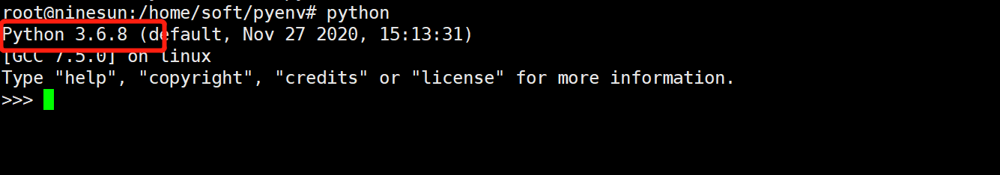

<!-- TOC -->

- [1.学习路线](#1学习路线)
- [2.Rule of ML](#2rule-of-ml)
  - [2.1.Enviroment](#21enviroment)
    - [2.1.1.Pyenv](#211pyenv)
      - [2.1.1.1.pyenv介绍](#2111pyenv介绍)
      - [2.1.1.2.pyenv安装](#2112pyenv安装)
        - [1.从远程仓库中克隆 pyenv](#1从远程仓库中克隆-pyenv)
        - [2.配置环境变量](#2配置环境变量)
        - [3.检测是否配置成功](#3检测是否配置成功)
        - [4.使用pyenv安装python版本](#4使用pyenv安装python版本)
  - [2.2.Kaggle](#22kaggle)
- [3.Regression:Case Study——回归：案例研究](#3regressioncase-study回归案例研究)
  - [3.1 我们分析一个宠物是否值得进化](#31-我们分析一个宠物是否值得进化)
    - [3.1.1 Model——模型](#311-model模型)

<!-- /TOC -->
# 1.学习路线

# 2.Rule of ML
## 2.1.Enviroment
### 2.1.1.Pyenv
#### 2.1.1.1.pyenv介绍
> Pyenv是一个管理python版本的工具，使用者可以在系统中安装不同且彼此独立的python,维持系统原生python不受套件安装移除污染
#### 2.1.1.2.pyenv安装
##### 1.从远程仓库中克隆 pyenv
``` shell
git clone https://github.com/yyuu/pyenv.git /home/soft/pyenv
```
注意：/home/soft/pyenv是你自己要克隆的目录
##### 2.配置环境变量
``` shell
vim /etc/profile
```
``` shell
# pyenv
export PYENV_ROOT=/home/soft/pyenv
export PATH="$PYENV_ROOT/bin:$PATH"
eval "$(pyenv init -)"
```

使用source命令使文件生效
``` shell
source /etc/profile
```
##### 3.检测是否配置成功
```shell
pyenv -v
```

##### 4.使用pyenv安装python版本
``` shell
pyenv install 3.6.8
```

通过pyenv versions来进行查看已经安装的python版本

如果我们安装了多个版本的python,可以通过global命令来进行指定版本
``` shell
pyenv global 3.6.8
```

输入python可以查看目前的python版本已经切换到3.6.8

通过pip install 即可安装python所需要的库
下面以numpy为例
``` shell
pip install numpy
```
通过该指令即可将numpy安装目前指定的3.6.8环境下

通过pyenv uninstall即可卸载不需要的python版本
``` shelll
pyenv uninstall 3.7.0
```
就完成了对python环境3.7.0的卸载
## 2.2.Kaggle
在kaggle上面我们可以找相应的训练模型或者数据集，也可以将我们的训练模型在kaggle上面进行训练

# 3.Regression:Case Study——回归：案例研究
## 3.1 我们分析一个宠物是否值得进化
### 3.1.1 Model——模型
找到一个合适的模型
