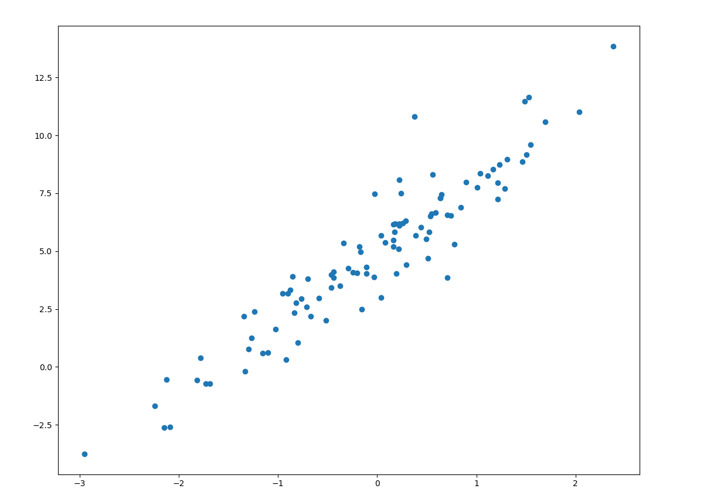
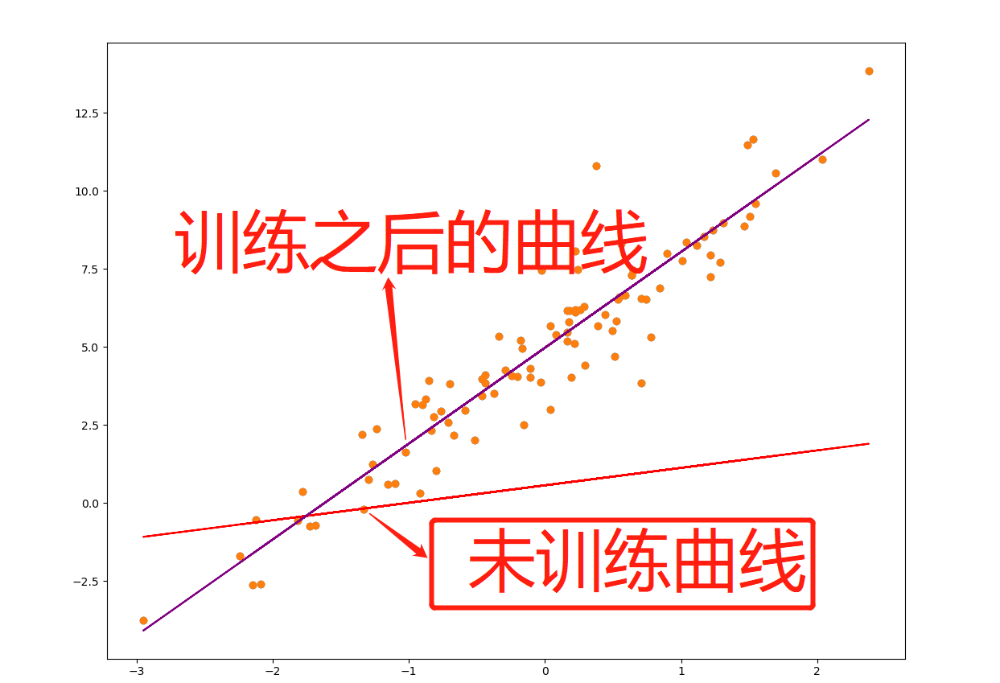
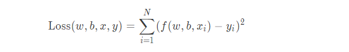
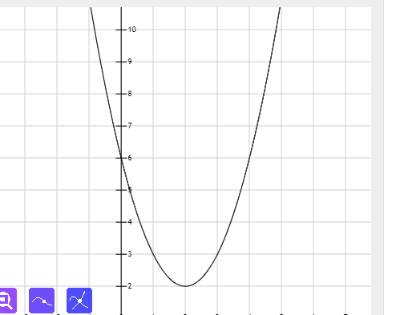

<!-- TOC -->

- [1.概述](#1概述)
- [2.形式](#2形式)
- [3.目的](#3目的)

<!-- /TOC -->
# 1.概述
机器学习中最常见的两个问题：
* 回归任务：在监督学习中标签值为连续值时是回归任务
* 分类任务：在监督学习中标签值是离散值时是分类任务
而本文要讲的就是处理回归任务最基础的模型——线性回归模型
# 2.形式
线性回归可以用方程y=kx+b来表示，今天我们拓展到多元的线性回归，其表现形式为：
$
f=w_1x_1+w_2x_2+w_3x_3+w_nx_n即f=\sum_{i=1}^{n}{w_ix_i}   
$

用矩阵的形式表示就是
$$ 
f=w^Tx
$$
其中w是
$$
\left[
\begin{matrix}
w_1  \\
w_2\\
w_3\\
...\\
w_n 
\end{matrix} \right]
$$
x是：
$$
\left[
\begin{matrix}
x_1  \\
x_2\\
x_3\\
...\\
x_n 
\end{matrix} \right]
$$
在我们使用训练模型时x矩阵是我们的输入值
# 3.目的
线性回归的目的就是求解出合适的w,b，在一元的情况下拟合出一条直线（多元情况下是平面或者曲面），可以近似的代表各个数据样本的标签值。所以最好的直线要距离各个样本点都很接近，而如何求出这条直线就是本篇文章重点要将的内容。
* 需要拟合的曲线：

未训练之前以及训练之后的曲线：

求解线性回归模型的方法叫做最小二乘法，最小二乘法的核心就是保证所有数据偏差的平方和最小。而这个函数就是我们定义的损失函数，它的具体形式是：

求解最小二乘法的方法一般有两种方法:矩阵式和梯度下降法
下面我具体讲解一下我们最常用的梯度下降法：
我们以下面这个二次函数：
$y=(x-2)^2+2$

$\frac{dy}{dx}=2x-4$
$x_1=x_0-\frac{dy}{dx}|x=x_0$
$x_0=0时\frac{dy}{dx}|x_0=-4$
* 由$\frac{dy}{dx}|x_0=-4$说明是下降的，此时我们继续向右移动
* $x_1=x_0-\frac{dy}{dx}|x_0$
经过计算我们可以得出$x_1=4$由此得出我们找的下一个点是x=4但是我们通过图像我们很容看出x=0和x=4处的斜率方向是相反的，这种方式选取的点跨度太大，由此我们引入学习率$\eta$
将我们选择点的公式稍作变形为$x_1=x0-\eta\frac{dy}{dx}|x=x_0$
* 我们选取$\eta=0.01$经过计算$x_1=0-(0.01*-4)=0.04$于是我们选择0.04这个点作为第二个下降的点，依此类推，我们要找到$\frac{dy}{dx}=0$的点或$\frac{dy}{dx}无限接近0的点$，也就是极小值点
至此梯度下将就结束了，下面附上线性回归的代码：
``` python
import matplotlib.pyplot as plt
import tensorflow as  tf
import time

TRRE_W = 3.0
TRUE_b = 5.0
NUM_SAMPLES = 100
# 初始化随机数据
X = tf.random.normal(shape=[NUM_SAMPLES, 1]).numpy()  # 生成一个正态分布的100行，一列的矩阵
noise = tf.random.normal(shape=[NUM_SAMPLES, 1]).numpy()
y = X * TRRE_W + TRUE_b + noise  # 添加噪声
plt.scatter(X, y)
plt.show()


# 接下来我们定义线性回归模型
# f(w,b,x)=w*x+b
class Model(object):
    def __init__(self):
        # 随机初始化参数
        self.w = tf.Variable(tf.random.uniform([1]))
        self.b = tf.Variable(tf.random.uniform([1]))

    def __call__(self, x):
        return self.w * x + self.b


# 先实例化模型
model = Model()
plt.scatter(X, y)
plt.plot(X, model(X), c='r')  # 绘制折现图


# 上面的曲线并不能 够很好的拟合我们的数据，我们接下来定义损失函数
# Loss(w,vb,x,y)=[f(w,b,x)-y]^2
def Loss(model, x, y):
    y_ = model(x)
    return tf.reduce_mean(tf.square(y_ - y))


# 通过梯度下降进行迭代，降低损失
EPOCHS = 1000  # 定义训练次数
LEARNING_RATE = 0.01  # 定义学习率
for epoch in range(EPOCHS):
    with tf.GradientTape() as tape:
        loss = Loss(model, X, y)
    dw, db = tape.gradient(loss, [model.w, model.b])
    model.w.assign_sub(LEARNING_RATE * dw)
    model.b.assign_sub(LEARNING_RATE * db)
    print("Epoch:[{}/{}],loss:[{:.3f}],w/b:[{:.3f}/{:.3f}]".format(epoch, EPOCHS, loss, float(model.w.numpy()),
                                                                   float(model.b.numpy())))
plt.scatter(X, y)
plt.plot(X, model(X), c="purple")
plt.show()

```