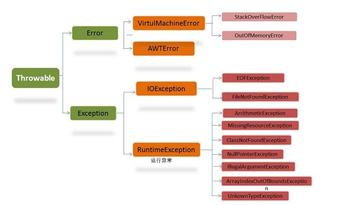

# 1.对接口的描述正确的是()
### A.一个类可以实现多个接口
### B.接口可以有非静态的成员变量
### C.在jdk8之前，接口可以实现方法
### D.实现接口的任何类，都需要实现接口的方法
> 解析：
> 答案：A
> A，一个类只能有一个直接父类，但是继承是有传递性的。一个类可以实现多的接口。一个接口可以继承多个类。
B，接口中没有普通变量（普通成员变量），接口中都是常量，默认修饰符：public static final
C，JDK8之前，接口中的方法都是默认public abstract的，JDK8之后，接口中可以有static、default的修饰的方法，一旦被修饰，方法必须有方法体（抽象方法是可以没有方法体的），接口中的方法都不能被private和protected修饰，同时外部接口、类只能被public修饰或者不写，但是内部接口、类可以被四个访问修饰符修饰。
D， 实现接口，其实就是需要重写接口中的abstract方法，一旦实现的类没有重写完，那么这个类必须是个抽象类（抽象类中可以没有抽象方法，但是有抽象方法的类必须是抽象类）。


# 2.在 applet 的方法中 , 可关闭小应用程序并释放其占用资源的是（ ）
### A.stop()
### B.paint()
### C.init()
### D.destroy()
> 解析：
> 答案：D
> Applet 类是浏览器类库中最为重要的类，同时也是所有 JAVA 小应用程序的基本类。 一个 Applet 应用程序从开始运行到结束时所经历的过程被称为 Applet 的生命周期。 Applet 的生命周期涉及 init() 、 start() 、 stop() 和 destroy() 四种方法，这 4 种方法都是 Applet 类的成员，可以继承这些方法，也可以重写这些方法，覆盖原来定义的这些方法。除此之外，为了在 Applet 程序中实现输出功能，每个 Applet 程序中还需要重载 paint() 方法：
1、  public void init()
init()方法是 Applet 运行的起点。当启动 Applet 程序时，系统首先调用此方法，以执行初始化任务。
2、  public void start()
start()方法是表明 Applet 程序开始执行的方法。当含有此 Applet 程序的 Web 页被再次访问时调用此方法。因此，如果每次访问 Web 页都需要执行一些操作的话，就需要在 Applet 程序中重载该方法。在 Applet 程序中，系统总是先调用 init() 方法，后调用 start() 方法。
3、  public void stop()
stop()方法使 Applet 停止执行，当含有该 Applet 的 Web 页被其他页代替时也要调用该方法。
4、  public void destroy()
destroy()方法收回 Applet 程序的所有资源，即释放已分配给它的所有资源。在 Applet 程序中，系统总是先调用 stop() 方法，后调用 destroy() 方法。
5、  paint(Graphics g)
paint(Graphics g)方法可以使 Applet 程序在屏幕上显示某些信息，如文字、色彩、背景或图像等。参数 g 是 Graphics 类的一个对象实例，实际上可以把 g 理解为一个画笔。对象 g 中包含了许多绘制方法，如 drawstring() 方法就是输出字符串。


# 3.java语言的下面几种数组复制方法中，哪个效率最高？
### A.for 循环逐一复制
### B.System.arraycopy
### C.Array.copyOf
### D.使用clone方法
> 解析：
> 答案：B
> 复制的效率System.arraycopy>clone>Arrays.copyOf>for循环
> 这里面在System类源码中给出了arraycopy的方法，是native方法，也就是本地方法，肯定是最快的。而Arrays.copyOf(注意是Arrays类，不是Array)的实现，在源码中是调用System.copyOf的，多了一个步骤，肯定就不是最快的

# 4.有关会话跟踪技术描述正确的是（）
### A.Cookie是Web服务器发送给客户端的一小段信息，客户端请求时，可以读取该信息发送到服务器端
### B.关闭浏览器意味着临时会话ID丢失，但所有与原会话关联的会话数据仍保留在服务器上，直至会话过期
### C.在禁用Cookie时可以使用URL重写技术跟踪会话
### D.隐藏表单域将字段添加到HTML表单并在客户端浏览器中显示
> 解析：
> 答案：A B C
> 1.session用来表示用户会话，session对象在服务端维护，一般tomcat设定session生命周期为30分钟，超时将失效，也可以主动设置无效；
>  2.cookie存放在客户端，可以分为内存cookie和磁盘cookie。内存cookie在浏览器关闭后消失，磁盘cookie超时后消失。当浏览器发送请求时，将自动发送对应cookie信息，前提是请求url满足cookie路径； 
> 3.可以将sessionId存放在cookie中，也可以通过重写url将sessionId拼接在url。因此可以查看浏览器cookie或地址栏url看到sessionId；
>  4.请求到服务端时，将根据请求中的sessionId查找session，如果可以获取到则返回，否则返回null或者返回新构建的session，老的session依旧存在
> 5.隐藏域在页面中对于用户是不可见的，在表单中插入隐藏域的目的在于收集或发送信息，以利于被处理表单的程序所使用。浏览者单击发送按钮发送表单的时候，隐藏域的信息也被一起发送到服务器。

# 5.在使用super和this关键字时，以下描述错误的是（）
### A.在子类构造方法中使用super()显示调用父类的构造方法，super()必须写在子类构造方法的第一行，否则编译不通过
### B.super()和this()不一定要放在构造方法内第一行
### C.this()和super()可以同时出现在一个构造函数中
### D.this()和super()可以在static环境中使用，包括static方法和static语句块
> 解析：
> 答案：B C D
> 1.super和this都只能位于构造器的第一行，而且不能同时使用，这是因为会造成初始化两次，this用于调用重载的构造器，super用于调用父类被子类重写的方法，由于super()和this()必须在构造函数第一行，所以这一点也表明他俩不能在一个构造函数中
> 2.super()表示调用父类构造函数、this()调用自己的构造函数，而自己的构造函数第一行要使用super()调用父类的构造函数，所以这俩不能在一个构造函数中会出现重复引用的情况
> 3.this()和super()都指的是对象，所以，均不可以在static环境中使用。包括：static变量,static方法，static语句块(里面不能使用非static类型的)。因为static修饰的方法不能存在this指针

# 6.下面有关forward和redirect的描述，正确的是() ？
### A.forward是服务器将控制权转交给另外一个内部服务器对象，由新的对象来全权负责响应用户的请求
### B.执行forward时，浏览器不知道服务器发送的内容是从何处来，浏览器地址栏中还是原来的地址
### C.执行redirect时，服务器端告诉浏览器重新去请求地址
### D.forward是内部重定向，redirect是外部重定向
### E.redirect默认将产生301 Permanently moved的HTTP响应
> 解析：
> 答案：B C D
> 1.从地址栏显示来说
forward是服务器请求资源,服务器直接访问目标地址的URL,把那个URL的响应内容读取过来,然后把这些内容再发给浏览器.浏览器根本不知道服务器发送的内容从哪里来的,所以它的地址栏还是原来的地址.
redirect是服务端根据逻辑,发送一个状态码,告诉浏览器重新去请求那个地址.所以地址栏显示的是新的URL.
2.从数据共享来说
forward:转发页面和转发到的页面可以共享request里面的数据.
redirect:不能共享数据.
3.从运用地方来说
forward:一般用于用户登陆的时候,根据角色转发到相应的模块.
redirect:一般用于用户注销登陆时返回主页面和跳转到其它的网站等.
4.从效率来说
forward:高.
redirect:低.

# 7.下面有关forward和redirect的描述，正确的是() ？
### A.forward是服务器将控制权转交给另外一个内部服务器对象，由新的对象来全权负责响应用户的请求
### B.执行forward时，浏览器不知道服务器发送的内容是从何处来，浏览器地址栏中还是原来的地址
### C.执行redirect时，服务器端告诉浏览器重新去请求地址
### D.forward是内部重定向，redirect是外部重定向
### E.redirect默认将产生301 Permanently moved的HTTP响应
> 解析：
> 答案：B C D
> 1.从地址栏显示来说
forward是服务器请求资源,服务器直接访问目标地址的URL,把那个URL的响应内容读取过来,然后把这些内容再发给浏览器.浏览器根本不知道服务器发送的内容从哪里来的,所以它的地址栏还是原来的地址.
redirect是服务端根据逻辑,发送一个状态码,告诉浏览器重新去请求那个地址.所以地址栏显示的是新的URL.
2.从数据共享来说
forward:转发页面和转发到的页面可以共享request里面的数据.
redirect:不能共享数据.
3.从运用地方来说
forward:一般用于用户登陆的时候,根据角色转发到相应的模块.
redirect:一般用于用户注销登陆时返回主页面和跳转到其它的网站等.
4.从效率来说
forward:高.
redirect:低.

# 8.执行下列代码的输出结果是( )
```c++
public class Demo{
　public static void main(String args[]){
　　　int num = 10;
　　　System.out.println(test(num));
}
public static int test(int b){
　　　try
　　　{
　　　　b += 10;
　　　　return b;
　　　}
　　　catch(RuntimeException e)
　　　{
　　　}
　　　catch(Exception e2)
　　　{
　　　}
　　　finally
　　　{
　　　　b += 10;
　　　　return b;
　　　}
　　}
}
```
### A.10
### B.20
### C.30
### D.40
> 解析：
> 答案：C
> 如果finally块中有return语句的话，它将覆盖掉函数中其他return语句。

# 9.若有定义语句： int a=10 ; double b=3.14 ; 则表达式 'A'+a+b 值的类型是（）
### A.char
### B.int
### C.double
### D.float
> 解析：
> 答案：C
> 不同类型运算结果类型向右边靠齐。
> char < short < int < float < double

# 10.下面论述正确的是（）？
### A.如果两个对象的hashcode相同，那么它们作为同一个HashMap的key时，必然返回同样的值
### B.如果a,b的hashcode相同，那么a.equals(b)必须返回true
### C.对于一个类，其所有对象的hashcode必须不同
### D.如果a.equals(b)返回true，那么a,b两个对象的hashcode必须相同
> 解析：
> 答案：D
> hashCode()方法和equals()方法的作用其实是一样的，在Java里都是用来对比两个对象是否相等一致。
那么equals()既然已经能实现对比的功能了，为什么还要hashCode()呢？因为重写的equals()里一般比较的比较全面比较复杂，这样效率就比较低，而利用hashCode()进行对比，则只要生成一个hash值进行比较就可以了，效率很高。
那么hashCode()既然效率这么高为什么还要equals()呢？ 因为hashCode()并不是完全可靠，有时候不同的对象他们生成的hashcode也会一样（生成hash值得公式可能存在的问题），所以hashCode()只能说是大部分时候可靠，并不是绝对可靠，
所以我们可以得出：
1.equals()相等的两个对象他们的hashCode()肯定相等，也就是用equals()对比是绝对可靠的。
2.hashCode()相等的两个对象他们的equal()不一定相等，也就是hashCode()不是绝对可靠的。
所有对于需要大量并且快速的对比的话如果都用equals()去做显然效率太低，所以解决方式是，每当需要对比的时候，首先用hashCode()去对比，如果hashCode()不一样，则表示这两个对象肯定不相等（也就是不必再用equal()去再对比了）,如果hashCode()相同，此时再对比他们的equals()，如果equals()也相同，则表示这两个对象是真的相同了，这样既能大大提高了效率也保证了对比的绝对正确性！

# 11.下面程序的输出结果为（）
``` java
public class Demo {
 public static String sRet = "";
 public static void func(int i)
 {
 try
 {
 if (i%2==0)
 {
 throw new Exception();
 }
 }
 catch (Exception e)
 {
 sRet += "0";
 return;
 } 
 finally
 {
 sRet += "1";
 }
 sRet += "2";
 }
 public static void main(String[] args)
 {
 func(1);
 func(2);
 System.out.println(sRet);
 }
 }
```
### A.120
### B.1201
### C.12012
### D.101
> 解析：
> 答案：B
> * 调用func(1),if不符合，直接进入finally，sRet=“1"
> * finally语句中没有返回值，故继续向下执行，sRet="12"
> * 调用func(2),if符合，sRet="120"，此时有返回值!!!
> * 调用finally语句，sRet="1201"
> * 因为已经有返回值了，finally之后的语句也不再执行，sRet="1201"。

# 12.在java7中，下列不能做switch()的参数类型是？
### A.int型
### B.枚举类型
### C.字符串
### D.浮点型
> 解析：
> 答案：D
> switch语句后的控制表达式只能是short、char、int、String、long整数类型和枚举类型，不能是float，double和boolean类型。String类型是java7开始支持。

# 13.以下代码可以使用的修饰符是：（）
### A.final
### B.static
### C.abstract
### D.public
> 解析：
> 答案：C
> * 接口中字段的修饰符：public static final（默认不写）
> * 接口中方法的修饰符：public abstract（默认不写）
> abstract只能修饰类和方法 不能修饰字段

# 14.下面有关java classloader说法错误的是?
### A.Java默认提供的三个ClassLoader是BootStrap ClassLoader，Extension ClassLoader，App ClassLoader
### B.ClassLoader使用的是双亲委托模型来搜索类的
### C.JVM在判定两个class是否相同时，只用判断类名相同即可，和类加载器无关
### D.ClassLoader就是用来动态加载class文件到内存当中用的
> 解析：
> 答案：C
> 
> 一个jvm中默认的classloader有Bootstrap ClassLoader、Extension ClassLoader、App ClassLoader，分别各司其职：
> * Bootstrap ClassLoader     负责加载java基础类，主要是 %JRE_HOME/lib/ 目录下的rt.jar、resources.jar、charsets.jar和class等
> * Extension ClassLoader      负责加载java扩展类，主要是 %JRE_HOME/lib/ext 目录下的jar和class
> * App ClassLoader负责加载当前java应用的classpath中的所有类。
classloader 加载类用的是全盘负责委托机制。 所谓全盘负责，即是当一个classloader加载一个Class的时候，这个Class所依赖的和引用的所有 Class也由这个classloader负责载入，除非是显式的使用另外一个classloader载入。
所以，当我们自定义的classloader加载成功了 com.company.MyClass以后，MyClass里所有依赖的class都由这个classLoader来加载完成。

> 比较两个类是否相等，只有这两个类是由同一个类加载器加载才有意义。否则，即使这两个类是来源于同一个Class文件，只要加载它们的类加载器不同，那么这两个类必定不相等。

补充：
###  1. 什么是类加载器？
> 把类加载的过程放到Java虚拟机外部去实现，让应用程序决定如何去获取所需要的类。实现这个动作的代码模块称为“类加载器”。  
### 2. 有哪些类加载器，分别加载哪些类
> 类加载器按照层次，从顶层到底层，分为以下三种：
(1)启动类加载器 : 它用来加载 Java 的核心库，比如String、System这些类
(2)扩展类加载器 : 它用来加载 Java 的扩展库。
(3) 应用程序类加载器 : 负责加载用户类路径上所指定的类库，一般来说，Java 应用的类都是由它来完成加载的。
### 3. 双亲委派模型
> 我们应用程序都是由以上三种类加载器互相配合进行加载的，还可以加入自己定义的类加载器。称为 类加载器的双亲委派模型 ，这里类加载器之间的父子关系一般不会以继承的关系来实现，而是都使用 组合关系 来复用父加载器的。
### 4. 双亲委托模型的工作原理
> 是当一个类加载器收到了类加载的请求，它首先不会自己去尝试加载这个类，而是把这个请求委派给父类加载器去完成，每一个层次的类加载都是如此，因此所有的加载请求最终都应该传送到顶层的启动类加载器中，只有当父加载器反馈自己无法加载这个加载请求的时候，子加载器才会尝试自己去加载。
### 5. 使用双亲委派模型好处？（原因）
> 第一：可以避免重复加载，当父亲已经加载了该类的时候，子类不需要再次加载。
第二：考虑到安全因素，如果不使用这种委托模式，那我们就可以随时使用自定义的String来动态替代java核心api中定义类型，这样会存在非常大的安全隐患，而双亲委托的方式，就可以避免这种情况，因为String已经在启动时被加载，所以用户自定义类是无法加载一个自定义的类装载器。

# 15.以下程序执行的结果是：
``` java
class X{
	Y y=new Y();
	public X(){
		System.out.print("X");
	}
}
class Y{
	public Y(){
		System.out.print("Y");
	}
}
public class Z extends X{
	Y y=new Y();
	public Z(){
		System.out.print("Z");
	}
	public static void main(String[] args) {
		new Z();
	}
}
```
### A.ZYXX
### B.ZYXY
### C.YXYZ
### D.ClaXYZXssLoader就是用来动态加载class文件到内存当中用的
> 解析：
> 答案：C
> 初始化过程： 
> * 初始化父类中的静态成员变量和静态代码块 ； 
> * 初始化子类中的静态成员变量和静态代码块 ； 
> * 初始化父类的普通成员变量和代码块，再执行父类的构造方法；
> * 初始化子类的普通成员变量和代码块，再执行子类的构造方法； 
 
>（1）初始化父类的普通成员变量和代码块，执行  Y y=new Y();  输出Y 
>（2）再执行父类的构造方法；输出X
>（3） 初始化子类的普通成员变量和代码块，执行  Y y=new   Y();  输出Y 
>（4）再执行子类的构造方法；输出Z
 所以输出YXYZ

# 16.下列语句：int *p, a = 10;  p = &a.
均表示地址的是（）
### A.a , p, &a
### B.&*a,&a,*p
### C.*&p, *p, &a
### D.&a, p, &*p
> 解析：
> 答案：D
> * *p表示指针p
> * &a表示取a的内存地址
> * p = &a 表示p等于a的内存地址
> * &*p表示获取指针p的内存地址
> * *&p表示指向P内存地址的一个指针

# 17.ArrayList list = new ArrayList(20);中的list扩充几次
### A.0
### B.1
### C.2
### D.3
> 解析：
> 答案：A
> Arraylist默认数组大小是10，扩容后的大小是扩容前的1.5倍，最大值小于Integer 的最大值减8，如果新创建的集合有带初始值，默认就是传入的大小，也就不会扩容，由于本地在创建数组时直接分配了内存大小，所以不会扩充

# 18.Thread. sleep()是否会抛出checked exception?
### A.会
### B.不会
> 解析：
> 答案：A
> checked exception：指的是编译时异常，该类异常需要本函数必须处理的，用try和catch处理，或者用throws抛出异常，然后交给调用者去处理异常。
runtime exception：指的是运行时异常，该类异常不必须本函数必须处理，当然也可以处理。
Thread.sleep()抛出的InterruptException属于checked exception；IllegalArgumentException属于Runtime exception;

# 19.关于String、StringBuffer、StringBuilder以下说法错误的是
### A.StringBuilder运行速度最快
### B.StringBuffer是线程安全的
### C.String的值是可变的
### D.StringBuffer运行速度比String快
> 解析：
> 答案：C
* #### String
String不可变！先来看看String的源码：
``` java
 public final class String implements Serializable, Comparable<String>, CharSequence {
    private final byte[] value;
    private final byte coder;
    private int hash;
    private static final long serialVersionUID = -6849794470754667710L;
    .......}

 ```
 1、String由final修饰，说明final不能被继承，不能被修改
 2、String用来存储数据的是字节数组 byte[] ，同样也是由final修饰的。
3、虽然字节数组value是由final修饰，但是我们要清楚一个原则就是：String是引用型变量，要清楚在String的数组是放在堆中的，然后将栈中放的是数组在堆中的引用地址，而我们通常所用的就是一个指向堆中真实数组数据的一个引用地址，所以也称String为引用型对象。简而言之：引用地址不可变，但是地址指向的堆中的数组数据是可以改变的。一旦创建了一个String对象，就在内存中申请一片固定的地址空间存放数据，不管怎么变，地址是不会变的，但是地址所指向的空间真实存放的数据是可以改变的。再通俗点就是：你家的门牌号不会变，但是你家要住几口人是你说了算。
* #### StringBuffer
先来看下StringBuffer的源码：
``` java
   public synchronized StringBuffer append(String str) {
        this.toStringCache = null;
        super.append(str);
        return this;
    }
```
由于有关键字synchronize，所以线程安全。

> String 和 StringBuffer、StringBuilder 的区别在于 String 声明的是不可变的对象，每次操作都会生成新的 String 对象，然后将指针指向新的 String 对象，而 StringBuffer、StringBuilder 可以在原有对象的基础上进行操作，所以在经常改变字符串内容的情况下最好不要使用 String。

> StringBuffer 和 StringBuilder 最大的区别在于，StringBuffer 是线程安全的，而 StringBuilder 是非线程安全的，但 StringBuilder 的性能却高于 StringBuffer，所以在单线程环境下推荐使用 StringBuilder，多线程环境下推荐使用 StringBuffer。

# 20.下列关于Java语言中String和char的说法，正确的是（）
### A.String是Java定义的一种基本数据类型。
### B.String是以“\0”结尾的char类型的数组char[]。
### C.使用equals()方法比较两个String是否内容一样（即字符串中的各个字符都一样）。
### D.Char类型在Java语言里面存储的是ASCII码。
> 解析：
> 答案：C
> * 基本数据类型包括byte，short，int，long，float，double，char，boolean
> * C语言当中String是以“\0”结尾的char类型的数组char[]，java不是， String内部是用char[]数组实现的，不过结尾不用\0。
> * char存储的unicode码，不仅可以存储ascII码，汉字也可以。

# 21.如下的Java程序 
``` java
public class Test { 
     public static void main(String[] args) { 
     System.out.println(args[0]); 
     } 
}
``` 
 若采用命令行“java Test one two three”调用，则程序输出的结果为：
### A.Test
### B.one
### C.two
### D.java
> 解析：
> 答案：B
> 采用命令行“ java Test one two three ”调用
其中Test为调用的方法，而one two three则为Test方法里面main函数的参数；
  System.out.println(args[0]);表示输出第一个元素，故为one；

# 22.从内存实现或者反射的角度来看，关于继承的说法正确的是（）。
注：此处的继承不代表能调用
### A.子类将继承父类的所有的数据域和方法
### B.子类将继承父类的其可见的数据域和方法
### C.子类只继承父类public方法和数据域
### D.子类只继承父类的方法，而不继承数据域
> 解析：
> 答案：A
> 在一个子类被创建的时候，首先会在内存中创建一个父类对象，然后在父类对象外部放上子类独有的属性，两者合起来形成一个子类的对象。所以所谓的继承使子类拥有父类所有的属性和方法其实可以这样理解，子类对象确实拥有父类对象中所有的属性和方法，但是父类对象中的私有属性和方法，子类是无法访问到的，只是拥有，但不能使用。就像有些东西你可能拥有，但是你并不能使用。所以子类对象是绝对大于父类对象的，所谓的子类对象只能继承父类非私有的属性及方法的说法是错误的。可以继承，只是无法访问到而已。

# 23.java中 String str = "hello world"下列语句错误的是？
### A.str+='      a'
### B.int strlen = str.length
### C.str=100
### D.str=str+100
> 解析：
> 答案：ABC
> * str += 'a'   和 str +="a"都是对的，但是如果a前面加一个空格，那么只能用双引号了。代表字符串
> * str += 'a'   和 str +="a"都是对的，但是如果a前面加一个空格，那么只能用双引号了。代表字符串
> * int 无法直接转成String类型

# 24.下列有关JAVA异常处理的叙述中正确的是（）
### A.finally是为确保一段代码不管是否捕获异常都会被执行的一段代码
### B.throws是用来声明一个成员方法可能抛出的各种非运行异常情况
### C.final用于可以声明属性和方法，分别表示属性的不可变及方法的不可继承
### D.throw是用来明确地抛出一个异常情况
> 解析：
> 答案：ABD
> * throw 用于方法块里面的 代码，比throws的层次要低，比如try...catch ....语句块，表示它抛出异常，但它不会处理它
#### final
> * 用于类 ---- 说明该类无法被继承，实例：String类
> * 用于方法-----说明该方法无法被覆盖，实例：final不能与abstract关键字同时使用
> * final用于变量-----说明属性不可变（可用于静态和非静态属性），但多和staic连用，表示常量

# 25.判断对错。List，Set，Map都继承自继承Collection接口。
### A.对
### B.错
> 解析：
> 答案：B
> 

# 26.以下哪个命令用于查看tar（backup.tar）文件的内容而不提取它?（）
### A.tar -xvf backup.tar
### B.tar -tvf backup.tar
### C.tar -svf backup.tar
### D.none of these
> 解析：
> 答案：B
> 把常用的tar解压命令总结下，当作备忘：
> #### tar 
> -c: 建立压缩档案
> -x：解压
> -t：查看内容
> -r：向压缩归档文件末尾追加文件
> -u：更新原压缩包中的文件
这五个是独立的命令，压缩解压都要用到其中一个，可以和别的命令连用但只能用其中一个。下面的参数是根据需要在压缩或解压档案时可选的。
-z：有gzip属性的
-j：有bz2属性的
-Z：有compress属性的
-v：显示所有过程
-O：将文件解开到标准输出
下面的参数-f是必须的
-f: 使用档案名字，切记，这个参数是最后一个参数，后面只能接档案名。
> #### 压缩
> * tar –cvf jpg.tar *.jpg  将目录里所有jpg文件打包成tar.jpg
> * tar –czf jpg.tar.gz *.jpg   将目录里所有jpg文件打包成jpg.tar后，并且将其用gzip压缩，生成一个gzip压缩过的包，命名为jpg.tar.gz
> * tar –cjf jpg.tar.bz2 *.jpg 将目录里所有jpg文件打包成jpg.tar后，并且将其用bzip2压缩，生成一个bzip2压缩过的包，命名为jpg.tar.bz2
> * tar –cZf jpg.tar.Z *.jpg   将目录里所有jpg文件打包成jpg.tar后，并且将其用compress压缩，生成一个umcompress压缩过的包，命名为jpg.tar.Z
> * rar a jpg.rar *.jpg rar格式的压缩，需要先下载rar for linux
> * zip jpg.zip *.jpg   zip格式的压缩，需要先下载zip for linux 
> #### 解压
> * tar –xvf file.tar  解压 tar包
> * tar -xzvf file.tar.gz 解压tar.gz
> * tar -xjvf file.tar.bz2   解压 tar.bz2
> * tar –xZvf file.tar.Z   解压tar.Z
> * unrar e file.rar 解压rar
> * unzip file.zip 解压zip
> #### 总结
> * *.tar 用 tar –xvf 解压
> * *.gz 用 gzip -d或者gunzip 解压
> * *.tar.gz和*.tgz 用 tar –xzf 解压
> * *.bz2 用 bzip2 -d或者用bunzip2 解压
> * *.tar.bz2用tar –xjf 解压
> * *.Z 用 uncompress 解压
> * *.tar.Z 用tar –xZf 解压
> * *.rar 用 unrar e解压
> * *.zip 用 unzip 解压

# 27.以下哪个类包含方法flush()？（）
#### A.InputStream
#### B.OutputStream
#### C.A和B 选项都包含
#### D.A和B 选项都不包含
> #### 答案:B
> #### 解析：
> flush（）函数强制将缓冲区中的字符流、字节流等输出，目的是如果输出流输出到缓冲区完成后，缓冲区并没有填满，那么缓冲区将会一直等待被填满。所以在关闭输出流之前要调用flush（）。

# 28.Java数据库连接库JDBC用到哪种设计模式?
#### A.生成器
#### B.桥接模式
#### C.抽象工厂
#### D.单例模式
> #### 答案：B
> #### 解析：
> * 桥接模式：
> 定义 ：将抽象部分与它的实现部分分离，使它们都可以独立地变化。
> 意图 ：将抽象与实现解耦。
> 桥接模式所涉及的角色
> 1.  Abstraction ：定义抽象接口，拥有一个Implementor类型的对象引用
> 2.  RefinedAbstraction ：扩展Abstraction中的接口定义
> 3.  Implementor ：是具体实现的接口，Implementor和RefinedAbstraction接口并不一定完全一致，实际上这两个接口可以完全不一样Implementor提供具体操作方法，而Abstraction提供更高层次的调用
> 4.  ConcreteImplementor ：实现Implementor接口，给出具体实现
Jdk中的桥接模式：JDBC
JDBC连接 数据库 的时候，在各个数据库之间进行切换，基本不需要动太多的代码，甚至丝毫不动，原因就是JDBC提供了统一接口，每个数据库提供各自的实现，用一个叫做数据库驱动的程序来桥接就行了
> * 抽象工厂
> 抽象工厂模式包含了几个角色：
AbstractFactory：用于声明生成抽象产品的方法
ConcreteFactory：实现了抽象工厂声明的生成抽象产品的方法，生成一组具体产品，这些产品构成了一个产品族，每一个产品都位于某个产品等级结构中；
AbstractProduct：为每种产品声明接口，在抽象产品中定义了产品的抽象业务方法；
Product：定义具体工厂生产的具体产品对象，实现抽象产品接口中定义的业务方法。
这是它的通用类图：
> 
> 其中 AbstractProductA 和 AbstractProductB 就是两个产品族的抽象类 (或者接口)，而 Product1 和 Product2 就是产品族下的具体产品类，AbstractCreator 就是工厂的抽象。

# 29.以下代码的输出结果是？
```java
public class B
{
    public static B t1 = new B();
    public static B t2 = new B();
    {
        System.out.println("构造块");
    }
    static
    {
        System.out.println("静态块");
    }
    public static void main(String[] args)
    {
        B t = new B();
    }
}
```
#### A.静态块 构造块 构造块 构造块
#### B.构造块 静态块 构造块 构造块
#### C.构造块 构造块 静态块 构造块
#### D.构造块 构造块 构造块 静态块
> #### 答案：C
> #### 解析：
> 大致的执行过程如下：
> * 1.实例化t之后，先执行实例化t1，此时会默认执行构造函数，即执行
> ```
> {
>        System.out.println("构造块");
>    }
> ```
> 所以控制台输出<font color=#FF0000>构造块</font>，紧接着实例化t2，继续执行构造函数所以控制台接着打印<font color=#FF0000>构造块</font>，现在控制台情况如下：
> 
> 当
> ```
>  public static B t1 = new B();
>  public static B t2 = new B();
> ```
> 执行完成之后接着就会按照顺序执行静态代码块
> ```
> static
>    {
>        System.out.println("静态块");
>    }
> ```
> 此时输出<font color=#FF0000>静态块</font>，最后会执行t的构造函数，即输出<font color=#FF0000>构造块</font>
> 

# 30.下面哪几个函数 public void example(){....} 的重载函数？（）
#### A.public void example(int m){...}
#### B.public int example(){..}
#### C.public void example2(){..}
#### D.public int example(int m,float f){...}
> #### 答案：A,D
> #### 解析：
> 重载只要求参数列表不同，返回值无关。

# 31.Java 语言用以下哪个类来把基本类型数据封装为对象（）
#### A.包装类
#### B.Class
#### C.Math
#### D.Object
#### 答案：A
#### 解析：
>java的数据类型分为两大类：基本类型和引用类型；
基本类型只能保存一些常量数据，引用类型除了可以保存数据，还能提供操作这些数据的功能；
为了操作基本类型的数据，java也对它们进行了封装， 得到八个类，就是java中的基本类型的封装类；他们分别是：
   八种基本类型： byte short    int   long float double    char    boolean
对应的包装类 ： Byte Short Integer Long Float Double Character Boolean
# 32.有以下类定义：
``` java
abstract class Animal{
	abstract void say();
}
public class Cat extends Animal{
	public Cat(){
		System.out.printf("I am a cat");
	}
	public static void main(String[] args) {
		Cat cat=new Cat();
	}
}
````
运行后：
#### A.I am a cat
#### B.Animal能编译，Cat不能编译
#### C.Animal不能编译，Cat能编译
#### D.编译能通过，但是没有输出结果
#### 答案：B
#### 解析：
> 包含抽象方法的类称为抽象类，但并不意味着抽象类中只能有抽象方法，它和普通类一样，同样可以拥有成员变量和普通的成员方法。注意，抽象类和普通类的主要有三点区别：
1）抽象方法必须为public或者protected（因为如果为private，则不能被子类继承，子类便无法实现该方法），缺省情况下默认为public。
2）抽象类不能用来创建对象；
3）如果一个类继承于一个抽象类，则子类必须实现父类的抽象方法。如果子类没有实现父类的抽象方法，则必须将子类也定义为为abstract类。
在其他方面，抽象类和普通的类并没有区别。
# 33.有时为了避免某些未识别的异常抛给更高的上层应用，在某些接口实现中我们通常需要捕获编译运行期所有的异常， catch 下述哪个类的实例才能达到目的：（）
#### A.Error
#### B.Exception
#### C.RuntimeException
#### D.Throwable
#### 答案：B
#### 解析：
> 
因为error是系统出错，catch是无法处理的，难以修复的，RuntimeException不需要程序员进行捕获处理，error和exception都是throwable的子类，我们只需要对exception的实例进行捕获即可
# 34.关于abstract类的声明和描述
> 1、abstract类不能用来创建abstract类的对象；
2、final类不能用来派生子类，因为用final修饰的类不能被继承；
3、如2所述，final不能与abstract同时修饰一个类，abstract类就是被用来继承的；
4、类中有abstract方法必须用abstract修饰，但abstract类中可以没有抽象方法，接口中也可以有abstract方法。

# 35.下面有关java threadlocal说法正确的有？
#### A.ThreadLocal存放的值是线程封闭，线程间互斥的，主要用于线程内共享一些数据，避免通过参数来传递
#### B.线程的角度看，每个线程都保持一个对其线程局部变量副本的隐式引用，只要线程是活动的并且 ThreadLocal 实例是可访问的；在线程消失之后，其线程局部实例的所有副本都会被垃圾回收
#### C.在Thread类中有一个Map，用于存储每一个线程的变量的副本。
#### D.对于多线程资源共享的问题，同步机制采用了“以时间换空间”的方式，而ThreadLocal采用了“以空间换时间”的方式
#### 答案：B
#### 解析：
> * ThreadLocal类用来提供线程内部的局部变量。这种变量在多线程环境下访问(通过get或set方法访问)时能保证各个线程里的变量相对独立于其他线程内的变量。ThreadLocal实例通常来说都是private static类型的，用于关联线程和线程的上下文。 可以总结为一句话：ThreadLocal的作用是提供线程内的局部变量，这种变量在线程的生命周期内起作用，减少同一个线程内多个函数或者组件之间一些公共变量的传递的复杂度。     
> 举个例子，我出门需要先坐公交再做地铁，这里的坐公交和坐地铁就好比是同一个线程内的两个函数，我就是一个线程，我要完成这两个函数都需要同一个东西：公交卡（北京公交和地铁都使用公交卡），那么我为了不向这两个函数都传递公交卡这个变量（相当于不是一直带着公交卡上路），我可以这么做：将公交卡事先交给一个机构，当我需要刷卡的时候再向这个机构要公交卡（当然每次拿的都是同一张公交卡）。这样就能达到只要是我(同一个线程)需要公交卡，何时何地都能向这个机构要的目的。 有人要说了：你可以将公交卡设置为全局变量啊，这样不是也能何时何地都能取公交卡吗？但是如果有很多个人（很多个线程）呢？大家可不能都使用同一张公交卡吧(我们假设公交卡是实名认证的)，这样不就乱套了嘛。现在明白了吧？这就是ThreadLocal设计的初衷：提供线程内部的局部变量，在本线程内随时随地可取，隔离其他线程。
> * ThreadLocal类用于创建一个线程本地变量
在Thread中有一个成员变量ThreadLocals，该变量的类型是ThreadLocalMap,也就是一个Map，它的键是threadLocal，值为就是变量的副本。通过ThreadLocal的get()方法可以获取该线程变量的本地副本，在get方法之前要先set,否则就要重写initialValue()方法。
ThreadLocal的使用场景：     
        数据库连接：在多线程中，如果使用懒汉式的单例模式创建Connection对象，由于该对象是共享的，那么必须要使用同步方法保证线程安全，这样当一个线程在连接数据库时，那么另外一个线程只能等待。这样就造成性能降低。如果改为哪里要连接数据库就来进行连接，那么就会频繁的对数据库进行连接，性能还是不高。这时使用ThreadLocal就可以既可以保证线程安全又可以让性能不会太低。但是ThreadLocal的缺点时占用了较多的空间。
# 36.判断一块内存空间是否符合垃圾收集器收集的标准有哪些？
#### A.给对象赋予了空值null,以下再没有调用过
#### B.对象重新分配了内存空间
#### C.给对象赋予了空值null
#### D.给对象赋予了新值
#### 答案：B
#### 解析：
> 在java语言中，判断一块内存空间是否符合垃圾收集器收集标准的标准只有两个：
1.给对象赋值为null，以下没有调用过。
2.给对象赋了新的值，重新分配了内存空间。

# 37. 父类，子类的方法以及静态代码块执行的顺序
> 执行顺序为
> * 1.父类静态代码块、静态变量 ps:按声明顺序执行
> * 2.子类静态代码块、静态变量 ps:按声明顺序执行
> * 3.父类局部代码块、成员变量 ps:按声明顺序执行
> * 4.父类构造函数
> * 5.子类局部代码块、成员变量 ps:按声明顺序执行
> * 6.子类构造函数
# 38.
```java
Integer a = 1;
Integer b = 1;
Integer c = 500;
Integer d = 500;
System.out.print(a == b);
System.out.print(c == d);
```
#### A.true、true
#### B.true、false
#### C.false、true
#### D.false、false
#### 答案：B
#### 解析：
> Integer a = 1;是自动装箱会调用Interger.valueOf(int)方法；该方法注释如下：
> This method will always *** values in the range -128 to > 127 inclusive, and may *** other values outside of this range.
> 也就是说IntegerCache类缓存了-128到127的Integer实例，在这个区间内调用valueOf不会创建新的实例。

# 39.访问权限控制从最大权限到最小权限依次为：public、 包访问权限、protected和private 。（   ）
#### A.正确
#### B.错误
#### 答案：B
#### 解析:
> 

# 40.（）运算符把其操作数中所有值为0和所有值为1的位分别在结果的相应中设置1和0
#### A.&
#### B.|
#### C.！
#### D.~
#### 答案：D
#### 解析：
> ~是位运算符，意义是 按位非（NOT）
按位非也叫做补，一元运算符NOT“~”是对其运算数的每一位取反。
仅用于整数值
反转位，即0位变为1位，1变成0
在所有情况下〜x等于（-x）- 1

例如：
> ~ 0111 (7) = 1000 (8)

# 41.在java中重写方法应遵循规则的包括（）
#### A.访问修饰符的限制一定要大于被重写方法的访问修饰符
#### B.可以有不同的访问修饰符
#### C.参数列表必须完全与被重写的方法相同
#### D.必须具有不同的参数列表
#### 答案：B C
#### 解析：
> 方法的重写（override）两同两小一大原则：
方法名相同，参数类型相同
子类返回类型小于等于父类方法返回类型，
子类抛出异常小于等于父类方法抛出异常，
子类访问权限大于等于父类方法访问权限。
# 42.Java创建对象的方式
Java有5种方式来创建对象： 
* 1.使用 new 关键字（最常用）
``` java
ObjectName obj = new ObjectName();
```
* 2.使用反射的Class类的newInstance()方法
``` java
ObjectName obj = ObjectName.class.newInstance();
```
* 3.使用反射的Constructor类的newInstance()方法
``` java
 ObjectName obj = ObjectName.class.getConstructor.newInstance();
```
* 4.使用对象克隆clone()方法：
``` java
ObjectName obj = obj.clone(); 
```
* 5.使用反序列化（ObjectInputStream）的readObject()方法：
``` java
try (ObjectInputStream ois = new ObjectInputStream(new FileInputStream(FILE_NAME))) { ObjectName obj = ois.readObject(); }
```
# 43.下列哪些操作会使线程释放锁资源？
#### A.sleep()
#### B.wait()
#### C.join()
#### D.yield()
#### 答案：B C
#### 解析：
* 1.sleep()方法
> 在指定时间内让当前正在执行的线程暂停执行，但不会释放“锁标志”。不推荐使用。
sleep()使当前线程进入阻塞状态，在指定时间内不会执行。
* 2.wait()方法
> 在其他线程调用对象的notify或notifyAll方法前，导致当前线程等待。线程会释放掉它所占有的“锁标志”，从而使别的线程有机会抢占该锁。
当前线程必须拥有当前对象锁。如果当前线程不是此锁的拥有者，会抛出IllegalMonitorStateException异常。
唤醒当前对象锁的等待线程使用notify或notifyAll方法，也必须拥有相同的对象锁，否则也会抛出IllegalMonitorStateException异常。
waite()和notify()必须在synchronized函数或synchronized　block中进行调用。如果在non-synchronized函数或non-synchronized　block中进行调用，虽然能编译通过，但在运行时会发生IllegalMonitorStateException的异常。
* 3.yield方法
> 暂停当前正在执行的线程对象。
yield()只是使当前线程重新回到可执行状态，所以执行yield()的线程有可能在进入到可执行状态后马上又被执行。
yield()只能使同优先级或更高优先级的线程有执行的机会。 
* 4.join方法
> join()等待该线程终止。
等待调用join方法的线程结束，再继续执行。如：t.join();//主要用于等待t线程运行结束，若无此句，main则会执行完毕，导致结果不可预测
