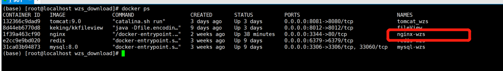

当我们配置nginx出错导致镜像无法启动，由于镜像无法启动，导致我们无法进入容器直接修改，此时我们只能通过替换配置文件进行修改
# 1.查看报错的原因
```
docker logs 镜像id
```
# 2.将容器内的配置复制出来
```
docker cp nginx-wzs:/etc/nginx/nginx.conf ./dist
```
注意：
* 1.nginx-wzs是你的镜像名称
    
* 2.dist是你要存放配置文件的目录，任意目录都可以，只要你自己能找到
# 3.修改配置文件
```
vim nginx.cong
```
# 4.替换容器内的配置文件
```
docker cp nginx.conf nginx-wzs:/etc/nginx/nginx.conf
```
# 5.重启容器
```
docker start nginx-wzs
```
至此问题就解决了