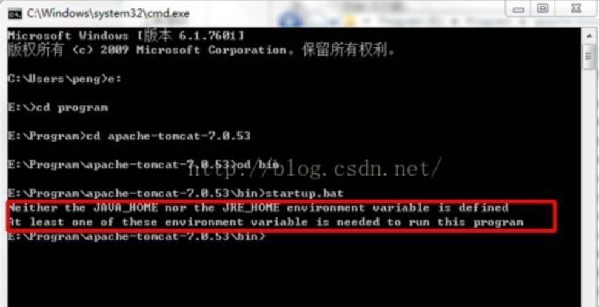
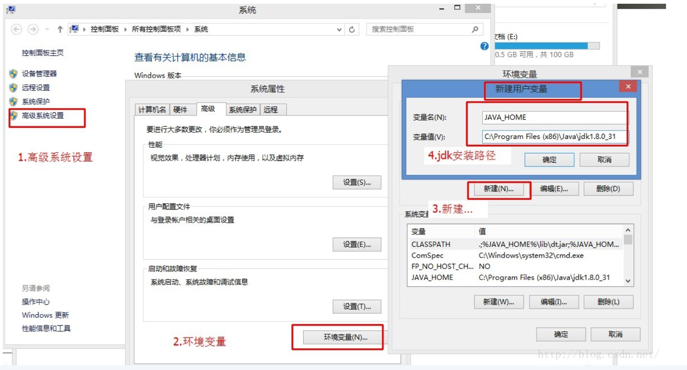
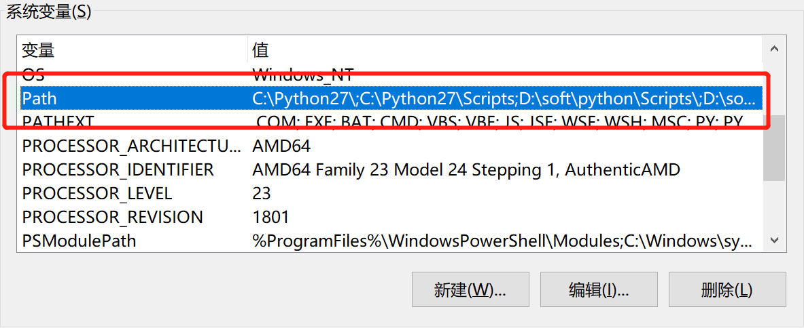
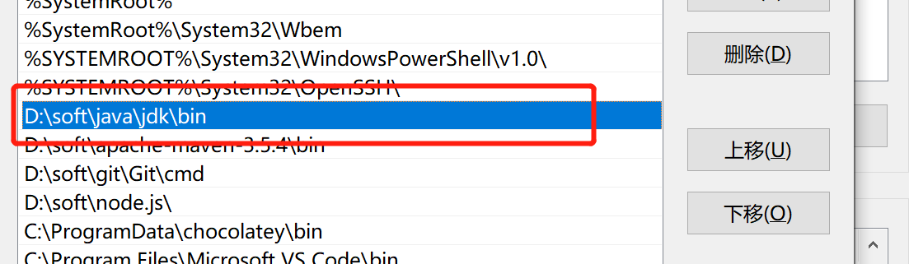
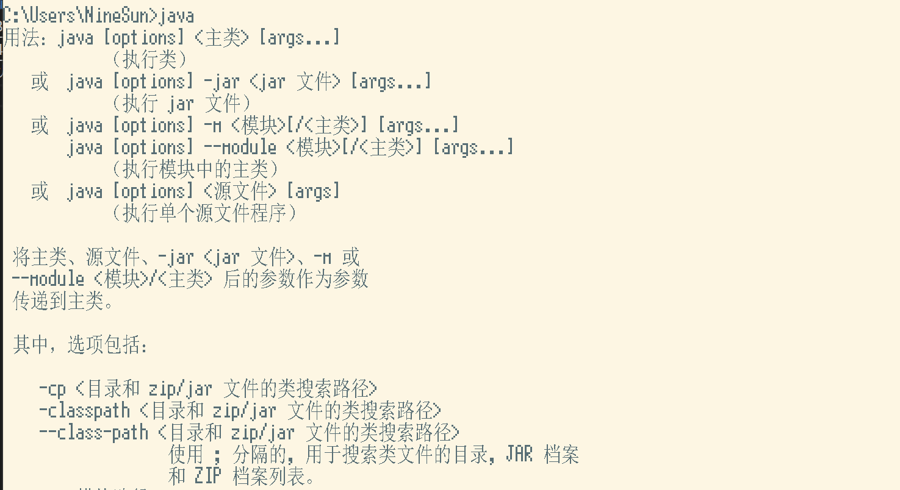
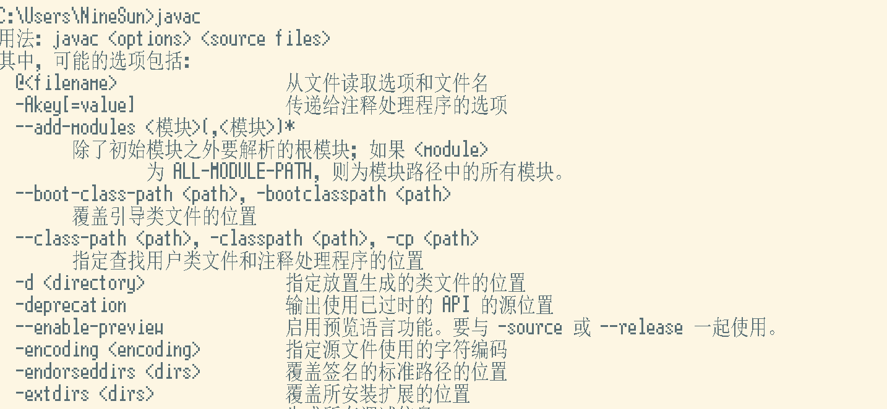

<!-- TOC -->

- [1.首先cd到tomcat的bin目录下,输入指令startup.bat run，如果出现下图所示提示](#1首先cd到tomcat的bin目录下输入指令startupbat-run如果出现下图所示提示)
- [2.闪退的原因还有可能是java环境变量没有配置好导致，打开高级系统设置配置环境，点击path，完成以下配置](#2闪退的原因还有可能是java环境变量没有配置好导致打开高级系统设置配置环境点击path完成以下配置)

<!-- /TOC -->
# 1.首先cd到tomcat的bin目录下,输入指令startup.bat run，如果出现下图所示提示

则说明环境变量未添加JAVA_HOME，打开高级系统设置配置环境

完成以上操作步骤即可
# 2.闪退的原因还有可能是java环境变量没有配置好导致，打开高级系统设置配置环境，点击path，完成以下配置

完成以上操作，打开cmd，输入java若出现以下信息

继续输入javac，出现以下信息说明配置成功

再次启动tomcat即可