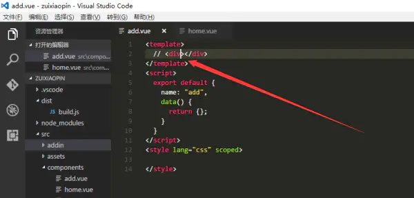
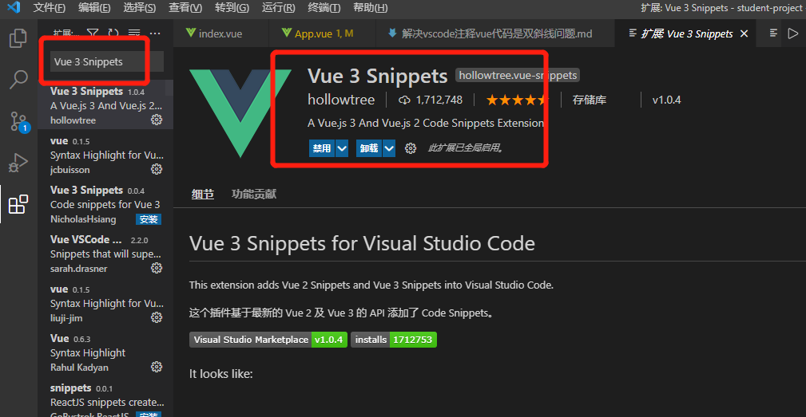
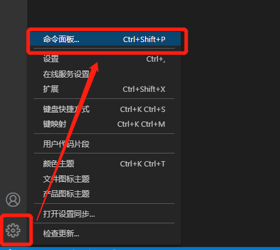
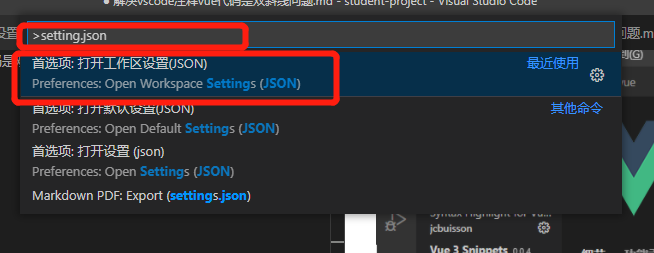
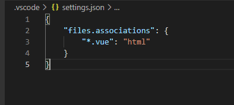

# 1.问题描述：

这种注释对于我们的代码不生效
# 2.解决方案
## 2.1 下载插件
```
Vue 3 Snippets
```

## 2.2 安装成功之后配置setting.json


在setting.json中添加以下代码
``` json
{
    "files.associations": {
        "*.vue": "html"
    }
}
```

至此注释就正常了