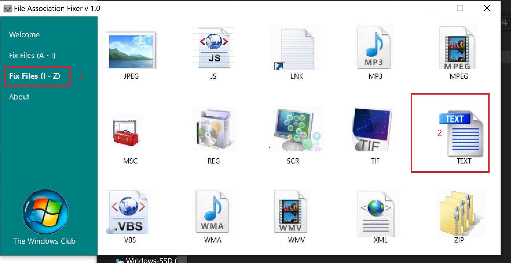

# 1.问题描述
> windows无法访问指定设备、路径或文件。您可能没有合适的权限访问这个项目
# 2.解决办法：
## 2.1. 下载File Association Fixer.exe文件
> [点击此处下载](https://pan.baidu.com/s/1nh5KgUFh1XmbFpJFGVXYlw)
> 提取码：upv8
## 2.2.点击下图所示步骤

## 2.3.重启即可