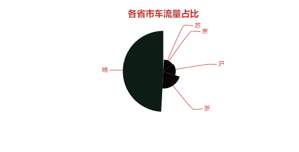
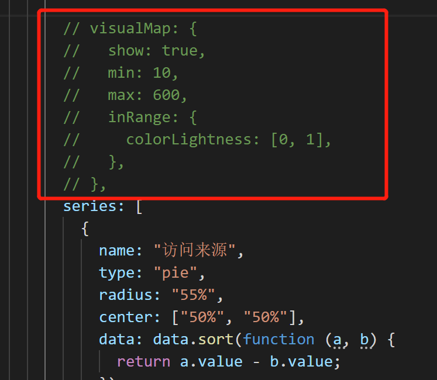
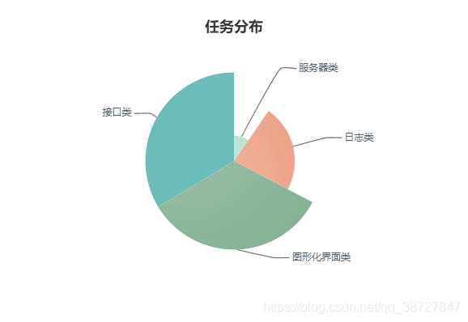

<!-- TOC -->

- [1.问题描述](#1问题描述)
- [2.解决方案](#2解决方案)
  - [2.1 方案一：将visualMap属性注释或直接删除](#21-方案一将visualmap属性注释或直接删除)
  - [2.2 方案2：使用itemStyle:{normal:{color:'#7FAE90'}},手动设置每个data的颜色值](#22-方案2使用itemstylenormalcolor7fae90手动设置每个data的颜色值)

<!-- /TOC -->
# 1.问题描述
当我们将饼图的data数据替换为自己的数据之后会发现饼图全部变成了黑色，如图所示：

但是当我们更换为官方原版的数值之后，颜色又正常了，这是因为我们设置了一个visualMap的属性，然后里面有max、min值，这两个值对应的是饼图颜色的渐变；
而导致这个问题的原因就是因为我们自己的data中的数据太小，所以渐变出来的颜色都是黑色（实际上只是很接近于黑色的颜色）
# 2.解决方案
## 2.1 方案一：将visualMap属性注释或直接删除

## 2.2 方案2：使用itemStyle:{normal:{color:'#7FAE90'}},手动设置每个data的颜色值
通过这种方式还可以设置自定义的图标颜色
``` js
 data: [
         {value: 35, name: '图形化界面类', itemStyle:{normal:{color:'#7FAE90'}}},
            {value: 10, name: '服务器类', itemStyle:{normal:{color:'#9FDABF'}}},
            {value: 24, name: '日志类', itemStyle:{normal:{color:'#E98F6F'}}},
            {value: 35, name: '接口类', itemStyle:{normal:{color:'#6ABDB8'}}},

        ]
```
效果如下所示：

